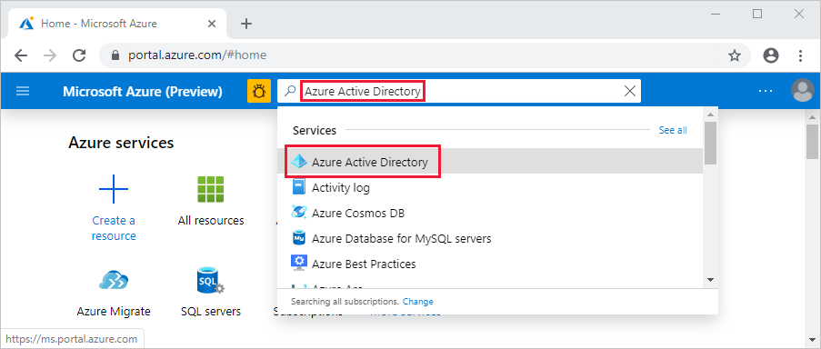
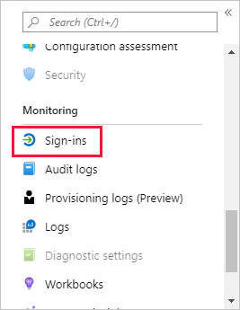
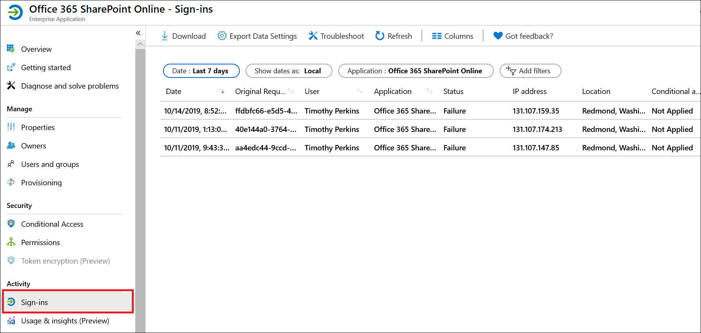
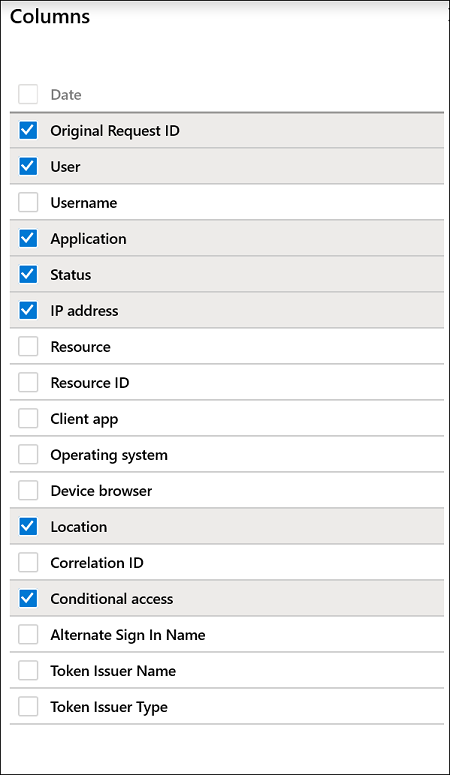
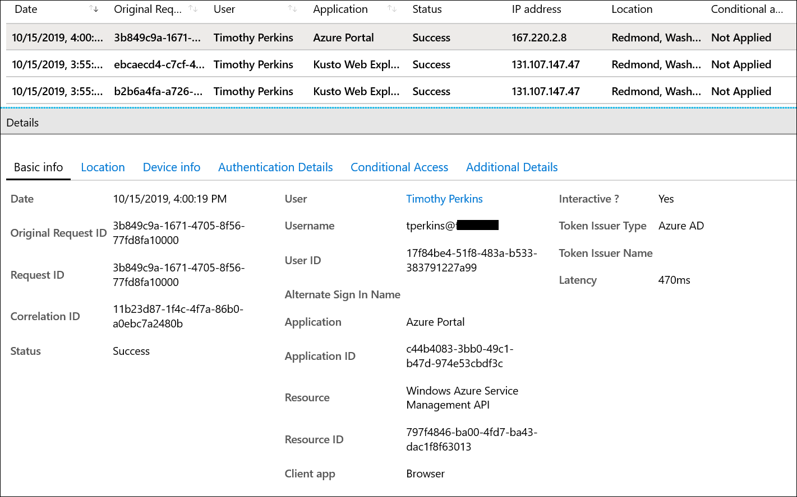
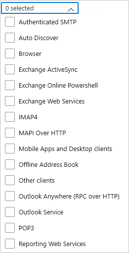
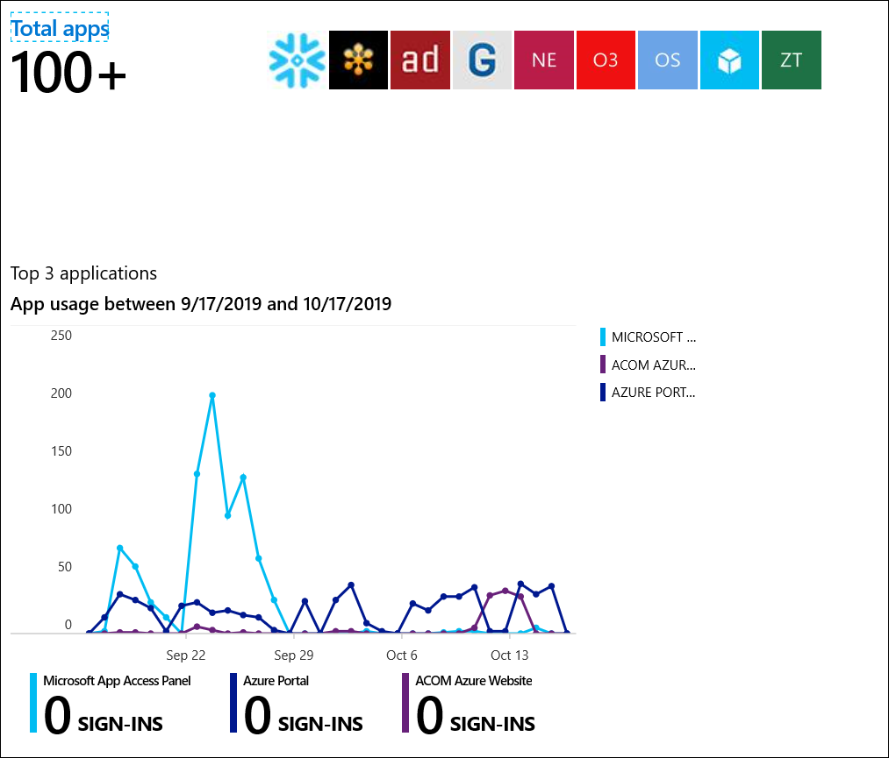
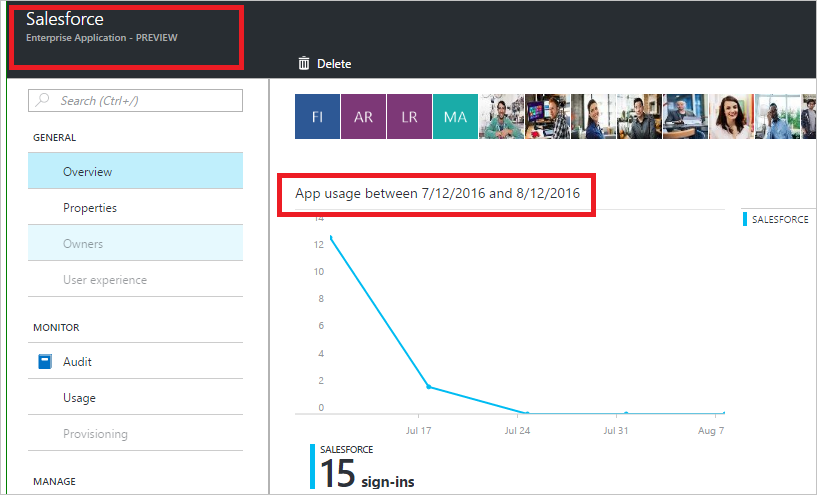

# Sign-in activity reports in the Azure Active Directory portal

The reporting architecture in Azure Active Directory (Azure AD) consists of the following components:

- **Activity** 
    - **Sign-ins** – Information about the usage of managed applications and user sign-in activities.
    - **Audit logs** - [Audit logs](concept-audit-logs.md) provide system activity information about users and group management, managed applications, and directory activities.
- **Security** 
    - **Risky sign-ins** - A [risky sign-in](concept-risky-sign-ins.md) is an indicator for a sign-in attempt by someone who isn't the legitimate owner of a user account.
    - **Users flagged for risk** - A [risky user](concept-user-at-risk.md) is an indicator for a user account that might have been compromised.

This article gives you an overview of the sign-ins report.

## Prerequisites

### Who can access the data?

* Users in the Security Administrator, Security Reader, Global Reader, and Report Reader roles
* Global Administrators
* Any user (non-admins) can access their own sign-ins 

### What Azure AD license do you need to access sign-in activity?

- The sign-in activity report is available in [all editions of Azure AD](reference-reports-data-retention.md#how-long-does-azure-ad-store-the-data).

- If you want to access the sign-in data using an API, your tenant must have an [Azure Active Directory Premium](../fundamentals/active-directory-get-started-premium.md) license associated with it.

## Sign-ins report

The user sign-ins report provides answers to the following questions:

* What is the sign-in pattern of a user?
* How many users have signed in over a week?
* What’s the status of these sign-ins?

On the [Azure portal](https://portal.azure.com) menu, select **Azure Active Directory**, or search for and select **Azure Active Directory** from any page.

Under **Monitoring**, select **Sign-ins** to open the [Sign-ins report](https://portal.azure.com/#blade/Microsoft_AAD_IAM/ActiveDirectoryMenuBlade/SignIns).

It may take up to two hours for some sign-in records to show up in the portal.

> [!IMPORTANT]
> The sign-ins report only displays the **interactive** sign-ins, that is, sign-ins where a user manually signs in using their username and password. Non-interactive sign-ins, such as service-to-service authentication, are not displayed in the sign-ins report. 

A sign-ins log has a default list view that shows:

- The sign-in date
- The related user
- The application the user has signed in to
- The sign-in status
- The status of the risk detection
- The status of the multi-factor authentication (MFA) requirement

You can customize the list view by clicking **Columns** in the toolbar.

The **Columns** dialog gives you access to the selectable attributes. In a sign-in report, you can't have fields
that have more than one value for a given sign-in request as column. This is, for example, true for authentication details, conditional access data and network location.   

Select an item in the list view to get more detailed information.

> [!NOTE]
> Customers can now troubleshoot Conditional Access policies through all sign-in reports. By clicking on the **Conditional Access** tab for a sign-in record, customers can review the Conditional Access status and dive into the details of the policies that applied to the sign-in and the result for each policy.
> For more information, see the [Frequently asked questions about CA information in all sign-ins](reports-faq.md#conditional-access).

## Filter sign-in activities

First, narrowing down the reported data to a level that works for you. Second, filter sign-ins data using date field as default filter. Azure AD provides you with a broad range of additional filters you can set:

**Request ID** - The ID of the request you care about.

**User** - The name or the user principal name (UPN) of the user you care about.

**Application** - The name of the target application.
 
**Status** - The sign-in status you care about:

- Success

- Failure

- Interrupted

**IP address** - The IP address of the device used to connect to your tenant.

The **Location** - The location the connection was initiated from:

- City

- State / Province

- Country/Region

**Resource** - The name of the service used for the sign-in.

**Resource ID** - The ID of the service used for the sign-in.

**Client app** - The type of the client app used to connect to your tenant:

|Name|Modern authentication|Description|
|---|:-:|---|
|Authenticated SMTP| |Used by POP and IMAP client's to send email messages.|
|Autodiscover| |Used by Outlook and EAS clients to find and connect to mailboxes in Exchange Online.|
|Exchange ActiveSync| |This filter shows all sign-in attempts where the EAS protocol has been attempted.|
|Browser||Shows all sign-in attempts from users using web browsers|
|Exchange ActiveSync| | Shows all sign-in attempts from users with client apps using Exchange ActiceSync to connect to Exchange Online|
|Exchange Online PowerShell| |Used to connect to Exchange Online with remote PowerShell. If you block basic authentication for Exchange Online PowerShell, you need to use the Exchange Online PowerShell module to connect. For instructions, see [Connect to Exchange Online PowerShell using multi-factor authentication](https://docs.microsoft.com/powershell/exchange/exchange-online/connect-to-exchange-online-powershell/mfa-connect-to-exchange-online-powershell).|
|Exchange Web Services| |A programming interface that's used by Outlook, Outlook for Mac, and third-party apps.|
|IMAP4| |A legacy mail client using IMAP to retrieve email.|
|MAPI over HTTP| |Used by Outlook 2010 and later.|
|Mobile apps and desktop clients||Shows all sign-in attempts from users using mobile apps and desktop clients.|
|Offline Address Book| |A copy of address list collections that are downloaded and used by Outlook.|
|Outlook Anywhere (RPC over HTTP)| |Used by Outlook 2016 and earlier.|
|Outlook Service| |Used by the Mail and Calendar app for Windows 10.|
|POP3| |A legacy mail client using POP3 to retrieve email.|
|Reporting Web Services| |Used to retrieve report data in Exchange Online.|
|Other clients| |Shows all sign-in attempts from users where the client app is not included or unknown.|

**Operating system** - The operating system running on the device used sign-on to your tenant. 

**Device browser** - If the connection was initiated from a browser, this field enables you to filter by browser name.

**Correlation ID** - The correlation ID of the activity.

**Conditional access** - The status of the applied conditional access rules

- **Not applied**: No policy applied to the user and application during sign-in.

- **Success**: One or more conditional access policies applied to the user and application (but not necessarily the other conditions) during sign-in. 

- **Failure**: One or more conditional access policies applied and was not satisfied during sign-in.

## Download sign-in activities

Click the **Download** option to create a CSV or JSON file of the most recent 250,000 records. Start with [download the sign-ins data](quickstart-download-sign-in-report.md) if you want to work with it outside the Azure portal.  

> [!IMPORTANT]
> The number of records you can download is constrained by the [Azure Active 
> Directory report retention policies](reference-reports-data-retention.md).  

## Sign-ins data shortcuts

Azure AD and the Azure portal both provide you with additional entry points to sign-ins data:

- The Identity security protection overview
- Users
- Groups
- Enterprise applications

### Users sign-ins data in Identity security protection

The user sign-in graph in the **Identity security protection** overview page shows weekly aggregations of sign-ins. The default for the time period is 30 days.

When you click on a day in the sign-in graph, you get an overview of the sign-in activities for this day.

Each row in the sign-in activities list shows:

* Who has signed in?
* What application was the target of the sign-in?
* What is the status of the sign-in?
* What is the MFA status of the sign-in?

By clicking an item, you get more details about the sign-in operation:

- User ID
- User
- Username
- Application ID
- Application
- Client
- Location
- IP address
- Date
- MFA Required
- Sign-in status

> [!NOTE]
> IP addresses are issued in such a way that there is no definitive connection between an IP address and where the computer with that address is physically located. Mapping IP addresses is complicated by the fact that mobile providers and VPNs issue IP addresses from central pools that are often very far from where the client device is actually used. 
> Currently in Azure AD reports, converting IP address to a physical location is a best effort based on traces, registry data, reverse look ups and other information.

On the **Users** page, you get a complete overview of all user sign-ins by clicking **Sign-ins** in the **Activity** section.

## Usage of managed applications

With an application-centric view of your sign-in data, you can answer questions such as:

* Who is using my applications?
* What are the top three applications in your organization?
* How is my newest application doing?

The entry point to this data is the top three applications in your organization. The data is contained within the last 30 days report in the **Overview** section under **Enterprise applications**.

The app-usage graphs weekly aggregations of sign-ins for your top three applications in a given time period. The default for the time period is 30 days.

If you want to, you can set the focus on a specific application.

When you click on a day in the app usage graph, you get a detailed list of the sign-in activities.

The **Sign-ins** option gives you a complete overview of all sign-in events to your applications.

## Office 365 activity logs

You can view Office 365 activity logs from the [Microsoft 365 admin center](https://docs.microsoft.com/office365/admin/admin-overview/about-the-admin-center). Consider the point  that, Office 365 activity and Azure AD activity logs share a significant number of the directory resources. Only the Microsoft 365 admin center provides a full view of the Office 365 activity logs. 

You can also access the Office 365 activity logs programmatically by using the [Office 365 Management APIs](https://docs.microsoft.com/office/office-365-management-api/office-365-management-apis-overview).

## Next steps

* [Sign-in activity report error codes](reference-sign-ins-error-codes.md)
* [Azure AD data retention policies](reference-reports-data-retention.md)
* [Azure AD report latencies](reference-reports-latencies.md)

