# Sign-in activity reports in the Azure Active Directory portal

With Azure Active Directory (Azure AD) reporting in the [Azure portal](https://portal.azure.com), you can get the information you need to determine how your environment is doing.

The reporting architecture in Azure Active Directory consists of the following components:

- **Activity** 
    - **Sign-in activities** – Information about the usage of managed applications and user sign-in activities
    - **Audit logs** - System activity information about users and group management, your managed applications and directory activities.
- **Security** 
    - **Risky sign-ins** - A risky sign-in is an indicator for a sign-in attempt that might have been performed by someone who is not the legitimate owner of a user account. For more details, see Risky sign-ins.
    - **Users flagged for risk** - A risky user is an indicator for a user account that might have been compromised. For more details, see Users flagged for risk.

This topic gives you an overview of the sign-in activities.

## Prerequisites

### Who can access the data?
* Users in the Security Admin, Security Reader, Report Reader role
* Global Admins
* Any user (non-admins) can access their own sign-ins 

### What Azure AD license do you need to access sign-in activity?
* Your tenant must have an Azure AD Premium license associated with it to see the all up sign-in activity report

## Sign-in activities

With the information provided by the user sign-in report, you find answers to questions such as:

* What is the sign-in pattern of a user?
* How many users have signed in over a week?
* What’s the status of these sign-ins?

Your first entry point to all sign-in activities data is **Sign-ins** in the Activity section of **Azure Active Directory**.

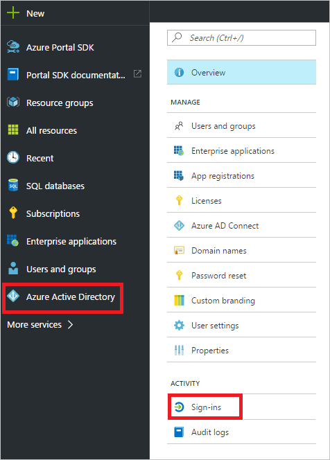

A sign-ins log has a default list view that shows:

- The sign-in date
- The related user
- The application the user has signed-in to
- The sign-in status
- The status of the risk detection
- The status of the multi-factor authentication (MFA) requirement

You can customize the list view by clicking **Columns** in the toolbar.

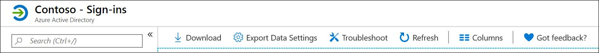

This enables you to display additional fields or remove fields that are already displayed.

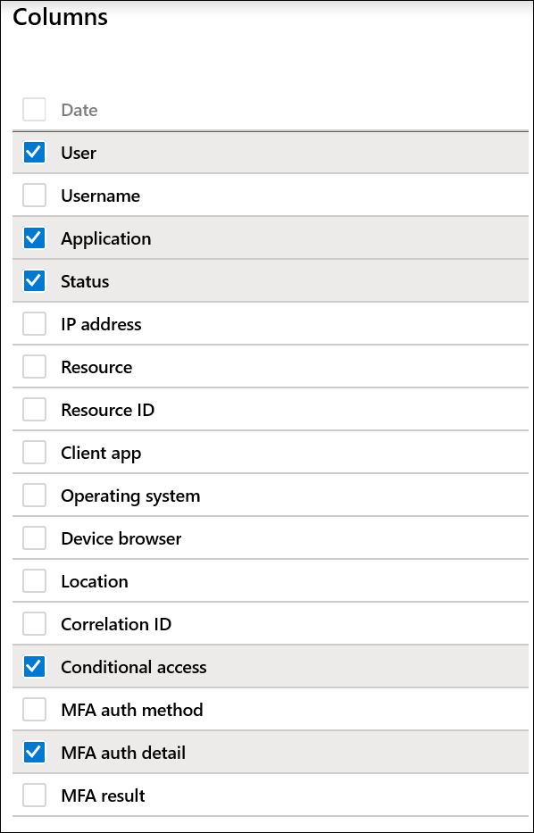

By clicking an item in the list view, you get all available details about it in a horizontal view.

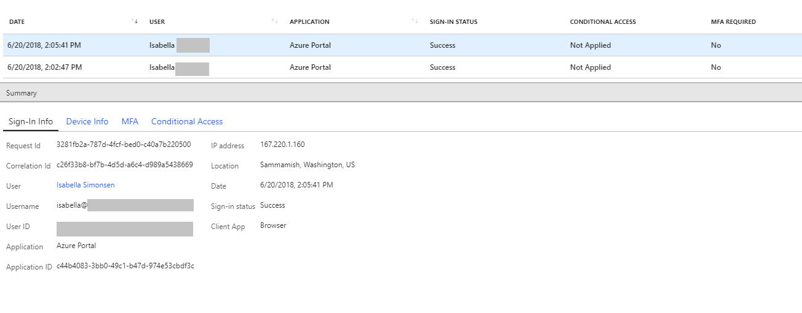

> [!NOTE]
> Customers can now troubleshoot conditional access policies through all sign-in reports. By clicking on the **Conditional access** tab for a sign-in record, customers can review the conditional access status and dive into the details of the policies that applied to the sign-in and the result for each policy.
> For more information, see the [Frequently asked questions about CA information in all sign-ins](reports-faq.md#conditional-access).

## Filter sign-in activities

To narrow down the reported data to a level that works for you, you can filter the sign-ins data using the following default fields:

- User
- Application
- Sign-in status
- Status of the risk detection
- Date

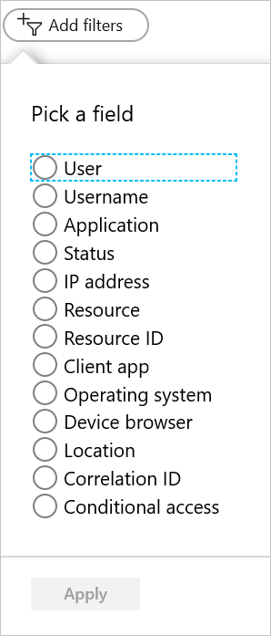

The **User** filter enables you to specify the name or the user principal name (UPN) of the user you care about.

The **Application** filter enables you to specify the name of the application you care about.

The **Sign-in status** filter enables you to select:

- All
- Success
- Failure

The **Risk Detected** filter enables you to select:

- All
- Yes
- No

The **Date** filter enables to you to define a timeframe for the returned data.  
Possible values are:

- 1 month
- 7 days
- 24 hours
- Custom time interval

When you select a custom timeframe, you can configure a start time and an end time.

If you add additional fields to your sign-ins view, these fields are automatically added to the list of filters. For example, by adding **Client App** field to your list, you also get another filter option that enables you to set the following filters:

- Browser      
- Exchange ActiveSync (supported)               
- Exchange ActiveSync (unsupported)
- Other clients               
    - IMAP
    - MAPI
    - Older Office clients
    - POP
    - SMTP

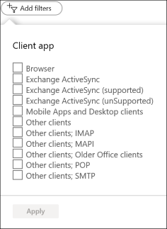

## Download sign-in activities

You can download the sign-in activities data if you want work with it outside the Azure portal. Clicking **Download** creates a CSV file of the most recent 5K records.  In addition to a download button, the Azure portal also provides you with an option to generate a script to download your data.  

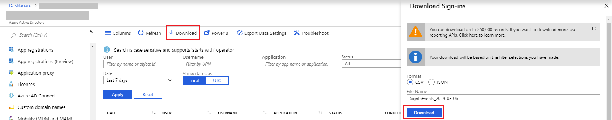

If you need more flexibility, you can use the script solution. Clicking **Script** creates a PowerShell script that includes all the filters you have set. Download and run this script in **administrator mode** to generate the CSV file. 

### Running the script on a Windows 10 machine

If you want to run the script on a **Windows 10** machine, you need to perform a few additional steps first. 

1. Install the [AzureRM module](https://docs.microsoft.com/powershell/azure/install-azurerm-ps?view=azurermps-6.4.0l).
2. Import the module by opening a PowerShell prompt and running the command **Import-Module AzureRM**.
3. Run **Set-ExecutionPolicy unrestricted** and choose **Yes to All**. 
4. Now you can run the downloaded PowerShell script in administrator mode to generate the CSV file.

In addition to the technical implementation, the number of records you can download is also constrained by the [Azure Active Directory report retention policies](reference-reports-data-retention.md).  

## Sign-in activities shortcuts

In addition to Azure Active Directory, the Azure portal provides you with additional entry points to sign-in activities data:

- The identity security protection overview
- Users
- Groups
- Enterprise applications

### Users sign-ins activities

With the information provided by the user sign-in report, you find answers to questions such as:

- What is the sign-in pattern of a user?
- How many users have users signed in over a week?
- What’s the status of these sign-ins?

Your entry point to this data is the user sign-in graph on the **identity security protection** overview page. The user sign-in graph shows weekly aggregations of sign ins for all users in a given time period. The default for the time period is 30 days.

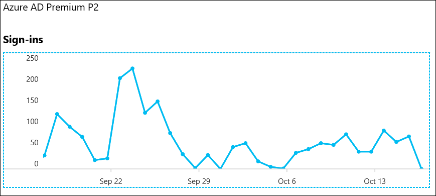

When you click on a day in the sign-in graph, you get an overview of the sign-in activities for this day.

Each row in the sign-in activities list shows:

* Who has signed in?
* What application was the target of the sign-in?
* What is the status of the sign-in?
* What is the MFA status of the sign-in?

By clicking an item, you get more details about the sign-in operation:

- User ID
- User
- Username
- Application ID
- Application
- Client
- Location
- IP address
- Date
- MFA Required
- Sign-in status

 
On the **Users** page, you get a complete overview of all user sign-ins by clicking **Sign-ins** in the **Activity** section.

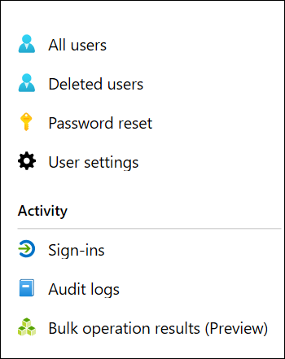

## Usage of managed applications

With an application-centric view of your sign-in data, you can answer questions such as:

* Who is using my applications?
* What are the top 3 applications in your organization?
* I have recently rolled out an application. How is it doing?

Your entry point to this data is the top 3 applications in your organization within the last 30 days report in the **Overview** section under **Enterprise applications**.

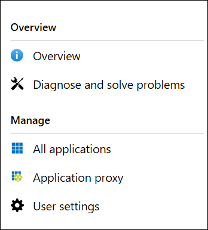

The app usage graph weekly aggregations of sign ins for your top 3 applications in a given time period. The default for the time period is 30 days.

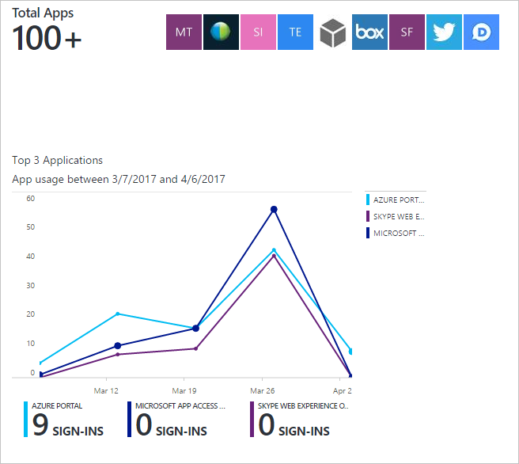

If you want to, you can set the focus on a specific application.

When you click on a day in the app usage graph, you get a detailed list of the sign-in activities.

The **Sign-ins** option gives you a complete overview of all sign-in events to your applications.

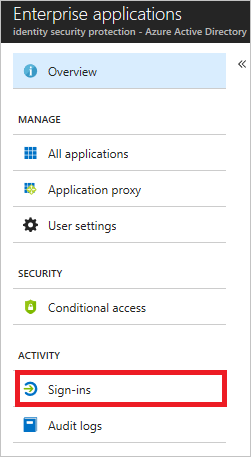

## Next steps

If you want to know more about sign-in activity error codes, see the [Sign-in activity report error codes in the Azure Active Directory portal](reference-sign-ins-error-codes.md).

