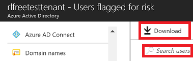
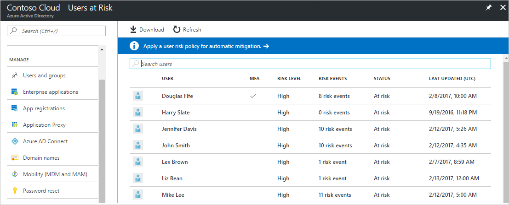

---

title: Users flagged for risk security report in the Azure Active Directory portal | Microsoft Docs
description: Learn about the users flagged for risk security report in the Azure Active Directory portal
services: active-directory
author: MarkusVi
manager: daveba

ms.assetid: addd60fe-d5ac-4b8b-983c-0736c80ace02
ms.service: active-directory
ms.devlang: na
ms.topic: conceptual
ms.tgt_pltfrm: na
ms.workload: identity
ms.subservice: report-monitor
ms.date: 01/17/2019
ms.author: markvi
ms.reviewer: dhanyahk

ms.collection: M365-identity-device-management
---
# Users flagged for risk report in the Azure portal

Azure Active Directory (Azure AD) detects suspicious actions related to your user accounts. For each detected action, a record called a [risk event](concept-risk-events.md) is created.

You can access the security reports from the [Azure portal](https://portal.azure.com) by selecting the **Azure Active Directory** blade and then navigating to the **Security** section. 

The detected risk events are used to calculate:

- **Risky sign-ins** - A risky sign-in is an indicator for a sign-in attempt that might have been performed by someone who is not the legitimate owner of a user account. 

- **Users flagged for risk** - A risky user is an indicator for a user account that might have been compromised. 

To learn how to configure the policies that trigger these risk events, see [How to configure the user risk policy](../identity-protection/howto-user-risk-policy.md). 

## What Azure AD license do you need to access the users at risk report?  

All editions of Azure Active Directory provide you with users flagged for risk reports. However, the level of report granularity varies between the editions: 

- In the **Azure Active Directory Free and Basic editions**, you get a list of users flagged for risk. 

- In addition, the **Azure Active Directory Premium 1** edition allows you to examine some of the underlying risk events that have been detected for each report. 

- The **Azure Active Directory Premium 2** edition provides you with the most detailed information about all underlying risk events and it also enables you to configure security policies that automatically respond to configured risk levels.

## Users at risk report for Azure AD free and basic editions

The users flagged for risk report in the Azure AD free and basic editions provides you with a list of user accounts that may have been compromised. 

Selecting a user provides sign-in information. For users that are at risk, you can review the user’s sign-in history and reset the password if necessary.

This dialog provides you with an option to:

- Download the report
- Search users

    

For more detailed information, you need a premium license.

## Users at risk report for Azure AD premium editions

The users flagged for risk report in the Azure AD premium editions provides you with:

- A list of user accounts that may have been compromised 

- Aggregated information about the [risk event types](concept-risk-events.md) that have been detected

- An option to download the report

- An option to configure a [user risk remediation policy](../identity-protection/howto-user-risk-policy.md)  

When you select a user, you get a detailed report view for this user that enables you to:

- Open the All sign-ins view

- Reset the user's password

- Dismiss all events

- Investigate reported risk events for the user. 

To investigate a risk event, select one from the list to open the **Details** blade for this risk event. On the **Details** blade, you have the option to either manually close a risk event or reactivate a manually closed risk event. 

## Next steps

- [How to configure the user risk policy](../identity-protection/howto-user-risk-policy.md)
- [How to configure the risk remediation policy](../identity-protection/howto-user-risk-policy.md)
- [Azure Active Directory Identity Protection](../active-directory-identityprotection.md)

