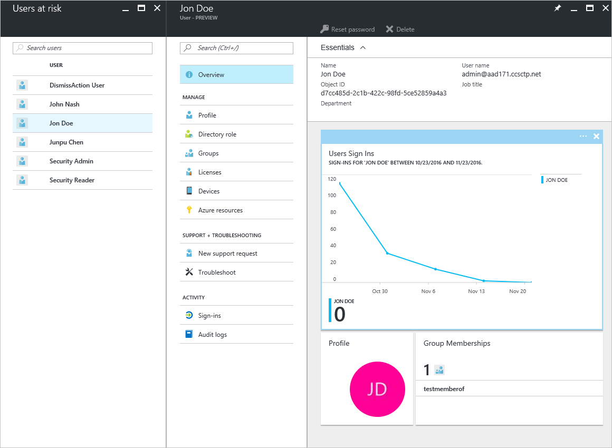

---

title: Users flagged for risk security report in the Azure Active Directory portal | Microsoft Docs
description: Learn about the users flagged for risk security report in the Azure Active Directory portal
services: active-directory
author: priyamohanram
manager: mtillman

ms.assetid: addd60fe-d5ac-4b8b-983c-0736c80ace02
ms.service: active-directory
ms.devlang: na
ms.topic: get-started-article
ms.tgt_pltfrm: na
ms.workload: identity
ms.component: report-monitor
ms.date: 11/14/2017
ms.author: priyamo
ms.reviewer: dhanyahk

---
# Users flagged for risk security report in the Azure Active Directory portal

With the security reports in the Azure Active Directory (Azure AD), you can gain insights into the probability of compromised user accounts in your environment. 

Azure Active Directory detects suspicious actions that are related to your user accounts. For each detected action, a record called *risk event* is created. For more information, see [Azure Active Directory risk events](concept-risk-events.md). 

The detected risk events are used to calculate:

- **Risky sign-ins** - A risky sign-in is an indicator for a sign-in attempt that might have been performed by someone who is not the legitimate owner of a user account. For more information, see [How to configure the sign-in risk policy](../identity-protection/howto-sign-in-risk-policy.md). 

- **Users flagged for risk** - A risky user is an indicator for a user account that might have been compromised. For more information, see [How to configure the user risk policy](../identity-protection/howto-user-risk-policy.md).  

In the Azure portal, you can find the security reports on the **Azure Active Directory** blade in the **Security** section.  

## What Azure AD license do you need to access a security report?  

All editions of Azure Active Directory provide you with users flagged for risk reports.  
However, the level of report granularity varies between the editions: 

- In the **Azure Active Directory Free and Basic editions**, you already get a list of users flagged for risk. 

- The **Azure Active Directory Premium 1** edition extends this model by also enabling you to examine some of the underlying risk events that have been detected for each report. 

- The **Azure Active Directory Premium 2** edition provides you with the most detailed information about all underlying risk events and enables you to configure security policies that automatically respond to configured risk levels.

## Azure Active Directory free and basic edition

The users flagged for risk report in the Azure Active Directory free and basic editions provides you with a list of user accounts that may have been compromised. 

Selecting a user opens the related user data blade.
For users that are at risk, you can review the user’s sign-in history and reset the password if necessary.

This dialog provides you with an option to:

- Download the report

- Search users

## Azure Active Directory premium editions

The users flagged for risk report in the Azure Active Directory premium editions provides you with:

- A list of user accounts that may have been compromised 

- Aggregated information about the [risk event types](concept-risk-events.md) that have been detected

- An option to download the report

- An option to configure a [user risk remediation policy](../identity-protection/howto-user-risk-policy.md)  

When you select a user, you get a detailed report view for this user that enables you to:

- Open the All sign-ins view

- Reset the user's password

- Dismiss all events

- Investigate reported risk events for the user. 

To investigate a risk event, select one from the list to open the **Details** blade for this risk event. On the **Details** blade, you have the option to either manually close a risk event or reactivate a manually closed risk event. 

## Next steps

- For more information about Azure Active Directory Identity Protection, see [Azure Active Directory Identity Protection](../active-directory-identityprotection.md).

