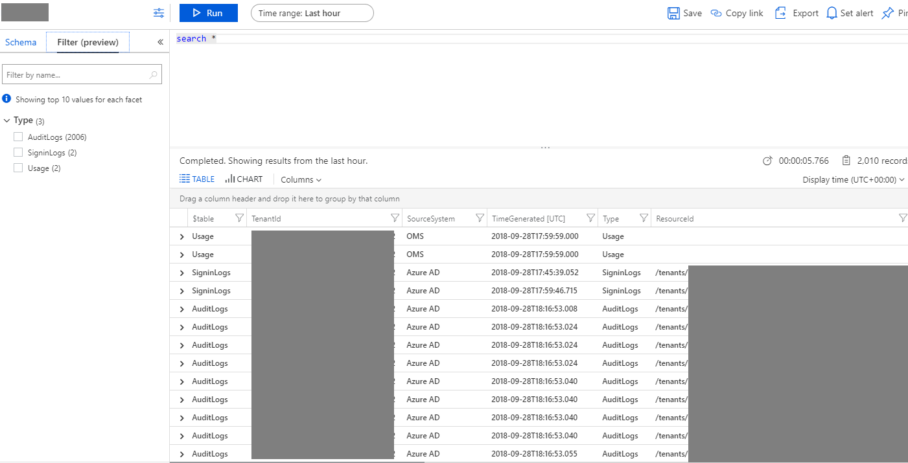
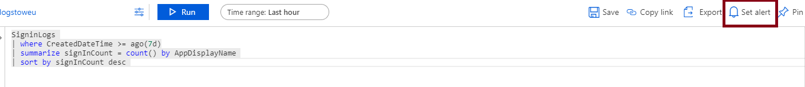
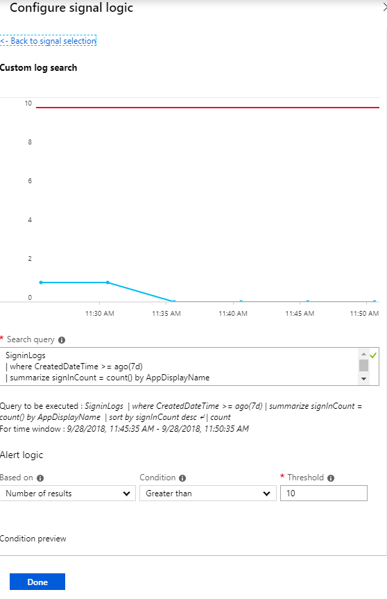

# Analyze Azure AD activity logs with Log Analytics (preview)

In this article, you learn how to analyze the Azure AD activity logs in your Log Analytics workspace. 

## Prerequisites 

To follow along, you need:

* A Log Analytics workspace in your Azure subscription. Learn how to [create a Log Analytics workspace](https://docs.microsoft.com/azure/log-analytics/log-analytics-quick-create-workspace).
* First, complete the steps to [route the Azure AD activity logs to your Log Analytics workspace](howto-integrate-activity-logs-with-log-analytics.md).

## Navigate to the Log Analytics workspace

1. Sign in to the [Azure portal](https://portal.azure.com). 

2. Select **Azure Active Directory**, and then select **Logs** from the **Monitoring** section to open your Log Analytics workspace. The workspace will open with a default query.

    


## View the schema for Azure AD activity logs

The logs are pushed to the **AuditLogs** and **SigninLogs** tables in the workspace. To view the schema for these tables:

1. From the default query view in the previous section, select **Schema** and expand the workspace. 

2. Expand the **Log Management** section and then expand either **AuditLogs** or **SignInLogs** to view the log schema.
    
    

## Query the Azure AD activity logs

Now that you have the logs in your workspace, you can now run queries against them. For example, to get the top applications used in the last week, replace the default query with the following and select **Run**

```
SigninLogs 
| where CreatedDateTime >= ago(7d)
| summarize signInCount = count() by AppDisplayName 
| sort by signInCount desc 
```

To get the top audit events over the last week, use the following query:

```
AuditLogs 
| where TimeGenerated >= ago(7d)
| summarize auditCount = count() by OperationName 
| sort by auditCount desc 
```


## Alert on Azure AD activity log data

You can also set up alerts on your query. For example, to configure an alert when more than 10 applications have been used in the last week:

1. From the workspace, select **Set alert** to open the **Create rule** page. 
    

2. Select the default **alert criteria** created in the alert and update the **Threshold** in the default metric to 10. 
    

3. Enter a name and description for the alert, and choose the severity level. For our example, we could set it to **Informational**.

4. Select the **Action Group** that will be alerted when the signal occurs. You can choose to notify your team via email or text message, or you could automate the action using webhooks, Azure functions or logic apps. Learn more about [creating and managing alert groups in the Azure portal](https://docs.microsoft.com/azure/monitoring-and-diagnostics/monitoring-action-groups).

5. Once you have configured the alert, select **Create alert** to enable it. 


## Next steps

* [Get started with queries in Log Analytics](https://docs.microsoft.com/azure/log-analytics/query-language/get-started-queries)
* [Create and manage alert groups in the Azure portal](https://docs.microsoft.com/azure/monitoring-and-diagnostics/monitoring-action-groups)