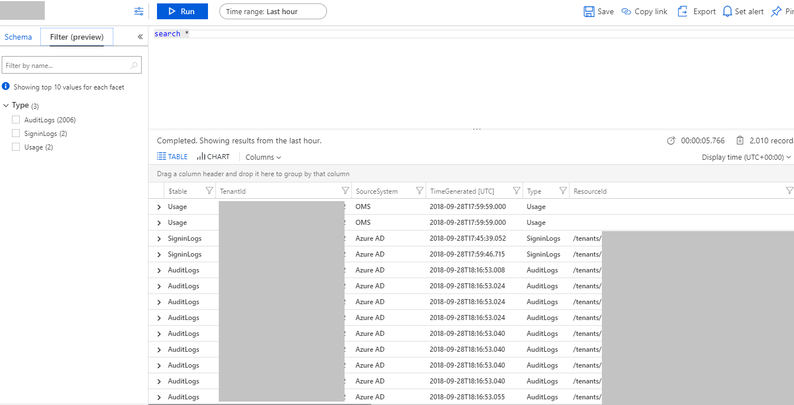
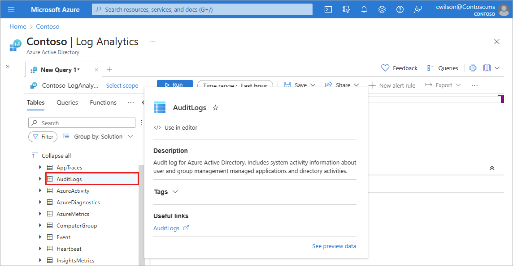
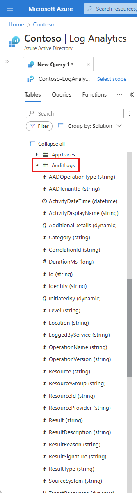
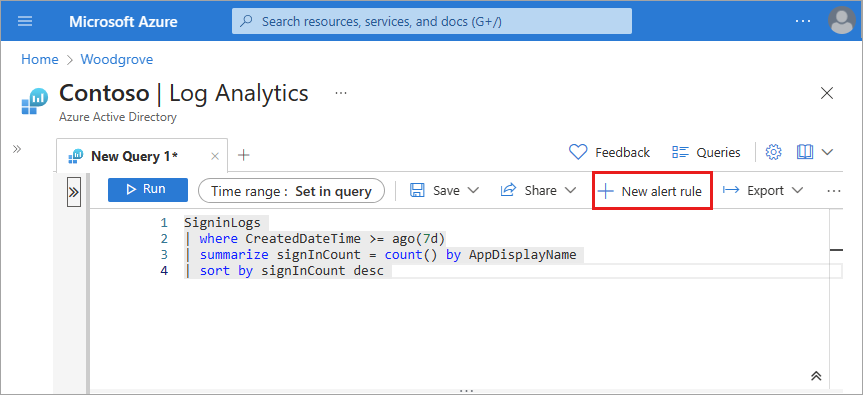

# Analyze Microsoft Entra activity logs with Log Analytics

After you [integrate Microsoft Entra activity logs with Azure Monitor logs](howto-integrate-activity-logs-with-log-analytics.md), you can use the power of Log Analytics and Azure Monitor logs to gain insights into your environment.

 * Compare your Microsoft Entra sign-in logs against security logs published by Microsoft Defender for Cloud.
  
 * Troubleshoot performance bottlenecks on your application’s sign-in page by correlating application performance data from Azure Application Insights.

 * Analyze the Identity Protection risky users and risk detections logs to detect threats in your environment.

This article describes to analyze the Microsoft Entra activity logs in your Log Analytics workspace. 

## Roles and licenses

To analyze activity logs with Log Analytics, you need:

- A Microsoft Entra tenant with a [Premium P1 license](../fundamentals/get-started-premium.md)
- A Log Analytics workspace *and* access to that workspace
- The appropriate roles for Azure Monitor *and* Microsoft Entra ID

### Log Analytics workspace

You must create a [Log Analytics workspace](/azure/azure-monitor/logs/quick-create-workspace). There are a combination of factors that determine access to Log Analytics workspaces. You need the right roles for the workspace *and* the resources sending the data.

For more information, see [Manage access to Log Analytics workspaces](/azure/azure-monitor/logs/manage-access).

### Azure Monitor roles

Azure Monitor provides [two built-in roles](/azure/azure-monitor/roles-permissions-security#monitoring-reader) for viewing monitoring data and editing monitoring settings. Azure role-based access control (RBAC) also provides two Log Analytics built-in roles that grant similar access.

- **View**:
    - Monitoring Reader
    - Log Analytics Reader

- **View and modify settings**:
    - Monitoring Contributor
    - Log Analytics Contributor

For more information on the Azure Monitor built-in roles, see [Roles, permissions, and security in Azure Monitor](/azure/azure-monitor/roles-permissions-security#monitoring-reader).

For more information on the Log Analytics RBAC roles, see [Azure built-in roles](/azure/role-based-access-control/built-in-roles#log-analytics-contributor)

<a name='azure-ad-roles'></a>

### Microsoft Entra roles

Read only access allows you to view Microsoft Entra ID log data inside a workbook, query data from Log Analytics, or read logs in the Microsoft Entra admin center. Update access adds the ability to create and edit diagnostic settings to send Microsoft Entra data to a Log Analytics workspace.

- **Read**:
  - Reports Reader
  - Security Reader
  - Global Reader

- **Update**:
  - Security Administrator

For more information on Microsoft Entra built-in roles, see [Microsoft Entra built-in roles](../roles/permissions-reference.md).

## Access Log Analytics

To view the Microsoft Entra ID Log Analytics, you must already be sending your activity logs from Microsoft Entra ID to a Log Analytics workspace. This process is covered in the [How to integrate activity logs with Azure Monitor](howto-integrate-activity-logs-with-log-analytics.md) article.

[!INCLUDE [portal updates](~/articles/active-directory/includes/portal-update.md)]

1. Sign in to the [Microsoft Entra admin center](https://entra.microsoft.com) as at least a [Reports Reader](../roles/permissions-reference.md#reports-reader). 

1. Browse to **Identity** > **Monitoring & health** > **Log Analytics**. A default search query runs.

    

1. Expand the **LogManagement** category to view the list of log related queries.

1. Select or hover over the name of a query to view a description and other useful details.

    

1. Expand a query from the list to view the schema.

    

## Query activity logs

You can run queries against the activity logs being routed to a Log Analytics workspace. For example, to get a list of applications with the most sign-ins from last week, enter the following query and select the **Run** button.

```
SigninLogs 
| where CreatedDateTime >= ago(7d)
| summarize signInCount = count() by AppDisplayName 
| sort by signInCount desc 
```

To get the top audit events over the last week, use the following query:

```
AuditLogs 
| where TimeGenerated >= ago(7d)
| summarize auditCount = count() by OperationName 
| sort by auditCount desc 
```
## Set up alerts

You can also set up alerts on a query. After running a query, the **+ New alert rule** button becomes active.

1. From Log Analytics, select the **+ New alert rule** button.
    - The **Create a rule** process involves several sections to customize the criteria for the rule.
    - For more information on creating alert rules, see [Create a new alert rule](/azure/azure-monitor/alerts/alerts-create-new-alert-rule) from the Azure Monitor documentation, starting with the **Condition** steps.
    
    

1. On the **Actions** tab, select the **Action Group** that will receive the alert when the signal occurs.
    - You can choose to notify your team via email or text message, or you could automate the action using webhooks, Azure functions or logic apps.
    - Learn more about [creating and managing alert groups in the Azure portal](/azure/azure-monitor/alerts/action-groups).

1. On the **Details** tab, give the alert rule a name and associate it with a subscription and resource group.

1. After configuring all necessary details, select the **Review + Create** button. 

## Use workbooks to analyze logs

Microsoft Entra workbooks provide several reports related to common scenarios involving audit, sign-in, and provisioning events. *You can also alert on any of the data provided in the reports, using the steps described in the previous section.*

* **Provisioning analysis:** This workbook shows reports related to auditing provisioning activity. Activities can include the number of new users provisioned, provisioning failures, number of users updated, update failures, the number of users deprovisioned, and corresponding failures. For more information, see [Understand how provisioning integrates with Azure Monitor logs](../app-provisioning/application-provisioning-log-analytics.md).

* **Sign-ins Events**: This workbook shows the most relevant reports related to monitoring sign-in activity, such as sign-ins by application, user, device, and a summary view tracking the number of sign-ins over time.

* **Conditional Access insights**: The Conditional Access insights and reporting workbook enables you to understand the effect of Conditional Access policies in your organization over time. For more information, see [Conditional Access insights and reporting](../conditional-access/howto-conditional-access-insights-reporting.md).

## Next steps

* [Get started with queries in Azure Monitor logs](/azure/azure-monitor/logs/get-started-queries)
* [Create and manage alert groups in the Azure portal](/azure/azure-monitor/alerts/action-groups)
