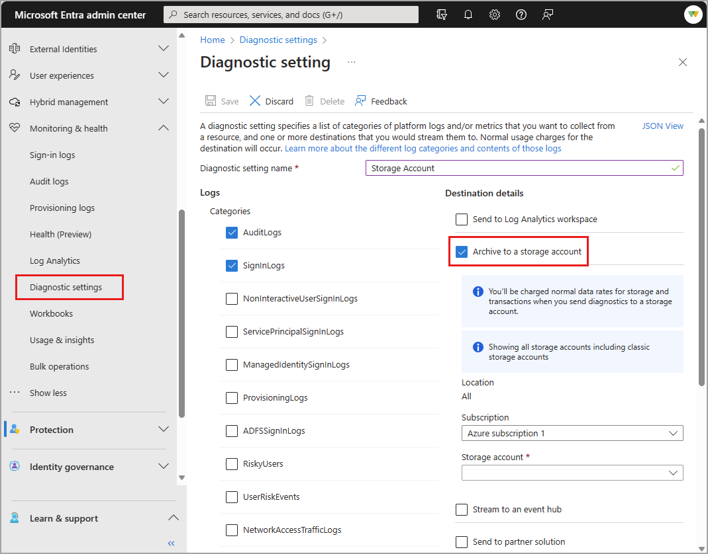

# How to archive Microsoft Entra activity logs to an Azure storage account

If you need to store Microsoft Entra activity logs for longer than the [default retention period](reference-reports-data-retention.md), you can archive your logs to a storage account. 

## Prerequisites 

To use this feature, you need:

* An Azure subscription. If you don't have an Azure subscription, you can [sign up for a free trial](https://azure.microsoft.com/free/).
* An Azure storage account. 
* A user who's a *Security Administrator* or *Global Administrator* for the Microsoft Entra tenant.

## Archive logs to an Azure storage account

[!INCLUDE [diagnostic-settings-include](../includes/diagnostic-settings-include.md)]

6. Under **Destination Details** select the **Archive to a storage account** check box. 

7. Select the appropriate **Subscription** and **Storage account** from the menus.

    

8. After the categories have been selected, in the **Retention days** field, type in the number of days of retention you need of your log data. By default, this value is *0*, which means that logs are retained in the storage account indefinitely. If you set a different value, events older than the number of days selected are automatically cleaned up.

    > [!NOTE]
    > The Diagnostic settings storage retention feature is being deprecated. For details on this change, see [**Migrate from diagnostic settings storage retention to Azure Storage lifecycle management**](/azure/azure-monitor/essentials/migrate-to-azure-storage-lifecycle-policy).
 
9. Select **Save** to save the setting.

10. Close the window to return to the Diagnostic settings pane.

## Next steps

- [Learn about other ways to access activity logs](howto-access-activity-logs.md)
- [Manually download activity logs](howto-download-logs.md)
- [Integrate activity logs with Azure Monitor logs](howto-integrate-activity-logs-with-azure-monitor-logs.md)
- [Stream logs to an event hub](howto-stream-logs-to-event-hub.md)
