# Prerequisites to access the Azure Active Directory reporting API

The [Azure Active Directory (Azure AD) reporting APIs](https://msdn.microsoft.com/library/azure/ad/graph/howto/azure-ad-reports-and-events-preview) provide you with programmatic access to the data through a set of REST-based APIs. You can call these APIs from a variety of programming languages and tools.

The reporting API uses [OAuth](https://msdn.microsoft.com/library/azure/dn645545.aspx) to authorize access to the web APIs.

To prepare your access to the reporting API, you need to:

1. Assign roles
2. Register an application
3. Grant permissions
4. Gather configuration settings

## Assign roles

To get access to the reporting data through the API, you need to have one of the following roles assigned:

- Security Reader

- Security Admin

- Global Admin

## Register an application

You need to register an app even if you're accessing the reporting API using a script. This gives you an **Application ID**, which is required for an authorization call and it enables your code to receive tokens.

To configure your directory to access the Azure AD reporting API, you must sign in to the Azure portal with an Azure administrator account that is also a member of the **Global Administrator** directory role in your Azure AD tenant.

> [!IMPORTANT]
> Applications running under credentials with "admin" privileges like this can be very powerful, so please be sure to keep the application's ID/secret credentials secure.
> 

**To register an Azure Active Directory application:**

1. In the [Azure portal](https://portal.azure.com), on the left navigation pane, click **Azure Active Directory**.
   
    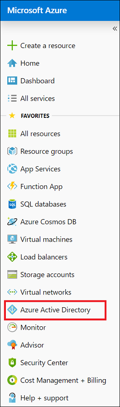 

2. On the **Azure Active Directory** page, click **App registrations**.

    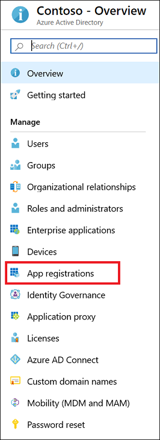 

3. On the **App registrations** page, in the toolbar on the top, click **New application registration**.

    

4. On the **Create** page, perform the following steps:

    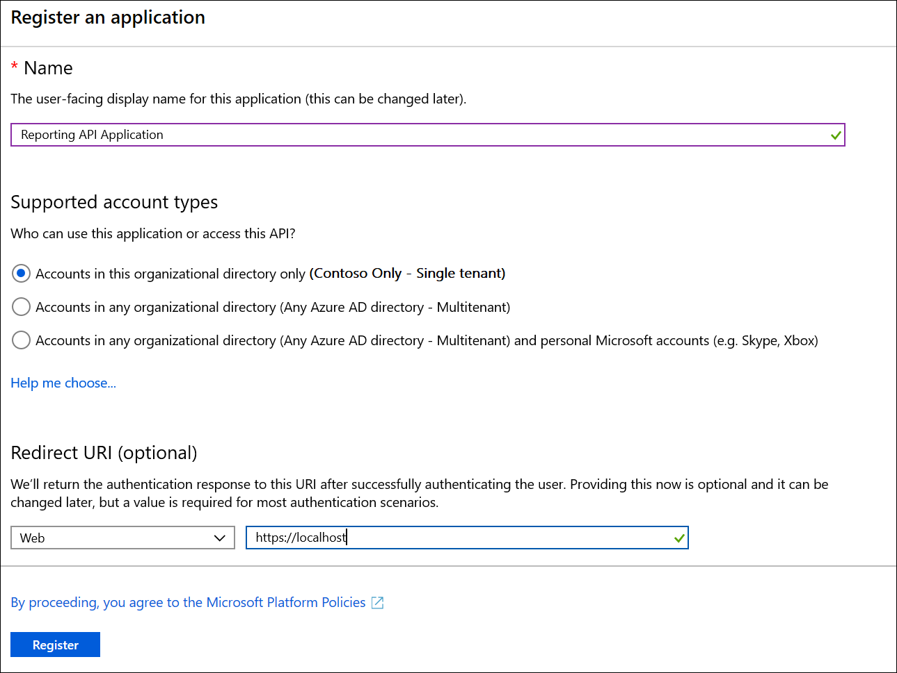

    a. In the **Name** textbox, type `Reporting API application`.

    b. As **Application type**, select **Web app / API**.

    c. In the **Sign-on URL** textbox, type `https://localhost`.

    d. Click **Create**. 

## Grant permissions 

Depending on API you want to access, you need to grant your app the following permissions:  

| API | Permission |
| --- | --- |
| Windows Azure Active Directory | Read directory data |
| Microsoft Graph | Read all audit log data |

The following section lists the steps for both APIs. If you don't want to access one of the APIs, you can skip the related steps.
 

**To grant your application permissions to use the APIs:**

1. On the **App registrations** page, in the apps list, click **Reporting API application**.

2. On the **Reporting API application** page, in the toolbar on the top, click **Settings**. 

    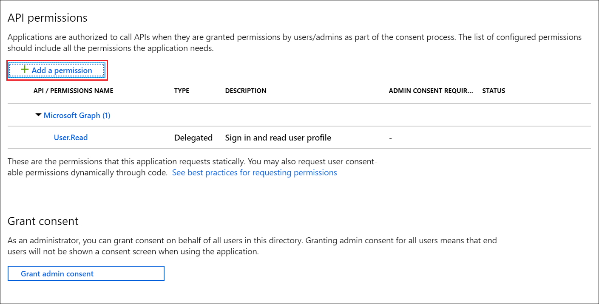

3. On the **Settings** page, click **Required permissions**. 

    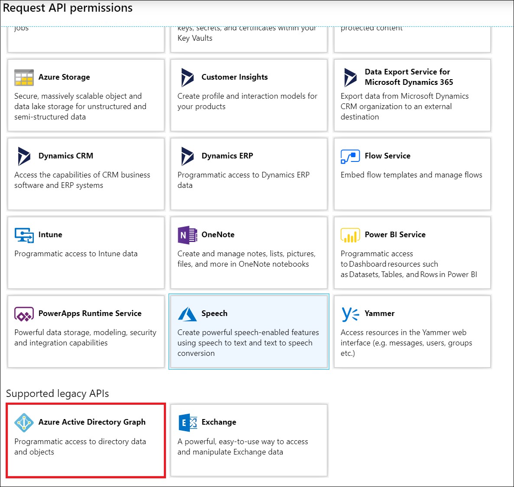

4. On the **Required permissions** page, in the **API** list, click **Windows Azure Active Directory**. 

    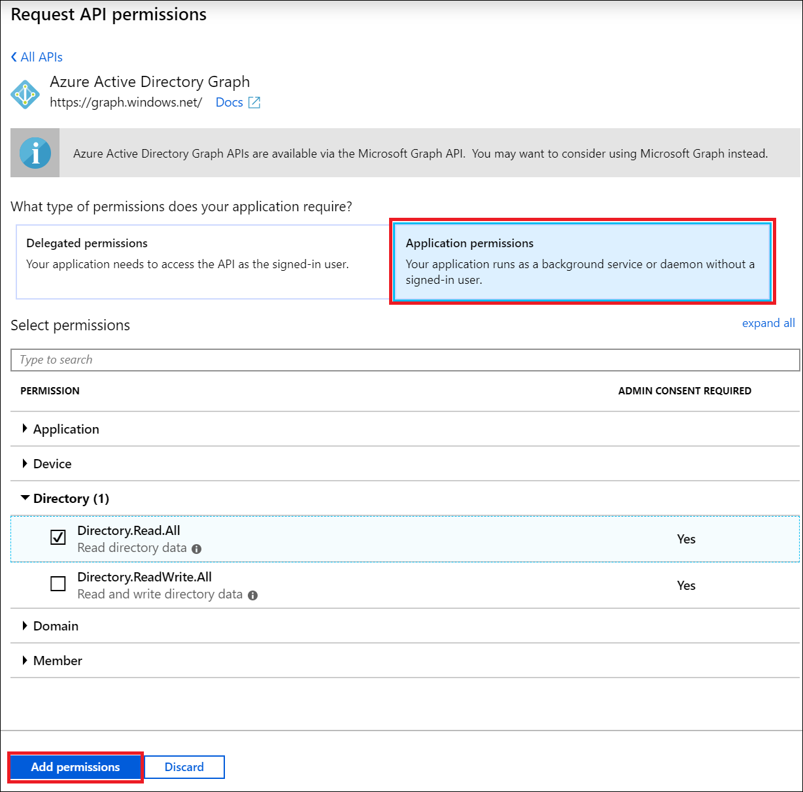

5. On the **Enable Access** page, select **Read directory data** and, deselect **Sign in and read user profile**. 

    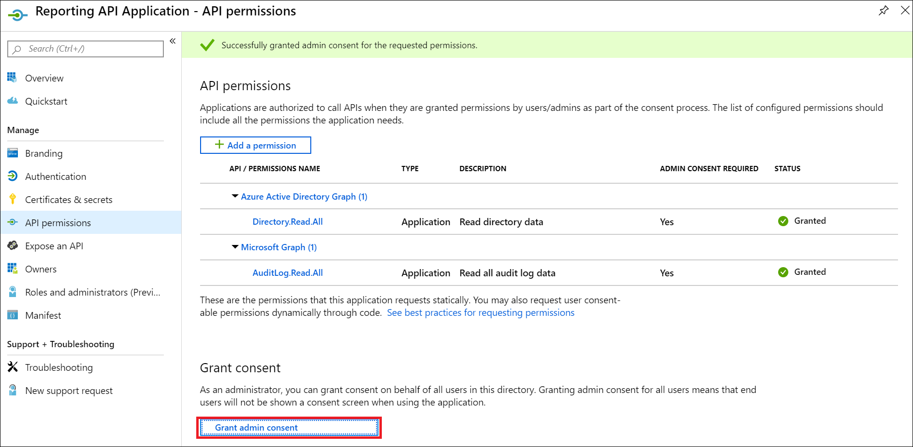

6. In the toolbar on the top, click **Save**.

    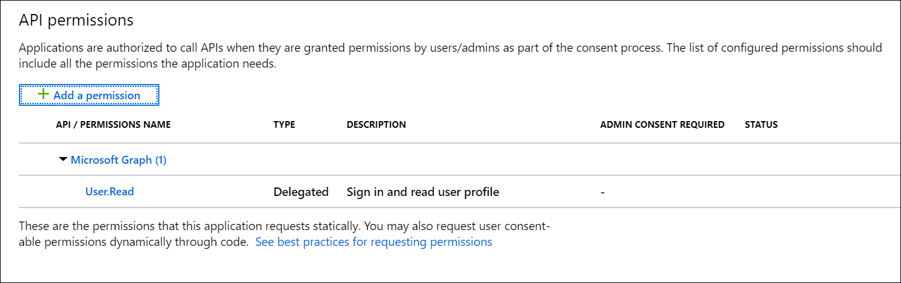

7. On the **Required permissions** page, in the toolbar on the top, click **Add**.

    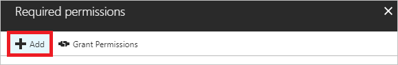

8. On the **Add API access** page, click **Select an API**.

    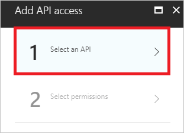

9. On the **Select an API** page, click **Microsoft Graph**, and then click **Select**.

    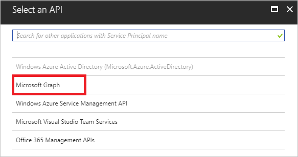

10. On the **Enable Access** page, select **Read all audit log data**, and then click **Select**.  

    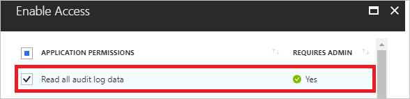

11. On the **Add API access** page, click **Done**.  

12. On the **Required permissions** page, in the toolbar on the top. click **Grant Permissions**, and then click **Yes**.

    

## Gather configuration settings 

This section shows you how to get the following settings from your directory:

- Domain name
- Client ID
- Client secret

You need these values when configuring calls to the reporting API. 

### Get your domain name

**To get your domain name:**

1. In the [Azure portal](https://portal.azure.com), on the left navigation pane, click **Azure Active Directory**.
   
     

2. On the **Azure Active Directory** page, click **Custom domain names**.

    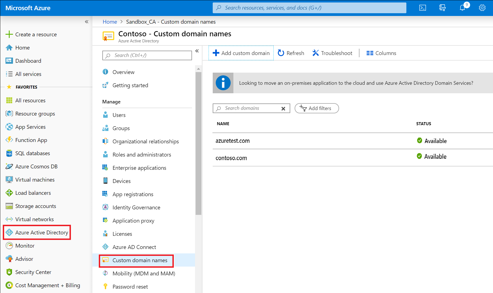 

3. Copy your domain name from the list of domains.

### Get your application's client ID

**To get your application's client ID:**

1. In the [Azure portal](https://portal.azure.com), on the left navigation pane, click **Azure Active Directory**.
   
     

2. On the **App registrations** page, in the apps list, click **Reporting API application**.

3. On the **Reporting API application** page, at the **Application ID**, click **Click to copy**.

    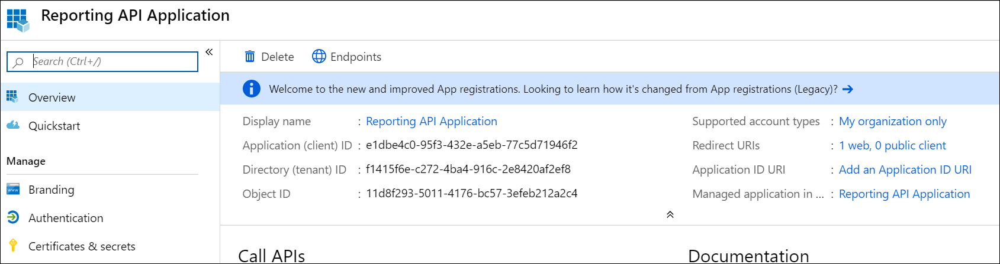 

### Get your application's client secret
To get your application's client secret, you need to create a new key and save its value upon saving the new key because it is not possible to retrieve this value later anymore.

**To get your application's client secret:**

1. In the [Azure portal](https://portal.azure.com), on the left navigation pane, click **Azure Active Directory**.
   
     

2. On the **App registrations** page, in the apps list, click **Reporting API application**.

3. On the **Reporting API application** page, in the toolbar on the top, click **Settings**. 

    

4. On the **Settings** page, in the **APIR Access** section, click **Keys**. 

    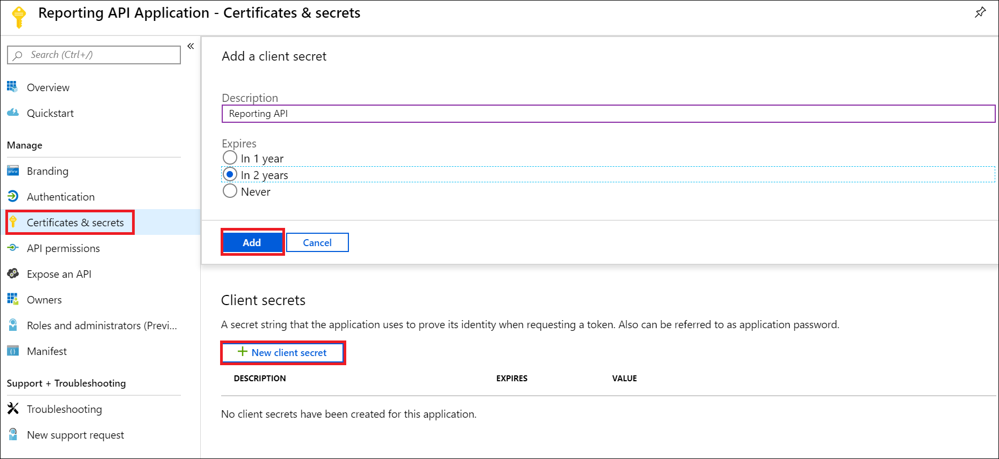

5. On the **Keys** page, perform the following steps:

    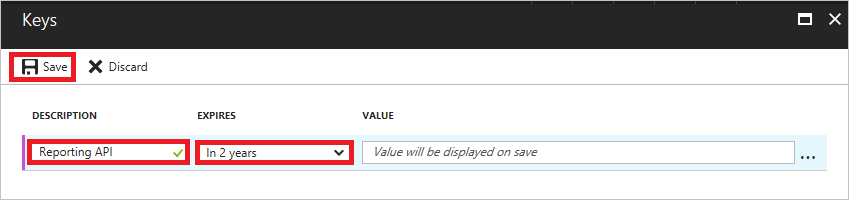

    a. In the **Description** textbox, type `Reporting API`.

    b. As **Expires**, select **In 2 years**.

    c. Click **Save**.

    d. Copy the key value.

## Next steps

* [Get data using the Azure Active Directory reporting API with certificates](tutorial-access-api-with-certificates.md)
* [Get a first impression of the reporting APIs](concept-reporting-api.md)
* [Audit API reference](https://developer.microsoft.com/graph/docs/api-reference/beta/resources/directoryaudit) 
* [Sign-in activity report API reference](https://developer.microsoft.com/graph/docs/api-reference/beta/resources/signin)
