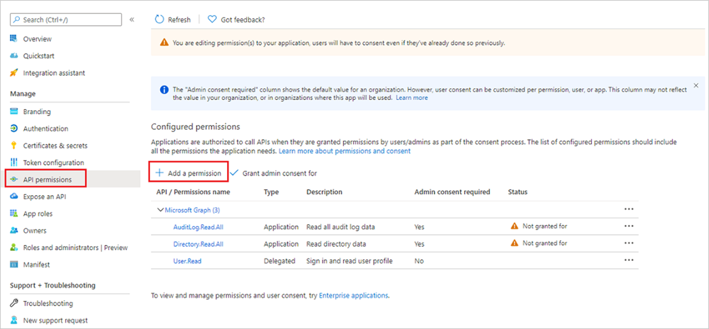
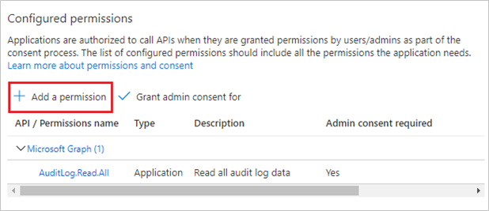
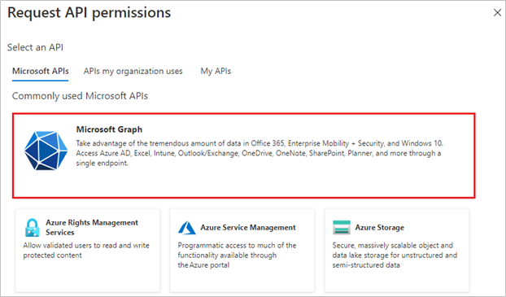
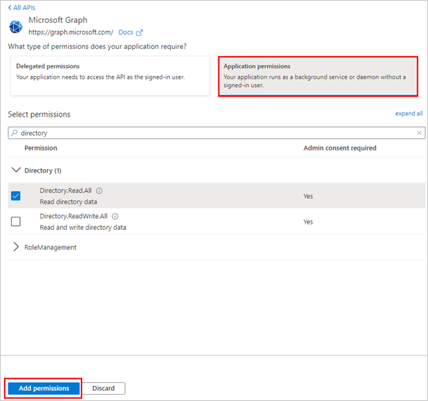
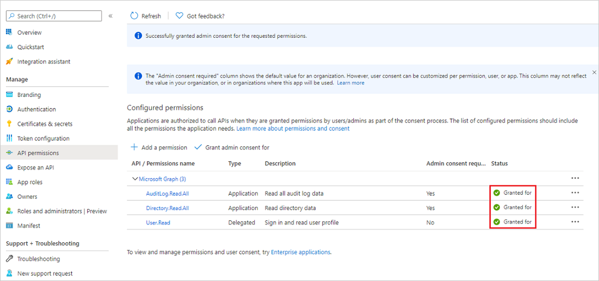
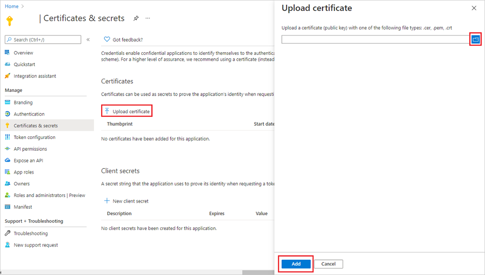

# Prerequisites to access the Azure Active Directory reporting API

The [Azure Active Directory (Azure AD) reporting APIs](./concept-reporting-api.md) provide you with programmatic access to the data through a set of REST-based APIs. You can call these APIs from many programming languages and tools. The reporting API uses [OAuth](../../api-management/api-management-howto-protect-backend-with-aad.md) to authorize access to the web APIs.

To prepare your access to the reporting API, you'll need to have the appropriate role and license requirements. Then you'll register an application, grant permissions, and gather your configuration settings.

## Roles and license requirements

To get access to the reporting data through the API, you need to have one of the following roles:

- Security Reader
- Security Administrator
- Global Administrator

In order to access the sign-in reports for a tenant, an Azure AD tenant must have associated Azure AD Premium license. Azure AD Premium P1 (or above) license is required  to access sign-in reports for any Azure AD tenant. Alternatively if the directory type is Azure AD B2C, the sign-in reports are accessible through the API without any additional license requirement. 

## Register an application

Registration is needed even if you're accessing the reporting API using a script. The registration gives you an **Application ID**, which is required for the authorization calls and enables your code to receive tokens.

To configure your directory to access the Azure AD reporting API, you must sign in to the [Azure portal](https://portal.azure.com) in one of the roles defined above.

> [!IMPORTANT]
> Applications running under credentials with administrator privileges can be very powerful, so be sure to keep the application's ID and secret credentials in a secure location.
> 

**To register an Azure AD application:**

1. In the [Azure portal](https://portal.azure.com), go to **Azure Active Directory** > **App registrations**.

     

1. Select **New registration**.

    

1. On the **Registration an Application** page:
    1. Give the application a **Name** such as `Reporting API application`.
    1. For **Supported accounts type**, select **Accounts in this organizational directory only**.
    1. In the **Redirect URI** section, select **Web** from the list and type `https://localhost`.
    1. Select **Register**.

    

## Grant permissions 

To access the Azure AD reporting API, you must grant your app *Read directory data* and *Read all audit log data* permissions for the Microsoft Graph API.

**To grant your application permissions to use the APIs:**

1. Go to **API permissions** and select **Add a permission**.

    

1. On the **Request API permissions page** page, select the **Microsoft Graph** tile then select **Application Permissions**.

    

1. Search for and select **Directory**, then select **Directory.ReadAll**.
1. Search for and select **AuditLog**, then select **AuditLog.Read.All**.
1. Select the **Add permissions** button.

    

1. On the **Reporting API Application - API Permissions** page, select **Grant admin consent**.

    

## Gather configuration settings 

This section shows you how to gather the following settings from your directory:

- Domain name
- Client ID
- Client secret or certificate

You need these values when configuring calls to the reporting API. We recommend using a certificate because it's more secure.

### Get your domain name

1. Go to **Azure Active Directory** > **Custom domain names**.
1. Copy your domain name from the list of domains.

### Get your application's client ID

1. Go to **Azure Active Directory** > **App Registrations**.
1. Locate the **Application ID** and select **Click to copy**.

     

### Get your application's client secret

1. Go to **Azure Active Directory** and select your application from the **App Registrations** page.
1. Select **Certificates and Secrets** on the **API Application** page.
1. From the **Client Secrets** section, select **+ New Client Secret**. 

    

1. On the **Add a client secret** page:
    1. Give the secret a **Description** such as `Reporting API`.
    1. Set the secret's expiration, such as 24 months.
    1. Select **Save**.
    1. Copy the key value.

### Upload the certificate of your application

If you don't have a certificate to upload, follow the steps outline in the [Create a self-signed certificate to authenticate your application](../develop/howto-create-self-signed-certificate.md) article.

1. Go **Azure Active Directory** > **App Registration**.
1. Select your application
4. Select **Certificates & secrets** > **Upload certificate**.
6. Select the file icon, go to a certificate, and then select **Add**.

    

## Troubleshoot errors in the reporting API

This section lists the common error messages you may run into while accessing activity reports using the Microsoft Graph API and steps for their resolution.

### Error: Failed to get user roles from Microsoft Graph

 Sign into your account using both sign-in buttons in the Graph Explorer UI to avoid getting an error when trying to sign in using Graph Explorer. 

### Error: Failed to do premium license check from Microsoft Graph 

If you run into this error message while trying to access sign-ins using Graph Explorer, choose **Modify Permissions** underneath your account on the left nav, and select **Tasks.ReadWrite** and **Directory.Read.All**. 

### Error: Tenant isn't B2C or tenant doesn't have premium license

Accessing sign-in reports requires an Azure Active Directory premium 1 (P1) license. If you see this error message while accessing sign-ins, make sure that your tenant is licensed with an Azure AD P1 license.

### Error: The allowed roles doesn't include User. 

 Avoid errors trying to access audit logs or sign-in using the API. Make sure your account is part of the **Security Reader** or **Reports Reader** role in your Azure Active Directory tenant.

### Error: Application missing Azure AD 'Read directory data' permission 

### Error: Application missing Microsoft Graph API 'Read all audit log data' permission

Follow the steps in the [Prerequisites to access the Azure Active Directory reporting API](howto-configure-prerequisites-for-reporting-api.md) to ensure your application is running with the right set of permissions. 

## Next steps

* [Get data using the Azure Active Directory reporting API with certificates](tutorial-access-api-with-certificates.md)
* [Audit API reference](/graph/api/resources/directoryaudit) 
* [Sign-in activity report API reference](/graph/api/resources/signin)
