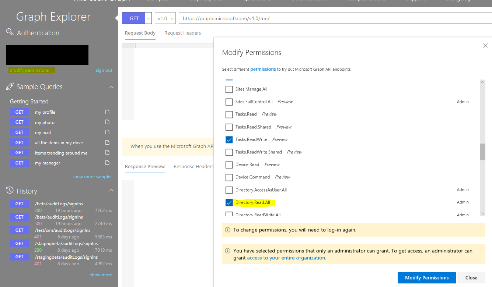

# Prerequisites to access the Azure Active Directory reporting API

The [Azure Active Directory (Azure AD) reporting APIs](https://docs.microsoft.com/azure/active-directory/reports-monitoring/concept-reporting-api) provide you with programmatic access to the data through a set of REST-based APIs. You can call these APIs from of programming languages and tools.

The reporting API uses [OAuth](https://docs.microsoft.com/azure/api-management/api-management-howto-protect-backend-with-aad) to authorize access to the web APIs.

To prepare your access to the reporting API, you need to:

1. [Assign roles](#assign-roles)
2. [License Requirements](#license-requirements)
3. [Register an application](#register-an-application)
4. [Grant permissions](#grant-permissions)
5. [Gather configuration settings](#gather-configuration-settings)

## Assign roles

To get access to the reporting data through the API, you need to have one of the following roles assigned:

- Security Reader

- Security Administrator

- Global Administrator

## License Requirements

In order to access the sign-in reports for a tenant, an Azure AD tenant must have associated Azure AD Premium license. Azure AD Premium P1 (or above) license is required  to access sign-in reports for any Azure AD tenant. Alternatively if the directory type is Azure AD B2C , the sign-in reports are accessible through the API without any additional license requirement. 

## Register an application

Registration is needed even if you're accessing the reporting API using a script. The registration gives you an **Application ID**, which is required for the authorization calls and enables your code to receive tokens.

To configure your directory to access the Azure AD reporting API, you must sign in to the [Azure portal](https://portal.azure.com) with an Azure administrator account that is also a member of the **Global Administrator** directory role in your Azure AD tenant.

> [!IMPORTANT]
> Applications running under credentials with administrator privileges can be very powerful, so please be sure to keep the application's ID and secret credentials in a secure location.
> 

**To register an Azure AD application:**

1. In the [Azure portal](https://portal.azure.com), select **Azure Active Directory** from the left navigation pane.
   
     

2. In the **Azure Active Directory** page, select **App registrations**.

     

3. From the **App registrations** page, select **New registration**.

    

4. The **Registration an Application** page:

    

    a. In the **Name** textbox, type `Reporting API application`.

    b. For **Supported accounts type**, select **Accounts in this organizational only**.

    c. In the **Redirect URL**  select **Web** textbox, type `https://localhost`.

    d. Select **Register**. 

## Grant permissions 

Depending on API you want to access, you need to grant your app the following permissions:  

| API | Permission |
| --- | --- |
| Windows Azure Active Directory | Read directory data |
| Microsoft Graph | Read all audit log data |

The following section lists the steps for both APIs. If you don't want to access one of the APIs, you can skip the related steps.

**To grant your application permissions to use the APIs:**

1. Select **API permissions** then **Add a permission**. 

    

2. On the **Request API permissions page**, locate **Support legacy API** **Azure Active Directory Graph**. 

    

3. On the **Required permissions** page, select **Application Permissions**, expand **Directory** checkbox **Directory.ReadAll**.  Select **Add permissions**.

    

4. On the **Reporting API Application - API Permissions** page, select **Grant admin consent**. 

    

5. Note: **Microsoft Graph** is added by default during API Registration.

    

## Gather configuration settings 

This section shows you how to get the following settings from your directory:

- Domain name
- Client ID
- Client secret

You need these values when configuring calls to the reporting API. 

### Get your domain name

**To get your domain name:**

1. In the [Azure portal](https://portal.azure.com), on the left navigation pane, select **Azure Active Directory**.
   
     

2. On the **Azure Active Directory** page, select **Custom domain names**.

     

3. Copy your domain name from the list of domains.

### Get your application's client ID

**To get your application's client ID:**

1. In the [Azure portal](https://portal.azure.com), on the left navigation pane, click **Azure Active Directory**.
   
     

2. Select your application from the **App Registrations** page.

3. From the application page, navigate to **Application ID** and select **Click to copy**.

     

### Get your application's client secret
 Avoid errors trying to access audit logs or sign-in using the API.

**To get your application's client secret:**

1. In the [Azure portal](https://portal.azure.com), on the left navigation pane, click **Azure Active Directory**.
   
     

2.  Select your application from the **App Registrations** page.

3.  Select **Certificates and Secrets** on the **API Application** page, in the **Client Secrets** section, click **+ New Client Secret**. 

    

5. On the **Add a client secret** page, add:

    a. In the **Description** textbox, type `Reporting API`.

    b. As **Expires**, select **In 2 years**.

    c. Click **Save**.

    d. Copy the key value.

## Troubleshoot errors in the reporting API

This section lists the common error messages you may run into while accessing activity reports using the Microsoft Graph API and steps for their resolution.

### Error: Failed to get user roles from Microsoft Graph

 Sign into your account using both sign-in buttons in the Graph Explorer UI to avoid getting an error when trying to sign in using Graph Explorer. 

### Error: Failed to do premium license check from Microsoft Graph 

If you run into this error message while trying to access sign-ins using Graph Explorer, choose **Modify Permissions** underneath your account on the left nav, and select **Tasks.ReadWrite** and **Directory.Read.All**. 

### Error: Tenant is not B2C or tenant doesn't have premium license

Accessing sign-in reports requires an Azure Active Directory premium 1 (P1) license. If you see this error message while accessing sign-ins, make sure that your tenant is licensed with an Azure AD P1 license.

### Error: The allowed roles does not include User. 

 Avoid errors trying to access audit logs or sign-in using the API. Make sure your account is part of the **Security Reader** or **Report Reader** role in your Azure Active Directory tenant.

### Error: Application missing AAD 'Read directory data' permission 

### Error: Application missing Microsoft Graph API 'Read all audit log data' permission

Follow the steps in the [Prerequisites to access the Azure Active Directory reporting API](howto-configure-prerequisites-for-reporting-api.md) to ensure your application is running with the right set of permissions. 

## Next steps

* [Get data using the Azure Active Directory reporting API with certificates](tutorial-access-api-with-certificates.md)
* [Audit API reference](https://developer.microsoft.com/graph/docs/api-reference/beta/resources/directoryaudit) 
* [Sign-in activity report API reference](https://developer.microsoft.com/graph/docs/api-reference/beta/resources/signin)
