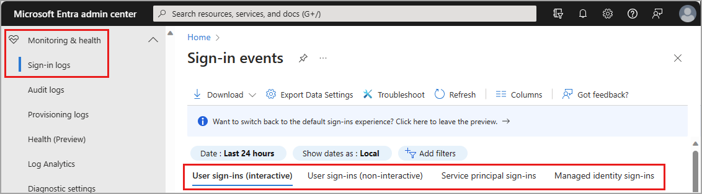
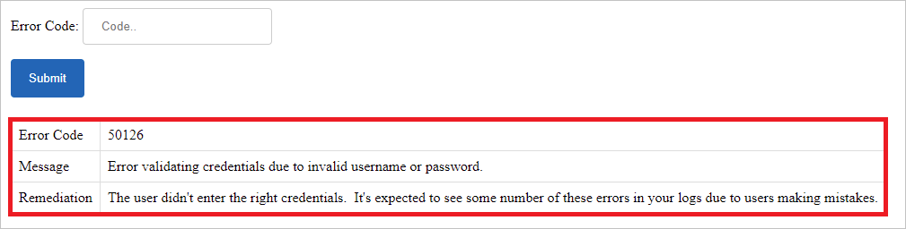

# How to customize and analyze the sign-in logs

Sign-in logs are a commonly used tool to troubleshoot user access issues and investigate risky sign-in activity. There are over 30 columns you can choose from to customize your view of the sign-in logs in the Azure Active Directory portal. This article shows you how to customize the columns and then filter the logs to find the information you need more efficiently.

## Prerequisites

To access the sign-ins log for a tenant, you must have one of the following roles:

- Reports Reader
- Security Reader
- Global Reader
- Security Administrator
- Global Administrator

To see Conditional Access data in the sign-ins log, you must also have one of the following roles:

- Company Administrator
- Global Reader
- Security Administrator
- Security Reader
- Conditional Access Administrator

The sign-in activity report is available in [all editions of Azure AD](reference-reports-data-retention.md#how-long-does-azure-ad-store-the-data). If you have an Azure Active Directory P1 or P2 license, you can access the sign-in activity report through the Microsoft Graph API. Logs may take a couple of days to appear in Microsoft Graph after you upgrade to a premium license.

## How to access the sign-in logs

You can always access your own sign-in history at [https://mysignins.microsoft.com](https://mysignins.microsoft.com). You can also access the sign-in logs from **Users** and **Enterprise applications** in Azure AD.

[!INCLUDE [portal updates](~/articles/active-directory/includes/portal-update.md)]

**To access the Azure AD sign-ins log:**

1. Sign in to the [Azure portal](https://portal.azure.com) using the appropriate least privileged role.
1. Go to **Azure Active Directory** > **Sign-in logs**.

    

On the sign-in logs page, you can switch between the following sign-in log types. For more information on the the logs, see [What are Azure AD sign-in logs?](concept-sign-ins.md).

- **Interactive user sign-ins:** Sign-ins where a user provides an authentication factor, such as a password, a response through an MFA app, a biometric factor, or a QR code.

- **Non-interactive user sign-ins:** Sign-ins performed by a client on behalf of a user. These sign-ins don't require any interaction or authentication factor from the user. For example, authentication and authorization using refresh and access tokens that don't require a user to enter credentials.

- **Service principal sign-ins:** Sign-ins by apps and service principals that don't involve any user. In these sign-ins, the app or service provides a credential on its own behalf to authenticate or access resources.

- **Managed identities for Azure resources sign-ins:** Sign-ins by Azure resources that have secrets managed by Azure. For more information, see [What are managed identities for Azure resources?](../managed-identities-azure-resources/overview.md).

## Customize the layout of the sign-in logs

To more effectively view the sign-ins log, spend a few moments customizing the view for your needs. You can only customize the column for the interactive user sign-in log. The sign-ins log has a default view, but you can customize the view using over 30 column options.

1. Select **Columns** from the menu at the top of the log.
1. Select the columns you want to view and select the **Save** button at the bottom of the window.

## Filter the sign-in logs <h3 id="filter-sign-in-activities"></h3>

Filtering the sign-in logs is a helpful way to quickly find logs that match a specific scenario. For example, you could filter the list to only view sign-ins that occurred in a specific geographic location, from a specific operating system, or from a specific type of credential.

Some filter options prompt you to select more options. Follow the prompts to make the selection you need for the filter. You can add multiple filters. 

Select the **Add filters** option from the top of the table to get started.

Once you apply a filter, you may to either enter a specific detail - such as a Request ID - or select another filter option. 

You can filter on several details. The following table describes some commonly used filters. Not all filter options are described. Special considerations on some filters are provided after the table.

| Filter | Description |
| --- | --- |
| Request ID | Unique identifier for a sign-in request |
| Correlation ID | Unique identifier for all sign-in requests that are part of a single sign-in attempt |
| User | The *user principal name* (UPN) of the user |
| Application | The application targeted by the sign-in request |
| Status | Options are *Success*, *Failure*, and *Interrupted* |
| Resource | The name of the service used for the sign-in |
| IP address | The IP address of the client used for the sign-in |
| Conditional Access | Options are *Not applied*, *Success*, and *Failure* |

### Considerations for sign-in log filters

- **IP address and location:** There's no definitive connection between an IP address and where the computer with that address is physically located. Mobile providers and VPNs issue IP addresses from central pools that are often far from where the client device is actually used. Currently, converting IP address to a physical location is a best effort based on traces, registry data, reverse lookups and other information.

- **Conditional Access:** 
    - *Not applied:* No policy applied to the user and application during sign-in.
    - *Success:* One or more Conditional Access policies applied to or were evaluated for the user and application (but not necessarily the other conditions) during sign-in. Even though a Conditional Access policy might not apply, if it was evaluated, the Conditional Access status will show 'Success'.
    - *Failure:* The sign-in satisfied the user and application condition of at least one Conditional Access policy and grant controls are either not satisfied or set to block access. 

- **Home tenant name:** Due to privacy commitments, Azure AD does not populate the home tenant name field in the case of a cross-tenant scenario.

- **Multifactor authentication:** When a user signs in with MFA, several separate MFA events are actually taking place. For example, if a user enters the wrong validation code or doesn't respond in time, additional MFA events are sent to reflect the latest status of the sign-in attempt. These sign-in events appear as one line item in the Azure AD sign-in logs. That same sign-in event in Azure Monitor, however, appears as multiple line items. These events all have the same `correlationId`.

## Analyze the sign-in logs

Now that your sign-in logs table is formatted for your needs, you can more effectively analyze the data. Some common scenarios are described here, but they aren't the only ways to analyze sign-in data. Further analysis and retention of sign-in data can be accomplished by exporting the logs to other tools. 

### Sign-in error codes

If a sign-in failed, you can get more information about the reason in the **Basic info** section of the related log item. The error code and associated failure reason appear in the details. Because of the complexity of some Azure AD environments, we can't document every possible error code and resolution. Some errors may require [submitting a support request](../fundamentals/how-to-get-support.md) to resolve the issue.

For a list of error codes related to Azure AD authentication and authorization, see the [Azure AD authentication and authorization error codes](../develop/reference-error-codes.md) article. In some cases, the [sign-in error lookup tool](https://login.microsoftonline.com/error) may provide remediation steps. Enter the **Error code** provided in the sign-in log details into the tool and select the **Submit** button. 

### Authentication details

The **Authentication Details** tab in the details of a sign-in log provides the following information for each authentication attempt:

- A list of authentication policies applied, such as Conditional Access or Security Defaults.
- A list of session lifetime policies applied, such as Sign-in frequency or Remember MFA.
- The sequence of authentication methods used to sign-in.
- If the authentication attempt was successful and the reason why.

This information allows you to troubleshoot each step in a user’s sign-in. Use these details to track:

- The volume of sign-ins protected by MFA. 
- The reason for the authentication prompt, based on the session lifetime policies.
- Usage and success rates for each authentication method.
- Usage of passwordless authentication methods, such as Passwordless Phone Sign-in, FIDO2, and Windows Hello for Business.
- How frequently authentication requirements are satisfied by token claims, such as when users aren't interactively prompted to enter a password or enter an SMS OTP.

While viewing the sign-ins log, select a sign-in event, and then select the **Authentication Details** tab.

When analyzing authentication details, take note of the following details:

- **OATH verification code** is logged as the authentication method for both OATH hardware and software tokens (such as the Microsoft Authenticator app).
- The **Authentication details** tab can initially show incomplete or inaccurate data until log information is fully aggregated. Known examples include: 
    - A **satisfied by claim in the token** message is incorrectly displayed when sign-in events are initially logged. 
    - The **Primary authentication** row isn't initially logged.
- If you're unsure of a detail in the logs, gather the **Request ID** and **Correlation ID** to use for further analyzing or troubleshooting.

## Next steps

- [Troubleshoot sign-in errors](howto-troubleshoot-sign-in-errors.md)