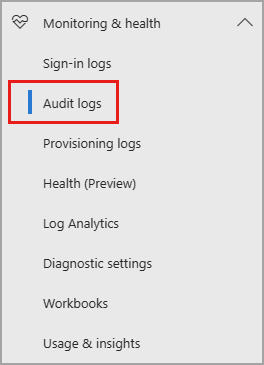
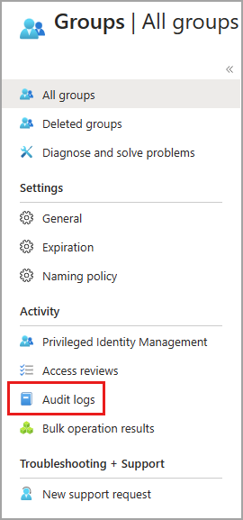
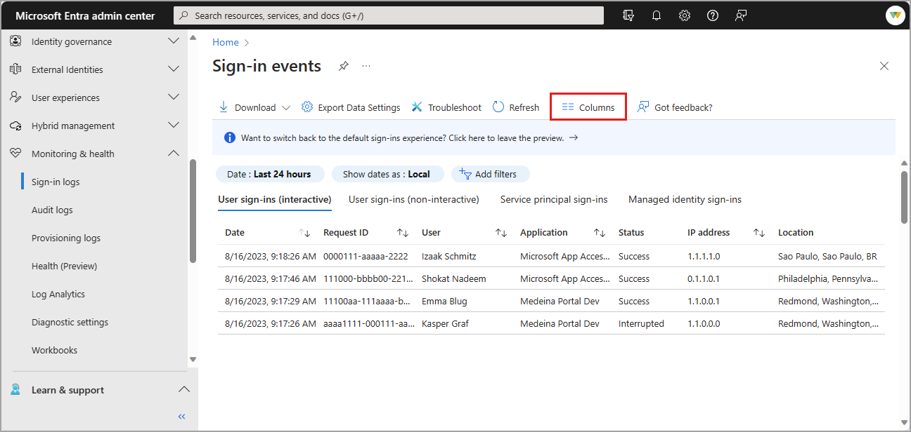
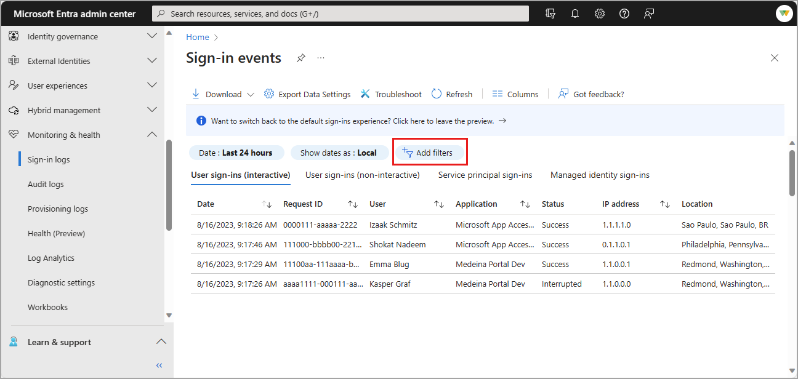
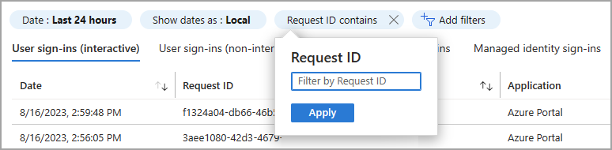
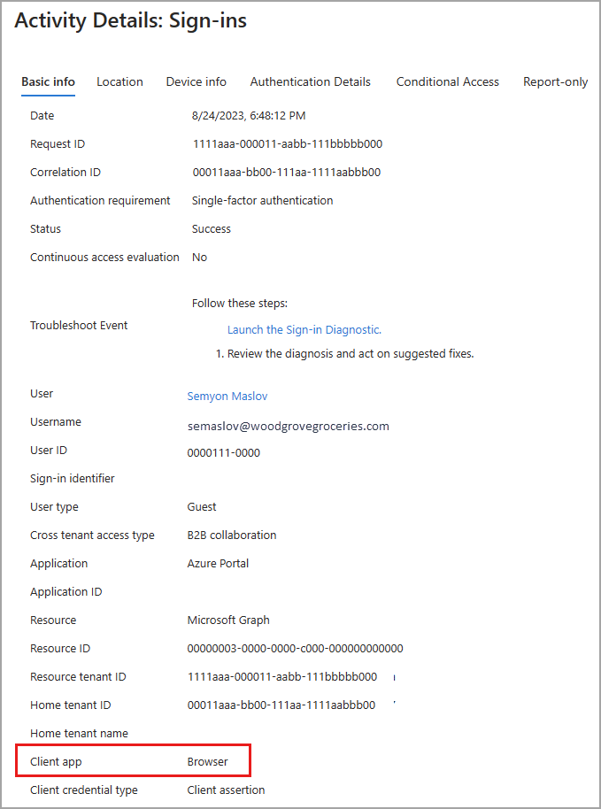
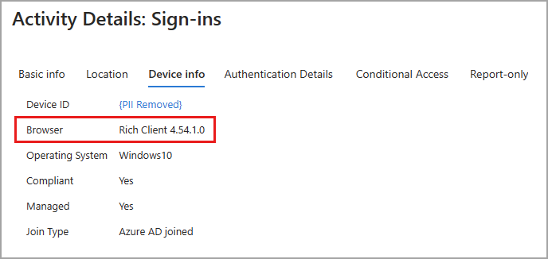

# How to customize and filter identity activity logs

Sign-in logs are a commonly used tool to troubleshoot user access issues and investigate risky sign-in activity. Audit logs collect every logged event in Azure Active Directory (Azure AD) and can be used to investigate changes to your environment. There are over 30 columns you can choose from to customize your view of the sign-in logs in the Azure AD portal. Audit logs and Provisioning logs can also be customized and filtered for your needs.

This article shows you how to customize the columns and then filter the logs to find the information you need more efficiently.

## Prerequisites

The required roles and licenses may vary based on the report. Global Administrators can access all reports, but we recommend using a role with least privilege access to align with the [Zero Trust guidance](/security/zero-trust/zero-trust-overview).

| Log / Report | Roles | Licenses |
|--|--|--|
| Audit | Report Reader Security Reader Security Administrator Global Reader | All editions of Azure AD |
| Sign-ins | Report Reader Security Reader Security Administrator Global Reader | All editions of Azure AD |
| Provisioning | Same as audit and sign-ins, plus Security Operator Application Administrator Cloud App Administrator A custom role with `provisioningLogs` permission | Premium P1/P2 |
| Conditional Access data in the sign-in logs | Company Administrator Global Reader Security Administrator Security Reader Conditional Access Administrator | Premium P1/P2 |

## How to access the activity logs in the Azure portal

You can always access your own sign-in history at [https://mysignins.microsoft.com](https://mysignins.microsoft.com). You can also access the sign-in logs from **Users** and **Enterprise applications** in Azure AD.

[!INCLUDE [portal updates](~/articles/active-directory/includes/portal-update.md)]

1. Sign in to the [Microsoft Entra admin center](https://entra.microsoft.com) as at least a [Reports Reader](../roles/permissions-reference.md#reports-reader).
1. Browse to **Identity** > **Monitoring & health** > **Audit logs**/**Sign-in logs**/**Provisioning logs**.

## Audit logs

With the information in the Azure AD audit logs, you can access all records of system activities for compliance purposes. Audit logs can be accessed from the **Monitoring and health** section of Azure AD, where you can sort and filter on every category and activity. You can also access audit logs in the area of the portal for the service you're investigating.

For example, if you're looking into changes to Azure AD groups, you can access the Audit logs from **Azure AD** > **Groups**. When you access the audit logs from the service, the filter is automatically adjusted according to the service.

### Customize the layout of the audit logs

Audit logs can be customized like the sign-in logs. There aren't as many column options, but it's as important to make sure you're seeing the columns you need. The **Service**, **Category** and **Activity** columns are related to each other, so these columns should always be visible. 

### Filter the audit logs

When you filter the logs by **Service**, the **Category** and **Activity** details automatically change. In some cases, there may only be one Category or Activity. For a detailed table of all potential combinations of these details, see [Audit activities](reference-audit-activities.md).

:::image type="content" source="media/howto-customize-filter-logs/audit-log-activities-filter.png" alt-text="Screenshot of the audit log activities filter with Conditional Access as the service." lightbox="media/howto-customize-filter-logs/audit-log-activities-filter-expanded.png":::

## Sign-in logs

On the sign-in logs page, you can switch between four sign-in log types. For more information on the logs, see [What are Azure AD sign-in logs?](concept-sign-ins.md).

:::image type="content" source="media/howto-customize-filter-logs/sign-in-logs-types.png" alt-text="Screenshot of the sign-in log types." lightbox="media/howto-customize-filter-logs/sign-in-logs-types-expanded.png":::

- **Interactive user sign-ins:** Sign-ins where a user provides an authentication factor, such as a password, a response through an MFA app, a biometric factor, or a QR code.

- **Non-interactive user sign-ins:** Sign-ins performed by a client on behalf of a user. These sign-ins don't require any interaction or authentication factor from the user. For example, authentication and authorization using refresh and access tokens that don't require a user to enter credentials.

- **Service principal sign-ins:** Sign-ins by apps and service principals that don't involve any user. In these sign-ins, the app or service provides a credential on its own behalf to authenticate or access resources.

- **Managed identities for Azure resources sign-ins:** Sign-ins by Azure resources that have secrets managed by Azure. For more information, see [What are managed identities for Azure resources?](../managed-identities-azure-resources/overview.md).

### Customize the layout of the sign-in logs

To more effectively view the sign-ins log, spend a few moments customizing the view for your needs. You can only customize the column for the interactive user sign-in log. The sign-ins log has a default view, but you can customize the view using over 30 column options.

1. Select **Columns** from the menu at the top of the log.
1. Select the columns you want to view and select the **Save** button at the bottom of the window.

### Filter the sign-in logs <h3 id="filter-sign-in-activities"></h3>

Filtering the sign-in logs is a helpful way to quickly find logs that match a specific scenario. For example, you could filter the list to only view sign-ins that occurred in a specific geographic location, from a specific operating system, or from a specific type of credential.

Some filter options prompt you to select more options. Follow the prompts to make the selection you need for the filter. You can add multiple filters. 

1. Select the **Add filters** button, choose a filter option and select **Apply**.

    

1. Either enter a specific detail - such as a Request ID - or select another filter option. 

    

You can filter on several details. The following table describes some commonly used filters. *Not all filter options are described.*

| Filter | Description |
| --- | --- |
| Request ID | Unique identifier for a sign-in request |
| Correlation ID | Unique identifier for all sign-in requests that are part of a single sign-in attempt |
| User | The *user principal name* (UPN) of the user |
| Application | The application targeted by the sign-in request |
| Status | Options are *Success*, *Failure*, and *Interrupted* |
| Resource | The name of the service used for the sign-in |
| IP address | The IP address of the client used for the sign-in |
| Conditional Access | Options are *Not applied*, *Success*, and *Failure* |

Now that your sign-in logs table is formatted for your needs, you can more effectively analyze the data. Further analysis and retention of sign-in data can be accomplished by exporting the logs to other tools. 

Customizing the columns and adjusting the filter helps to look at logs with similar characteristics. To look at the details of a sign-in, select a row in the table to open the **Activity Details** panel. There are several tabs in the panel to explore. For more information, see [Sign-in log activity details](concept-sign-in-log-activity-details.md).

:::image type="content" source="media/howto-customize-filter-logs/sign-in-activity-details.png" alt-text="Screenshot of the sign-in activity details." lightbox="media/howto-customize-filter-logs/sign-in-activity-details-expanded.png":::

### Client app filter

When reviewing where a sign-in originated, you may need to use the **Client app** filter. Client app has two subcategories: **Modern authentication clients** and **Legacy authentication clients**. Modern authentication clients have two more subcategories: **Browser** and **Mobile apps and desktop clients**. There are several subcategories for Legacy authentication clients, which are defined in the [Legacy authentication client details](#legacy-authentication-client-details) table.

**Browser** sign-ins include all sign-in attempts from web browsers. When viewing the details of a sign-in from a browser, the **Basic info** tab shows **Client app: Browser**.

On the **Device info** tab, **Browser** shows the details of the web browser. The browser type and version are listed, but in some cases, the name of the browser and version is not available. You may see something like **Rich Client 4.0.0.0**. 

#### Legacy authentication client details

The following table provides the details for each of the *Legacy authentication client* options.

|Name|Description|
|---|---|
|Authenticated SMTP|Used by POP and IMAP clients to send email messages.|
|Autodiscover|Used by Outlook and EAS clients to find and connect to mailboxes in Exchange Online.|
|Exchange ActiveSync|This filter shows all sign-in attempts where the EAS protocol has been attempted.|
|Exchange ActiveSync| Shows all sign-in attempts from users with client apps using Exchange ActiveSync to connect to Exchange Online|
|Exchange Online PowerShell|Used to connect to Exchange Online with remote PowerShell. If you block basic authentication for Exchange Online PowerShell, you need to use the Exchange Online PowerShell module to connect. For instructions, see [Connect to Exchange Online PowerShell using multi-factor authentication](/powershell/exchange/exchange-online/connect-to-exchange-online-powershell/mfa-connect-to-exchange-online-powershell).|
|Exchange Web Services|A programming interface that's used by Outlook, Outlook for Mac, and third-party apps.|
|IMAP4|A legacy mail client using IMAP to retrieve email.|
|MAPI over HTTP|Used by Outlook 2010 and later.|
|Offline Address Book|A copy of address list collections that are downloaded and used by Outlook.|
|Outlook Anywhere (RPC over HTTP)|Used by Outlook 2016 and earlier.|
|Outlook Service|Used by the Mail and Calendar app for Windows 10.|
|POP3|A legacy mail client using POP3 to retrieve email.|
|Reporting Web Services|Used to retrieve report data in Exchange Online.|
|Other clients|Shows all sign-in attempts from users where the client app isn't included or unknown.|

## Next steps

- [Analyze a sing-in error](quickstart-analyze-sign-in.md)
- [Troubleshoot sign-in errors](howto-troubleshoot-sign-in-errors.md)
- [Explore all audit log categories and activities](reference-audit-activities.md)
