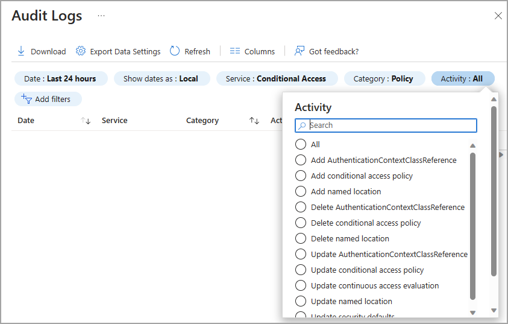

# How to customize and filter identity activity logs

Sign-in logs are a commonly used tool to troubleshoot user access issues and investigate risky sign-in activity. Audit logs collect every logged event in Azure Active Directory (Azure AD) and can be used to investigate changes to your environment. There are over 30 columns you can choose from to customize your view of the sign-in logs in the Azure AD portal. Audit logs and Provisioning logs can also be customized and filtered for your needs.

This article shows you how to customize the columns and then filter the logs to find the information you need more efficiently.

## Prerequisites

The required roles and licenses may vary based on the report. Global Administrators can access all reports, but we recommend using a role with least privilege access to align with the [Zero Trust guidance](/security/zero-trust/zero-trust-overview).

| Log / Report | Roles | Licenses |
|--|--|--|
| Audit | Report Reader Security Reader Security Administrator Global Reader | All editions of Azure AD |
| Sign-ins | Report Reader Security Reader Security Administrator Global Reader | All editions of Azure AD |
| Provisioning | Same as audit and sign-ins, plus Security Operator Application Administrator Cloud App Administrator A custom role with `provisioningLogs` permission | Premium P1/P2 |
| Conditional Access data in the sign-in logs | Company Administrator Global Reader Security Administrator Security Reader Conditional Access Administrator | Premium P1/P2 |

## How to access the activity logs in the Azure portal

You can always access your own sign-in history at [https://mysignins.microsoft.com](https://mysignins.microsoft.com). You can also access the sign-in logs from **Users** and **Enterprise applications** in Azure AD.

[!INCLUDE [portal updates](~/articles/active-directory/includes/portal-update.md)]

1. Sign in to the [Azure portal](https://portal.azure.com) using the appropriate least privileged role.
1. Go to **Azure Active Directory** > **Monitoring and health**.
1. Select the logs from the side menu.

## Sign-in logs

On the sign-in logs page, you can switch between the following sign-in log types. For more information on the the logs, see [What are Azure AD sign-in logs?](concept-sign-ins.md).

- **Interactive user sign-ins:** Sign-ins where a user provides an authentication factor, such as a password, a response through an MFA app, a biometric factor, or a QR code.

- **Non-interactive user sign-ins:** Sign-ins performed by a client on behalf of a user. These sign-ins don't require any interaction or authentication factor from the user. For example, authentication and authorization using refresh and access tokens that don't require a user to enter credentials.

- **Service principal sign-ins:** Sign-ins by apps and service principals that don't involve any user. In these sign-ins, the app or service provides a credential on its own behalf to authenticate or access resources.

- **Managed identities for Azure resources sign-ins:** Sign-ins by Azure resources that have secrets managed by Azure. For more information, see [What are managed identities for Azure resources?](../managed-identities-azure-resources/overview.md).

### Customize the layout of the sign-in logs

To more effectively view the sign-ins log, spend a few moments customizing the view for your needs. You can only customize the column for the interactive user sign-in log. The sign-ins log has a default view, but you can customize the view using over 30 column options.

1. Select **Columns** from the menu at the top of the log.
1. Select the columns you want to view and select the **Save** button at the bottom of the window.

### Filter the sign-in logs <h3 id="filter-sign-in-activities"></h3>

Filtering the sign-in logs is a helpful way to quickly find logs that match a specific scenario. For example, you could filter the list to only view sign-ins that occurred in a specific geographic location, from a specific operating system, or from a specific type of credential.

Some filter options prompt you to select more options. Follow the prompts to make the selection you need for the filter. You can add multiple filters. 

Select the **Add filters** option from the top of the table to get started.

Once you apply a filter, you may to either enter a specific detail - such as a Request ID - or select another filter option. 

You can filter on several details. The following table describes some commonly used filters. Not all filter options are described. Special considerations on some filters are provided after the table.

| Filter | Description |
| --- | --- |
| Request ID | Unique identifier for a sign-in request |
| Correlation ID | Unique identifier for all sign-in requests that are part of a single sign-in attempt |
| User | The *user principal name* (UPN) of the user |
| Application | The application targeted by the sign-in request |
| Status | Options are *Success*, *Failure*, and *Interrupted* |
| Resource | The name of the service used for the sign-in |
| IP address | The IP address of the client used for the sign-in |
| Conditional Access | Options are *Not applied*, *Success*, and *Failure* |

### Analyze the sign-in logs

Now that your sign-in logs table is formatted for your needs, you can more effectively analyze the data. Some common scenarios are described here, but they aren't the only ways to analyze sign-in data. Further analysis and retention of sign-in data can be accomplished by exporting the logs to other tools. 

Customizing the columns and adjusting the filter helps to look at logs with similar characteristics. Sometimes you need to look at the details of an individual log. Select a log to open the **Activity Details** panel. There are several tabs in the panel to explore. 

:::image type="content" source="media/howto-customize-filter-logs/sign-in-activity-details.png" alt-text="Screenshot of the sign-in activity details." lightbox="media/howto-customize-filter-logs/sign-in-activity-details-expanded.png":::

### Considerations for sign-in logs

- **IP address and location:** There's no definitive connection between an IP address and where the computer with that address is physically located. Mobile providers and VPNs issue IP addresses from central pools that are often far from where the client device is actually used. Currently, converting IP address to a physical location is a best effort based on traces, registry data, reverse lookups and other information.

- **Conditional Access:** 
    - *Not applied:* No policy applied to the user and application during sign-in.
    - *Success:* One or more Conditional Access policies applied to or were evaluated for the user and application (but not necessarily the other conditions) during sign-in. Even though a Conditional Access policy might not apply, if it was evaluated, the Conditional Access status will show 'Success'.
    - *Failure:* The sign-in satisfied the user and application condition of at least one Conditional Access policy and grant controls are either not satisfied or set to block access. 

- **Home tenant name:** Due to privacy commitments, Azure AD does not populate the home tenant name field in the case of a cross-tenant scenario.

- **Multifactor authentication:** When a user signs in with MFA, several separate MFA events are actually taking place. For example, if a user enters the wrong validation code or doesn't respond in time, additional MFA events are sent to reflect the latest status of the sign-in attempt. These sign-in events appear as one line item in the Azure AD sign-in logs. That same sign-in event in Azure Monitor, however, appears as multiple line items. These events all have the same `correlationId`.

## Audit logs

With the information in the Azure AD audit logs, you access all records of system activities for compliance purposes. Audit logs can be accessed from the **Monitoring and health** section where you can sort and filter on every category and activity. You can also access audit logs in the area of the portal for the service you're investigating.

For example, if you're looking into changes to Azure AD groups, you can access the Audit logs from **Azure AD** > **Groups**. When you access the audit logs from the service, the filter is automatically adjusted according to the service.

### Customize the layout of the audit logs

Audit logs can be customized like the sign-in logs. There aren't as many column options, but it's just as important to make sure you're seeing the columns you need. The **Service**, **Category** and **Activity** columns are related to each other, so these should always be visible. 

### Filter the audit logs

When you filter the logs by **Service** the **Category** and **Activity** details automatically change. In some cases, there may only be one Category or Activity. For a detailed table of all potential combinations of these details, see [Audit activities](reference-audit-activities.md).

## Next steps

- [Troubleshoot sign-in errors](howto-troubleshoot-sign-in-errors.md)
- [Explore all audit log categories and activities](reference-audit-activities.md)
