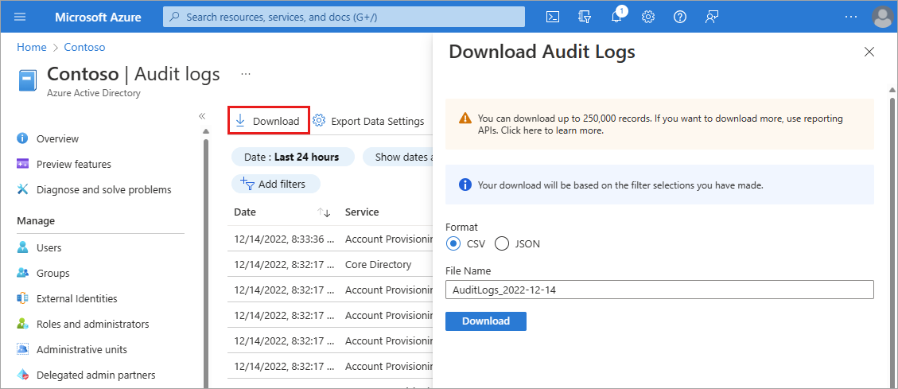
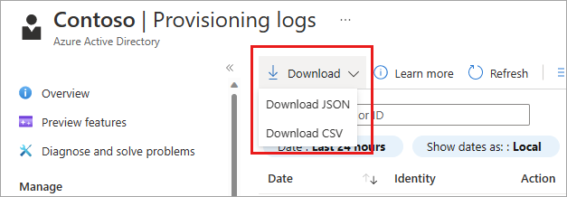
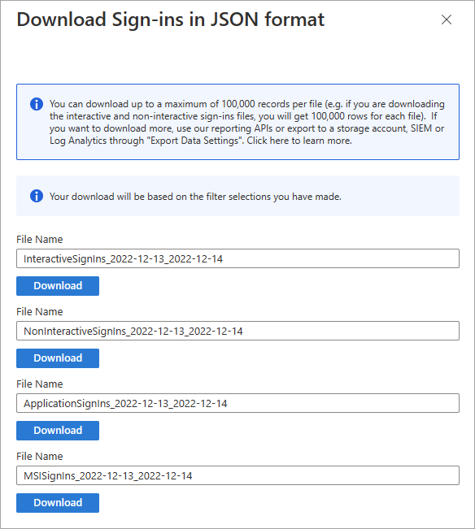

# How to download logs in Microsoft Entra ID

The Microsoft Entra admin center gives you access to three types of activity logs:

- **[Sign-ins](concept-sign-ins.md)**: Information about sign-ins and how your resources are used by your users.
- **[Audit](concept-audit-logs.md)**: Information about changes applied to your tenant such as users and group management or updates applied to your tenant’s resources.
- **[Provisioning](concept-provisioning-logs.md)**: Activities performed by a provisioning service, such as the creation of a group in ServiceNow or a user imported from Workday.

Microsoft Entra ID stores the data in these logs for a limited amount of time. As an IT administrator, you can download your activity logs to have a long-term backup. This article explains how to download activity logs in Microsoft Entra ID. 

## Prerequisites 

The option to download the data of an activity log is available in all editions of Microsoft Entra ID. You can also download activity logs using Microsoft Graph; however, downloading logs programmatically requires a premium license.

The required roles and licenses may vary based on the report. Global Administrators can access all reports, but we recommend using a role with least privilege access to align with the [Zero Trust guidance](/security/zero-trust/zero-trust-overview).

| Log / Report | Roles | Licenses |
|--|--|--|
| Audit | Report Reader Security Reader Security Administrator Global Reader | All editions of Microsoft Entra ID |
| Sign-ins | Report Reader Security Reader Security Administrator Global Reader | All editions of Microsoft Entra ID |
| Provisioning | Same as audit and sign-ins, plus Security Operator Application Administrator Cloud App Administrator A custom role with `provisioningLogs` permission | Premium P1 or P2 |

## Log download details

Microsoft Entra ID stores activity logs for a specific period. For more information, see [How long does Microsoft Entra ID store reporting data?](reference-reports-data-retention.md) By downloading the logs, you can control how long logs are stored. 

- Microsoft Entra ID supports the following formats for your download:
    - **CSV** 
    - **JSON** 
- Timestamps in the downloaded files are based on UTC.
- For large data sets (> 250,000 records), you should use the [reporting API](/graph/api/resources/azure-ad-auditlog-overview) to download the data.

  > [!NOTE]
   > **Issues downloading large data sets**  
   > The Azure portal downloader will time out if you attempt to download large data sets. Generally, data sets smaller than 250,000 records work well with the browser download feature. If you face issues completing large downloads in the browser, you should use the [reporting API](/graph/api/resources/azure-ad-auditlog-overview) to download the data.

## How to download activity logs

You can access the activity logs from the **Monitoring** section of Microsoft Entra ID or from the **Users** page of Microsoft Entra ID. If you view the audit logs from the **Users** page, the filter category is set to **UserManagement**. Similarly, if you view the audit logs from the **Groups** page, the filter category is set to **GroupManagement**. Regardless of how you access the activity logs, your download is based on the filter you've set. 

1. Sign in to the [Microsoft Entra admin center](https://entra.microsoft.com) as at least a [Reports Reader](../roles/permissions-reference.md#reports-reader).
1. Browse to **Identity** > **Monitoring & health** > **Audit logs**/**Sign-in logs**/**Provisioning logs**.
1. Select **Download**.
    - For audit and sign-in logs, a window appears where you select the download format (CSV or JSON).
    - For provisioning logs, you select the download format (CSV of JSON) from the Download button.
    - You can change the File Name of the download.
    - Select the **Download** button.
1. The download processes and sends the file to your default download location. 

The following screenshot shows the download window from the audit and sign-in log download process. 
    

The following screenshot shows menu options for the provisioning log download process.
    

If your tenant has enabled the [sign-in logs preview](concept-all-sign-ins.md), more options are available after selecting **Download**. The sign-in logs preview include interactive and non-interactive user sign-ins, service principal sign-ins, and managed identity sign-ins.
    

## Next steps

- [Integrate Microsoft Entra logs with Azure Monitor](howto-integrate-activity-logs-with-log-analytics.md)
- [Access Microsoft Entra logs using the Graph API](quickstart-access-log-with-graph-api.md)
