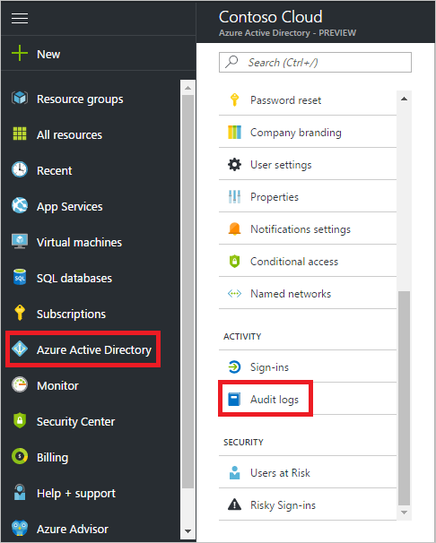
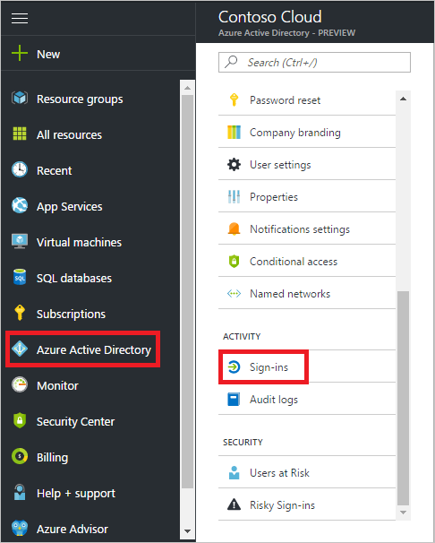
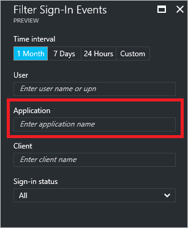
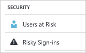

---

title: Find Azure Active Directory user activity reports in Azure portal | Microsoft Docs
description: Learn where the Azure Active Directory user activity reports are in the Azure portal.
services: active-directory
documentationcenter: ''
author: priyamohanram
manager: mtillman
editor: ''

ms.service: active-directory
ms.topic: conceptual
ms.workload: identity
ms.component: report-monitor
ms.date: 12/06/2017
ms.author: priyamo
ms.reviewer: dhanyahk 

---
# Find activity reports in the Azure portal

In this article, we describe how to find Azure Active Directory user activity reports in the Azure portal.

## Activity and integrated app reports

For context-based reporting in the Azure portal, existing reports are merged into a single view. A single, underlying API provides the data to the view.

To see this view, on the **Azure Active Directory** blade, under **ACTIVITY**, select **Audit logs**.

The following reports are consolidated in this view:

* Audit report
* Password reset activity
* Password reset registration activity
* Self-service groups activity
* Office365 Group Name Changes
* Account provisioning activity
* Password rollover status
* Account provisioning errors

The Application Usage report has been enhanced and is included in the **Sign-ins** view. To see this view, on the **Azure Active Directory** blade, under **ACTIVITY**, select **Sign-ins**.

The **Sign-ins** view includes all user sign-ins. You can use this information to get application usage information. You also can view application usage information in the **Enterprise applications** overview, in the **MANAGE** section.

## Access a specific report

Although the Azure portal offers a single view, you also can look at specific reports.

### Audit logs

In response to customer feedback, in the Azure portal, you can use advanced filtering to access the data you want. One filter you can use is an *activity category*, which lists the different types of activity logs in Azure AD. To narrow results to what you are looking for, you can select a category.

For example, if you are interested only in activities related to self-service password resets, you can choose the **Self-service Password Management** category. The categories you see are based on the resource you are working in.  

Activity categories include:

- Core Directory
- Self-service Password Management
- Self-service Group Management
- Account Provisioning

### Application usage

To view details about application usage for all apps or for a single app, under **ACTIVITY**, select **Sign-ins**. To narrow the results, you can filter on user name or application name.

### Security reports

#### Azure AD anomalous activity reports

Azure AD anomalous activity security reports are consolidated to provide you with one central view. This view shows all security-related risk events that Azure AD can detect and report on.

The following table lists the Azure AD anomalous activity security reports, and corresponding risk event types in the Azure portal.

| Azure AD anomalous activity report |  Identity protection risk event type|
| :--- | :--- |
| Users with leaked credentials | Leaked credentials |
| Irregular sign-in activity | Impossible travel to atypical locations |
| Sign-ins from possibly infected devices | Sign-ins from infected devices|
| Sign-ins from unknown sources | Sign-ins from anonymous IP addresses |
| Sign-ins from IP addresses with suspicious activity | Sign-ins from IP addresses with suspicious activity |
| - | Sign-ins from unfamiliar locations |

The following Azure AD anomalous activity security reports are not included as risk events in the Azure portal:

* Sign-ins after multiple failures
* Sign-ins from multiple geographies

For more information, see
[Azure Active Directory risk events](concept-risk-events.md).  

#### Detected risk events

In the Azure portal, you can access reports about detected risk events on the **Azure Active Directory** blade, under **SECURITY**. Detected risk events are tracked in the following reports:   

- Users at Risk
- Risky Sign-ins

For more information about security reports, see:

- [Users at Risk security report in the Azure Active Directory portal](concept-user-at-risk.md)
- [Risky Sign-ins report in the Azure Active Directory portal](concept-risky-sign-ins.md)

To view the **Application Usage** report, on the **Azure Active Directory** blade, under **MANAGE**, select **Enterprise Applications**, and then select **Sign-ins**.

## Next steps

For an overview of reporting, see the [Azure Active Directory reporting](overview-reports.md).
