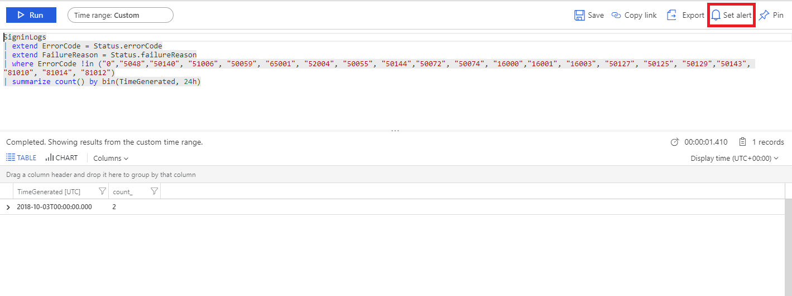
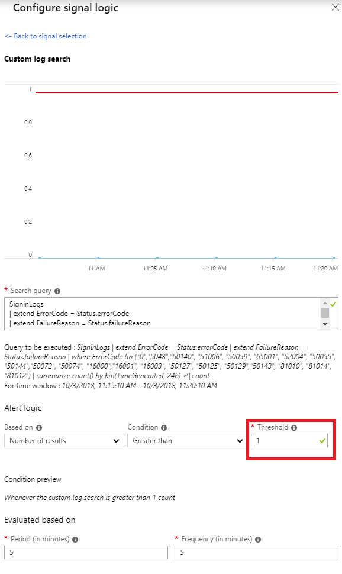
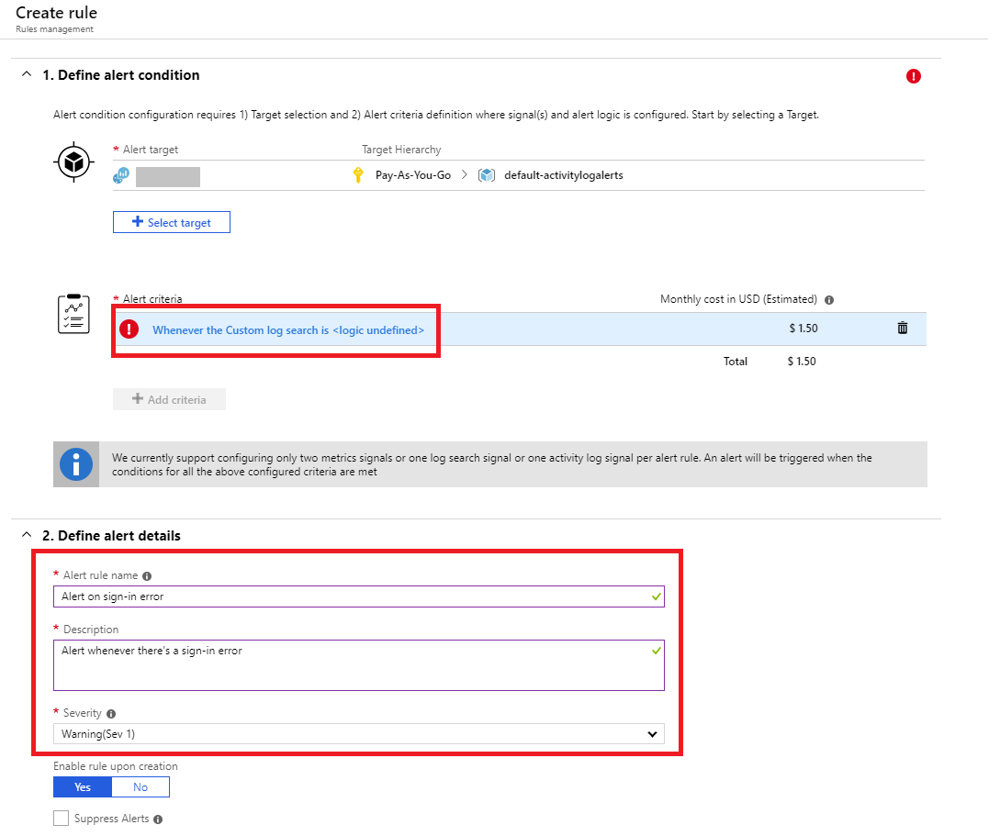

# Install and use the log analytics views for Azure Active Directory

The Azure Active Directory (Azure AD) log analytics views helps you analyze and search the Azure AD activity logs in your Azure AD tenant. Azure AD activity logs include:

* Audit logs: The [audit logs activity report](concept-audit-logs.md) gives you access to the history of every task that's performed in your tenant.
* Sign-in logs: With the [sign-in activity report](concept-sign-ins.md), you can determine who performed the tasks that are reported in the audit logs.

## Prerequisites

To use the log analytics views, you need:

* A Log Analytics workspace in your Azure subscription. Learn how to [create a Log Analytics workspace](../../azure-monitor/logs/quick-create-workspace.md).
* First, complete the steps to [route the Azure AD activity logs to your Log Analytics workspace](howto-integrate-activity-logs-with-log-analytics.md).
* Download the views from the [GitHub repository](https://aka.ms/AADLogAnalyticsviews) to your local computer.

## Install the log analytics views

1. Navigate to the [Azure portal](https://portal.azure.com) and select **All services**.
1. Type **Log Analytics** in the text box, and select **Log Analytics workspaces**. Select the workspace you routed the activity logs to, as part of the prerequisites.
1. Select **View Designer** > **Import** > **Choose File** to import the views from your local computer.
1. Select the views you downloaded from the prerequisites and select **Save** to save the import. Complete this step for the **Azure AD Account Provisioning Events** view and the **Sign-ins Events** view.

## Use the views

1. Navigate to the [Azure portal](https://portal.azure.com) and select **All services**.
1. Type **Log Analytics** in the text box, and select **Log Analytics workspaces**. Select the workspace you routed the activity logs to, as part of the prerequisites.

1. Once you're in the workspace, select **Workspace Summary**. You should see the following three views:

    * **Azure AD Account Provisioning Events**: This view shows reports related to the auditing provisioning activity. Activities can include the number of new users provisioned, provisioning failures, number of users updated, update failures, the number of users de-provisioned and their corresponding failures.    
    * **Sign-ins Events**: This view shows the most relevant reports related to monitoring sign-in activity, such as sign-ins by application, user, device, and a summary view tracking the number of sign-ins over time.

1. Select either of these views to jump in to the individual reports. You can also set alerts on any of the report parameters. For example, let's set an alert for every time there's a sign-in error.
1. Select the **Sign-ins Events** > **Sign-in errors over time** > **Analytics** to open the details page, with the actual query behind the report. 

    

1. Select **Set Alert**, and then select **Whenever the Custom log search is &lt;logic undefined&gt;** under the **Alert criteria** section. Since we want to alert whenever there's a sign-in error, set the **Threshold** of the default alert logic to **1** and then select **Done**. 

    

1. Enter a name and description for the alert and set the severity to **Warning**.

    

1. Select the action group to alert, such as a team you want to notify via email or text message. Learn how to [create and manage action groups in the Azure portal](../../azure-monitor/alerts/action-groups.md).

1. Select **Create alert rule** to create the alert. Now you'll be alerted every time there's a sign-in error.

## Next steps

* [How to analyze activity logs with Azure Monitor logs](howto-analyze-activity-logs-log-analytics.md)
* [Get started with Azure Monitor logs in the Azure portal](../../azure-monitor/logs/log-analytics-tutorial.md)