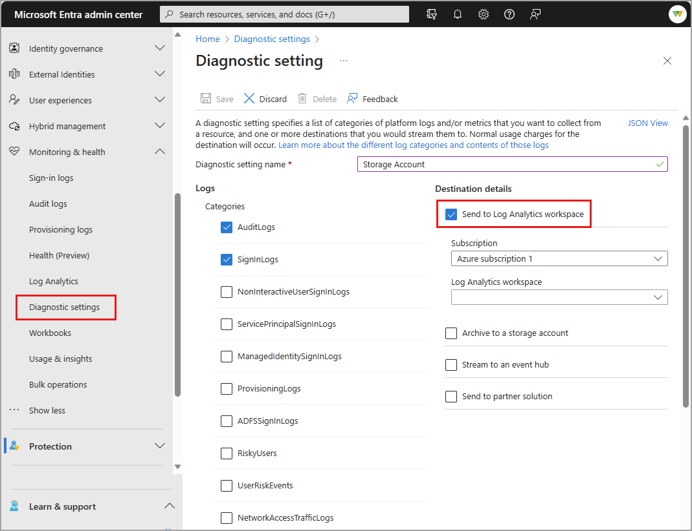

# Integrate Microsoft Entra logs with Azure Monitor logs

Using **Diagnostic settings** in Microsoft Entra ID, you can integrate logs with Azure Monitor so your sign-in activity and the audit trail of changes within your tenant can be analyzed along with other Azure data. 

This article provides the steps to integrate Microsoft Entra logs with Azure Monitor.

Use the integration of Microsoft Entra activity logs and Azure Monitor to perform the following tasks:

- Compare your Microsoft Entra sign-in logs against security logs published by Microsoft Defender for Cloud.
- Troubleshoot performance bottlenecks on your application’s sign-in page by correlating application performance data from Azure Application Insights.
- Analyze the Identity Protection risky users and risk detections logs to detect threats in your environment.
- Identify sign-ins from applications still using the Active Directory Authentication Library (ADAL) for authentication. [Learn about the ADAL end-of-support plan.](../develop/msal-migration.md)

> [!NOTE]
> Integrating Microsoft Entra logs with Azure Monitor automatically enables the Microsoft Entra data connector within Microsoft Sentinel.

## How do I access it? 

To use this feature, you need:

* An Azure subscription. If you don't have an Azure subscription, you can [sign up for a free trial](https://azure.microsoft.com/free/).
* A Microsoft Entra ID P1 or P2 tenant.
* **Global Administrator** or **Security Administrator** access for the Microsoft Entra tenant.
* A **Log Analytics workspace** in your Azure subscription. Learn how to [create a Log Analytics workspace](/azure/azure-monitor/logs/quick-create-workspace).
* Permission to access data in a Log Analytics workspace. See [Manage access to log data and workspaces in Azure Monitor](/azure/azure-monitor/logs/manage-access) for information on the different permission options and how to configure permissions.

## Create a Log Analytics workspace 

A Log Analytics workspace allows you to collect data based on a variety or requirements, such as geographic location of the data, subscription boundaries, or access to resources. Learn how to [create a Log Analytics workspace](/azure/azure-monitor/logs/quick-create-workspace). 

Looking for how to set up a Log Analytics workspace for Azure resources outside of Microsoft Entra ID? Check out the [Collect and view resource logs for Azure Monitor](/azure/azure-monitor/essentials/diagnostic-settings) article.

## Send logs to Azure Monitor

Follow the steps below to send logs from Microsoft Entra ID to Azure Monitor logs. Looking for how to set up Log Analytics workspace for Azure resources outside of Microsoft Entra ID? Check out the [Collect and view resource logs for Azure Monitor](/azure/azure-monitor/essentials/diagnostic-settings) article.

[!INCLUDE [diagnostic-settings-include](../includes/diagnostic-settings-include.md)]

6. Under **Destination Details** select the **Send to Log Analytics workspace** check box. 

7. Select the appropriate **Subscription** and **Log Analytics workspace** from the menus.

8. Select the **Save** button.

    

If you do not see logs appearing in the selected destination after 15 minutes, sign out and back into Azure to refresh the logs.

## Next steps

* [Analyze Microsoft Entra activity logs with Azure Monitor logs](howto-analyze-activity-logs-log-analytics.md)
* [Learn about the data sources you can analyze with Azure Monitor](/azure/azure-monitor/data-sources)
* [Automate creating diagnostic settings with Azure Policy](/azure/azure-monitor/essentials/diagnostic-settings-policy)
