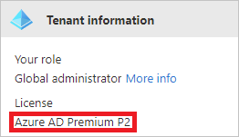

# Integrate Azure AD logs with Azure Monitor logs

Follow the steps in this article to integrate Azure Active Directory (Azure AD) logs with Azure Monitor.

Use the integration of Azure AD activity logs in Azure Monitor logs to perform tasks like:

 * Compare your Azure AD sign-in logs against security logs published by Microsoft Defender for Cloud.
  
 * Troubleshoot performance bottlenecks on your application’s sign-in page by correlating application performance data from Azure Application Insights.

 * Analyze Identity Protection risky users and risk detections logs to detect threats in your environment (public preview)
 
 * Identify sign-ins from applications that use the Active Directory Authentication Library (ADAL) for authentication. [ADAL is nearing end-of-support](../develop/msal-migration.md).

This Microsoft Ignite session video shows the benefits of using Azure Monitor logs for Azure AD logs in practical scenarios:

> [!VIDEO https://www.youtube.com/embed/MP5IaCTwkQg?start=1894]

## Supported reports

You can route audit activity logs and sign-in activity logs to Azure Monitor logs for further analysis. 

* **Audit logs**: The [audit logs activity report](concept-audit-logs.md) gives you access to the history of every task that's performed in your tenant.
* **Sign-in logs**: With the [sign-in activity report](concept-sign-ins.md), you can determine who performed the tasks that are reported in the audit logs.
* **Provisioning logs**: With the [provisioning logs](../app-provisioning/application-provisioning-log-analytics.md), you can monitor which users have been created, updated, and deleted in all your third-party applications. 
* **Risky users logs (public preview)**: With the [risky users logs](../identity-protection/howto-identity-protection-investigate-risk.md#risky-users), you can monitor changes in user risk level and remediation activity. 
* **Risk detections logs (public preview)**: With the [risk detections logs](../identity-protection/howto-identity-protection-investigate-risk.md#risk-detections), you can monitor user's risk detections and analyze trends in risk activity detected in your organization. 

## Prerequisites 

To use this feature, you need:

* An Azure subscription. If you don't have an Azure subscription, you can [sign up for a free trial](https://azure.microsoft.com/free/).
* An Azure AD tenant.
* A user who's a *global administrator* or *security administrator* for the Azure AD tenant.
* A Log Analytics workspace in your Azure subscription. Learn how to [create a Log Analytics workspace](../../azure-monitor/logs/quick-create-workspace.md).

## Licensing requirements

Using this feature requires an Azure AD Premium P1 or P2 tenant. 
You can find the license type of your tenant on the **[Overview](https://portal.azure.com/#blade/Microsoft_AAD_IAM/ActiveDirectoryMenuBlade/Overview)** page in **Azure Active Directory**.

 
If you want to know for how long the activity data is stored in a Premium tenant, see: [How long does Azure AD store the data?](reference-reports-data-retention.md#how-long-does-azure-ad-store-the-data)

## Send logs to Azure Monitor

1. Sign in to the [Azure portal](https://portal.azure.com). 

2. Select **Azure Active Directory** > **Diagnostic settings**. You can also select **Export Settings** from the **Audit Logs** or **Sign-ins** page to get to the diagnostic settings configuration page.  

3. Select one of the existent Log Analytics workspace

4. Click  **+ Add diagnostic setting** link

5. Type a name to this new diagnostic setting
 
6. Select one or more available sources (Logs and/or Metrics), by checking existent check box

7. In the **Destination details** section, select one of the available storage destinations:
    * To send to a log analytics workspace, select the **Send to Log Analytics workspace** check box. 
    * To archive on a storage account, select the **Archive to a storage account** check box.
    * To stream to an event hub, select the **Stream to an event hub** check box.
    * To send to a partner solution, select the **Send to partner solution** check box.

If you want to know each storage destination in detail, see: [Destinations](https://docs.microsoft.com/en-gb/azure/azure-monitor/essentials/diagnostic-settings?WT.mc_id=Portal-Microsoft_Azure_Monitoring&tabs=portal#destinations)

8. For each selected check box, confirm the Azure suscription associated and fulfil the displayed fields

9. Select **Save** to save the setting.

    

10. After about 15 minutes, verify that events are streamed to your Log Analytics workspace.

## Next steps

* [Analyze Azure AD activity logs with Azure Monitor logs](howto-analyze-activity-logs-log-analytics.md)
* [Install and use the log analytics views for Azure Active Directory](howto-install-use-log-analytics-views.md)
