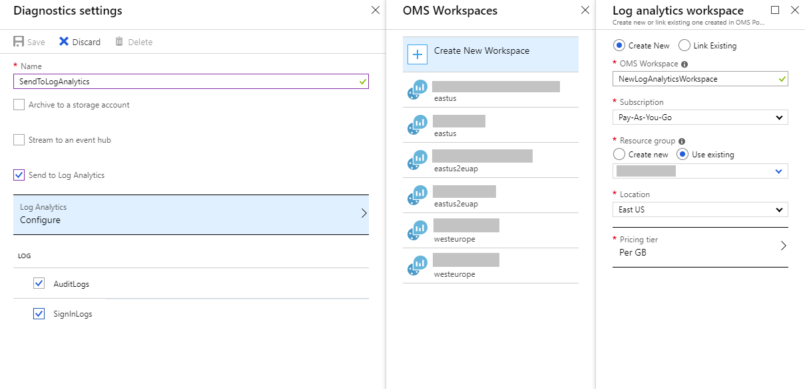

# How to integrate Azure AD logs with Azure Monitor logs

Using **Diagnostic settings** in Azure Active Directory (Azure AD), you can integrate logs with Azure Monitor so sign-in activity and the audit trail of changes within your tenant can be analyzed along with other Azure data. Integrating Azure AD logs with Azure Monitor logs enables rich visualizations, monitoring, and alerting on the connected data.

This article provides the steps to integrate Azure Active Directory (Azure AD) logs with Azure Monitor Logs. 

## Roles and licenses

To integrate Azure AD logs with Azure Monitor, you need the following roles and licenses:

* **An Azure subscription:** If you don't have an Azure subscription, you can [sign up for a free trial](https://azure.microsoft.com/free/).

* **An Azure AD Premium P1 or P2 tenant:** You can find the license type of your tenant on the [Overview](https://portal.azure.com/#blade/Microsoft_AAD_IAM/ActiveDirectoryMenuBlade/Overview) page in Azure AD.

* **Security Administrator access for the Azure AD tenant:** This role is required to set up the Diagnostics settings.

* **Permission to access data in a Log Analytics workspace:** See [Manage access to log data and workspaces in Azure Monitor](../../azure-monitor/logs/manage-access.md) for information on the different permission options and how to configure permissions.

## Integrate logs with Azure Monitor logs

To send Azure AD logs to Azure Monitor Logs you must first have a [Log Analytics workspace](../../azure-monitor/logs/log-analytics-overview.md). Then you can set up the Diagnostics settings in Azure AD to send your activity logs to that workspace. 

### Create a Log Analytics workspace 

A Log Analytics workspace allows you to collect data based on a variety or requirements, such as geographic location of the data, subscription boundaries, or access to resources. Learn how to [create a Log Analytics workspace](../../azure-monitor/logs/quick-create-workspace.md). 

Looking for how to set up a Log Analytics workspace for Azure resources outside of Azure AD? Check out the [Collect and view resource logs for Azure Monitor](../../azure-monitor/essentials/diagnostic-settings.md) article.

### Set up Diagnostics settings

Once you have a Log Analytics workspace created, follow the steps below to send logs from Azure Active Directory to that workspace. 

[!INCLUDE [portal updates](~/articles/active-directory/includes/portal-update.md)]

Follow the steps below to send logs from Azure Active Directory to Azure Monitor. Looking for how to set up Log Analytics workspace for Azure resources outside of Azure AD? Check out the [Collect and view resource logs for Azure Monitor](../../azure-monitor/essentials/diagnostic-settings.md) article.

1. Sign in to the [Azure portal](https://portal.azure.com) as a **Security Administrator**.

1. Go to **Azure Active Directory** > **Diagnostic settings**. You can also select **Export Settings** from the Audit logs or Sign-in logs.

1. Select **+ Add diagnostic setting** to create a new integration or select **Edit setting** to change an existing integration.

1. Enter a **Diagnostic setting name**. If you're editing an existing integration, you can't change the name.

1. Any or all of the following logs can be sent to the Log Analytics workspace. Some logs may be in public preview but still visible in the portal.
    * `AuditLogs`
    * `SignInLogs`
    * `NonInteractiveUserSignInLogs`
    * `ServicePrincipalSignInLogs`
    * `ManagedIdentitySignInLogs`
    * `ProvisioningLogs`
    * `ADFSSignInLogs` Active Directory Federation Services (ADFS)
    * `RiskyServicePrincipals`   
    * `RiskyUsers`
    * `ServicePrincipalRiskEvents` 
    * `UserRiskEvents`

1.  The following logs are in preview but still visible in Azure AD. At this time, selecting these options will not add new logs to your workspace unless your organization was included in the preview.
    * `EnrichedOffice365AuditLogs`
    * `MicrosoftGraphActivityLogs`
    * `NetworkAccessTrafficLogs`

1. In the **Destination details**, select **Send to Log Analytics workspace** and choose the appropriate details from the menus that appear.
    * You can also send logs to any or all of the following destinations. Additional fields appear, depending on your selection.
        * **Archive to a storage account:** Provide the number of days you'd like to retain the data in the **Retention days** boxes that appear next to the log categories. Select the appropriate details from the menus that appear.
        * **Stream to an event hub:** Select the appropriate details from the menus that appear.
        * **Send to partner solution:** Select the appropriate details from the menus that appear.

1. Select **Save** to save the setting.

    

If you do not see logs appearing in the selected destination after 15 minutes, sign out and back into Azure to refresh the logs.

> [!NOTE]
> Integrating Azure Active Directory logs with Azure Monitor will automatically enable the Azure Active Directory data connector within Microsoft Sentinel.

## Next steps

* [Analyze Azure AD activity logs with Azure Monitor logs](howto-analyze-activity-logs-log-analytics.md)
* [Learn about the data sources you can analyze with Azure Monitor](../../azure-monitor/data-sources.md)
* [Automate creating diagnostic settings with Azure Policy](../../azure-monitor/essentials/diagnostic-settings-policy.md)
