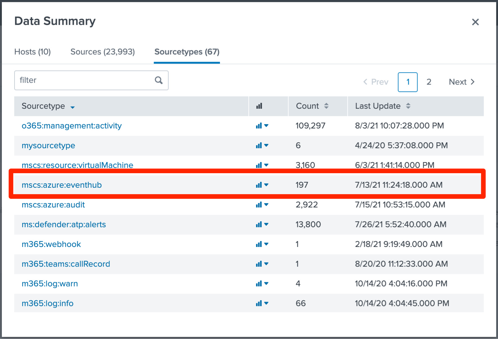
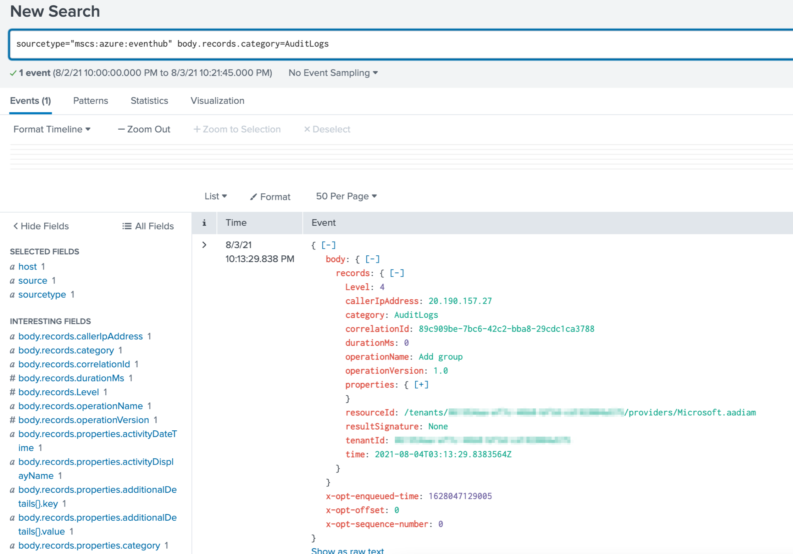

# How to: Integrate Azure Active Directory logs with Splunk using Azure Monitor

In this article, you learn how to integrate Azure Active Directory (Azure AD) logs with Splunk by using Azure Monitor. You first route the logs to an Azure event hub, and then you integrate the event hub with Splunk.

## Prerequisites

To use this feature, you need:

- An Azure event hub that contains Azure AD activity logs. Learn how to [stream your activity logs to an event hub](./tutorial-azure-monitor-stream-logs-to-event-hub.md). 

-  The [Splunk Add-on for Microsoft Cloud Services](https://splunkbase.splunk.com/app/3110/#/details). 

## Integrate Azure Active Directory logs 

1. Open your Splunk instance, and select **Data Summary**.

    

2. Select the **Sourcetypes** tab, and then select **mscs:azure:eventhub**

    

Append **body.records.category=AuditLogs** to the search. The Azure AD activity logs are shown in the following figure:

   

> [!NOTE]
> If you cannot install an add-on in your Splunk instance (for example, if you're using a proxy or running on Splunk Cloud), you can forward these events to the Splunk HTTP Event Collector. To do so, use this [Azure function](https://github.com/splunk/azure-functions-splunk), which is triggered by new messages in the event hub. 
>

## Next steps

* [Interpret audit logs schema in Azure Monitor](./overview-reports.md)
* [Interpret sign-in logs schema in Azure Monitor](reference-azure-monitor-sign-ins-log-schema.md)