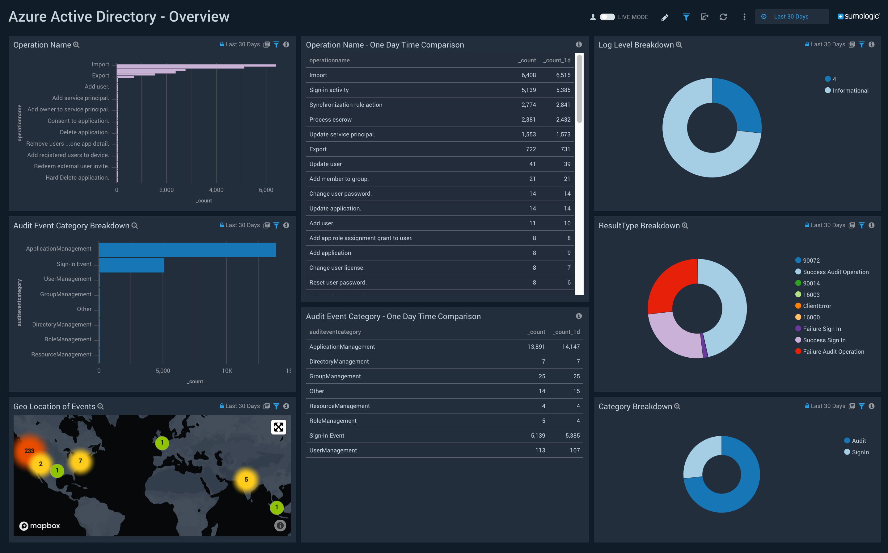

# Integrate Azure AD logs with SumoLogic by using Azure Monitor (preview)

In this article, you learn how to integrate Azure Active Directory (Azure AD) logs with SumoLogic by using Azure Monitor. You first route the logs to an Azure event hub, and then you integrate the event hub with SumoLogic.

## Prerequisites

To use this feature, you need:
* An Azure event hub that contains Azure AD activity logs. Learn how to [stream your activity logs to an event hub](quickstart-azure-monitor-stream-logs-to-event-hub.md). 
* A SumoLogic single sign-on enabled subscription.

## Steps to integrate Azure AD logs with SumoLogic 

1. First, [stream the Azure AD logs to an Azure event hub](quickstart-azure-monitor-stream-logs-to-event-hub.md).
2. Configure your SumoLogic instance to [collect logs for Azure Active Directory](https://help.sumologic.com/Send-Data/Applications-and-Other-Data-Sources/Azure_Active_Directory/Collect_Logs_for_Azure_Active_Directory).
3. [Install the Azure AD SumoLogic app](https://help.sumologic.com/Send-Data/Applications-and-Other-Data-Sources/Azure_Active_Directory/Install_the_Azure_Active_Directory_App_and_View_the_Dashboards) to use the pre-configured dashboards that provide real-time analysis of your environment.

 

## Next steps

* [Interpret audit logs schema in Azure Monitor](reference-azure-monitor-audit-log-schema.md)
* [Interpret sign-in logs schema in Azure Monitor](reference-azure-monitor-sign-ins-log-schema.md)
* [Frequently asked questions and known issues](concept-activity-logs-in-azure-monitor.md#frequently-asked-questions)
