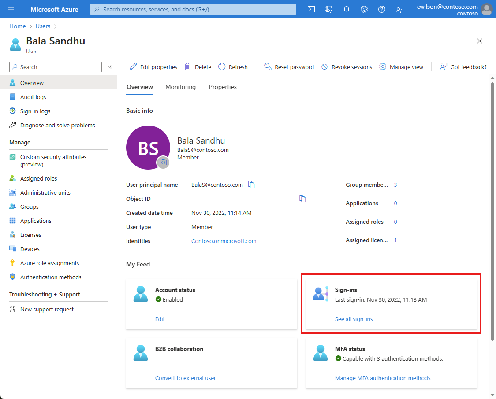

# How To: Manage inactive user accounts

In large environments, user accounts aren't always deleted when employees leave an organization. As an IT administrator, you want to detect and resolve these obsolete user accounts because they represent a security risk.

This article explains a method to handle obsolete user accounts in Azure Active Directory (Azure AD). 

>[!NOTE]
>This article applies only to finding inactive user accounts in Azure Active Directory (Azure AD). It does not apply to finding inactive accounts in [Azure AD B2C](/azure/active-directory-b2c/overview).

## What are inactive user accounts?

Inactive accounts are user accounts that aren't required anymore by members of your organization to gain access to your resources. One key identifier for inactive accounts is that they haven't been used *for a while* to sign in to your environment. Because inactive accounts are tied to the sign-in activity, you can use the timestamp of the last time an account attempted to sign in to detect inactive accounts. 

The challenge of this method is to define what *for a while* means for your environment. For example, users might not sign in to an environment *for a while*, because they are on vacation. When defining what your delta for inactive user accounts is, you need to factor in all legitimate reasons for not signing in to your environment. In many organizations, the delta for inactive user accounts is between 90 and 180 days. 

The last sign-in provides potential insights into a user's continued need for access to resources.  It can help with determining if group membership or app access is still needed or could be removed. For external user management, you can understand if an external user is still active within the tenant or should be cleaned up. 

## Detect inactive user accounts with Microsoft Graph

You can detect inactive accounts by evaluating the `lastSignInDateTime` property exposed by the `signInActivity` resource type of the **Microsoft Graph API**. The `lastSignInDateTime` property shows the last time a user attempted to make an interactive sign-in attempt in Azure AD. Using this property, you can implement a solution for the following scenarios:

- **Last sign-in date and time for all users**: In this scenario, you need to generate a report of the last sign-in date of all users. You request a list of all users, and the last `lastSignInDateTime` for each respective user:
    - `https://graph.microsoft.com/v1.0/users?$select=displayName,signInActivity` 

- **Users by name**: In this scenario, you search for a specific user by name, which enables you to evaluate the `lastSignInDateTime`:
    - `https://graph.microsoft.com/v1.0/users?$filter=startswith(displayName,'markvi')&$select=displayName,signInActivity`

- **Users by date**: In this scenario, you request a list of users with a `lastSignInDateTime` before a specified date:
    - `https://graph.microsoft.com/v1.0/users?$filter=signInActivity/lastSignInDateTime le 2019-06-01T00:00:00Z`

> [!NOTE]
> The `signInActivity` property supports `$filter` (`eq`, `ne`, `not`, `ge`, `le`) *but not with any other filterable properties*. You must specify `$select=signInActivity` or `$filter=signInActivity` while [listing users](/graph/api/user-list?view=graph-rest-beta&preserve-view=true), as the signInActivity property is not returned by default.

### What you need to know

The following details relate to the `lastSignInDateTime` property.

- The `lastSignInDateTime` property is exposed by the [signInActivity resource type](/graph/api/resources/signinactivity) of the [Microsoft Graph API](/graph/overview#whats-in-microsoft-graph).   

- The property is *not* available through the Get-AzureAdUser cmdlet.

- To access the property, you need an Azure Active Directory Premium edition license.

- To read the property, you need to grant the app the following Microsoft Graph permissions: 
    - AuditLog.Read.All
    - User.Read.All

- Each interactive sign-in attempt results in an update of the underlying data store. Typically, sign-ins show up in the related sign-in report within 6 hours. 
 
- To generate a `lastSignInDateTime` timestamp, you must attempt a sign-in. Either a failed or successful sign-in attempt, as long as it's recorded in the [Azure AD sign-in logs](concept-all-sign-ins.md), generates a `lastSignInDateTime` timestamp. The value of the `lastSignInDateTime` property may be blank if:
    - The last attempted sign-in of a user took place before April 2020.
    - The affected user account was never used for a sign-in attempt.

- The last sign-in date is associated with the user object. The value is retained until the next sign-in of the user. 

## How to investigate a single user

[!INCLUDE [portal updates](~/articles/active-directory/includes/portal-update.md)]

If you need to view the latest sign-in activity for a user, you can view the user's sign-in details in Azure AD. You can also use the Microsoft Graph **users by name** scenario described in the [previous section](#detect-inactive-user-accounts-with-microsoft-graph).

1. Sign in to the [Azure portal](https://portal.azure.com). 
1. Go to **Azure AD** > **Users** > select a user from the list.
1. In the **My Feed** area of the user's Overview, locate the **Sign-ins** tile. 

    

The last sign-in date and time shown on this tile may take up to 6 hours to update, which means the date and time may not be current. If you need to see the activity in near real time, select the **See all sign-ins** link on the **Sign-ins** tile to view all sign-in activity for that user. 

## Next steps

* [Get data using the Azure Active Directory reporting API with certificates](tutorial-access-api-with-certificates.md)
* [Audit API reference](/graph/api/resources/directoryaudit) 
* [Sign-in activity report API reference](/graph/api/resources/signin)
