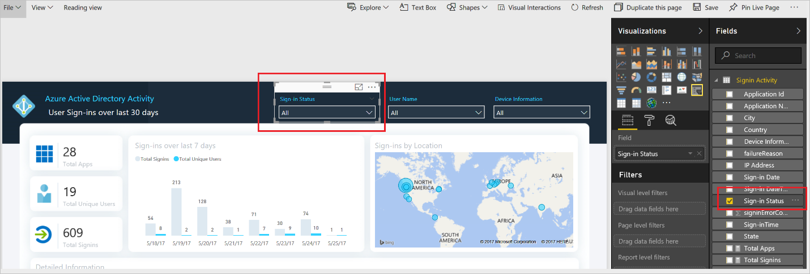

---

title: How to use the Azure Active Directory Power BI Content Pack | Microsoft Docs
description: Learn how to use the Azure Active Directory Power BI Content Pack
services: active-directory
author: priyamohanram
manager: mtillman

ms.assetid: addd60fe-d5ac-4b8b-983c-0736c80ace02
ms.service: active-directory
ms.devlang:
ms.topic: conceptual
ms.tgt_pltfrm:
ms.workload: identity
ms.component: report-monitor
ms.date: 12/06/2017
ms.author: priyamo
ms.reviewer: dhanyahk

---
# How to use the Azure Active Directory Power BI Content Pack

|  |
|--|
|Currently, the Azure AD Power BI content pack uses the Azure AD Graph APIs to retrieve data from your Azure AD tenant. As a result, you may see some disparity between the data available in the content pack and the data retrieved using the [Microsoft Graph APIs for reporting](concept-reporting-api.md). |
|  |

As an IT administrator, you need to understand how your users adopt and use Azure Active Directory features. This allows you to plan your IT infrastructure and communication to increase usage and get the most out of Azure AD features. Power BI Content Pack for Azure Active Directory gives you the ability to further analyze your data to gather richer insights into what’s going on with your directory. With the integration of Azure Active Directory APIs into Power BI, you can easily download the pre-built content pack and gain insight into all the activities within your Azure Active Directory using the rich visualization experience that Power BI offers. You can create your own dashboard and share it easily with anyone in your organization. 

## Prerequisites

You need an Azure AD premium (P1/P2) license to use the content pack. 

## Install the content pack

Check out the [quickstart](quickstart-install-power-bi-content-pack.md) to install the Azure AD Power BI content pack.

## What can I do with this content pack?

Before we jump into what you can do with this content pack, here’s quick preview of the various reports in the content pack. Report data goes back to the **last 30 days**.

### Reports included in this version of Azure Active Directory logs Content Pack

**App Usage and Trend report**:  Get insights into the apps used in your organization and which ones are being used the most and when. You can use this report to gather insights into how an app you recently rolled out in your organization is being used or find out which apps are popular. By doing this, you can improve usage if you see if the app is not being used.

**Sign-ins by location and users**: Get insights into all the sign-ins performed using Azure Identity and gives insights into the identity of the users. With this, you can dig deeper into individual sign-ins and answer questions like:

- From where did this user sign-ins?
- Which user has the most sign-ins and where do they sign-in from? 
- Was the sign-in successful?  
 
You can drill into details by clicking on a specific date or location.

**Unique users per app**:  Get a view of all unique users using a given app. This includes only users who have “*successfully*” signed into an application.

**Device sign-ins**: Get a view of the type of OS and browsers are being used by users in your organization with detailed information on the users including:

- User Name
- IP Address
- Location 
- Sign-in status 

With this report, you can understand the various device profiles used within your organization and determine device policies based on what’s used

**SSPR Funnel**: Get an understanding on how password resets are being done in your organization. Get a peek into how many password resets were attempted through the SSPR tool and how many of them were successful. Dig deeper into the Password resets failure using the SSPR funnel and understand why certain failures occurred. This report gives a deeper understanding of how the SSPR tool is used within your organization so you can make the right decisions.

## Customizing Azure AD Activity content pack

**Change Visualization**:  You can change a report visualization by clicking **Edit Report** and select the visualization you want.
 
 
 
 

**Include additional fields**:  You can add a field to the report or remove it by selecting the visual to which you want to add/remove the field. In the example below, I am adding “sign-in status” field to the table view. 
 
 

**Pin visualizations to your dashboard**:  You can customize your dashboard and include your own visualizations to the report and pin it to the dashboard. In the example below, I added a new filter called “Sign-in Status” and included it in the report. I also changed the visualization from bar chart to a line chart and can pin this new visual to the dashboard.

 

 
 

 

**Sharing your dashboard**: Once you have created the content you want, you can share the dashboard with the users in your organization. Please remember that once you share the report, they can see the fields you have selected in the report.
 
 

## Scheduling a daily refresh of your Power BI report

To schedule a daily refresh of your Power BI report, go to **Datasets > Settings > Schedule Refresh** and set it as shown below.
 
 

## Updating to newer version of content pack

If you want to update your content pack to get a newer version:

- Download the new content pack and set it up as per instructions listed in this article.

- Once you have set it up, go to **Data Source > Settings > Data source credentials** and re-enter your credentials as shown below

     

As soon as the new version of the content pack is working, you can remove the old version if needed by deleting the underlying reports and datasets associated with that content pack.

## Still having issues? 

Check out our [troubleshooting guide](troubleshoot-content-pack.md). For general help with Power BI, check out these [help articles](https://powerbi.microsoft.com/documentation/powerbi-service-get-started/).
 

## Next steps

* [Install Power BI content pack](quickstart-install-power-bi-content-pack.md).
* [Troubleshoot content pack errors](troubleshoot-content-pack.md).
* [What are Azure AD reports?](overview-reports.md).
