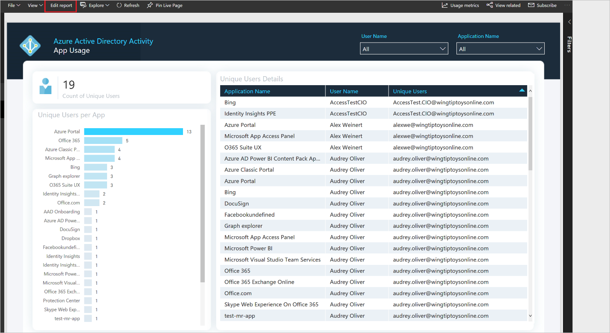
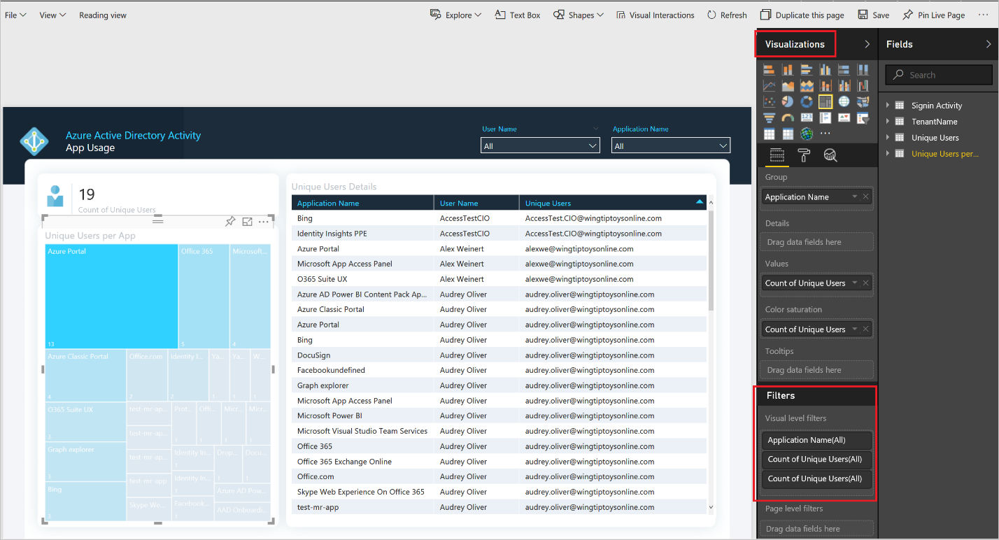
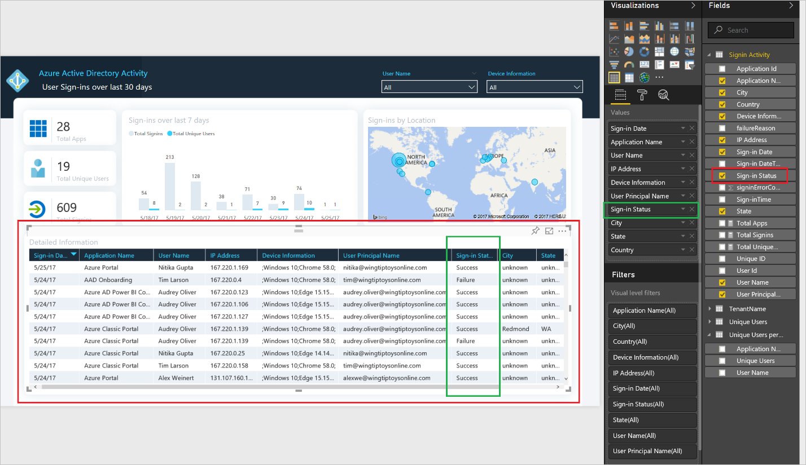
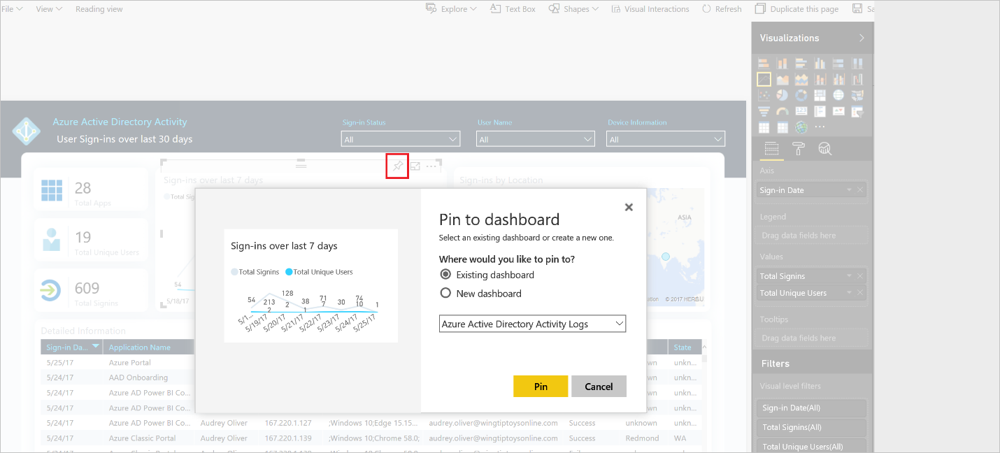
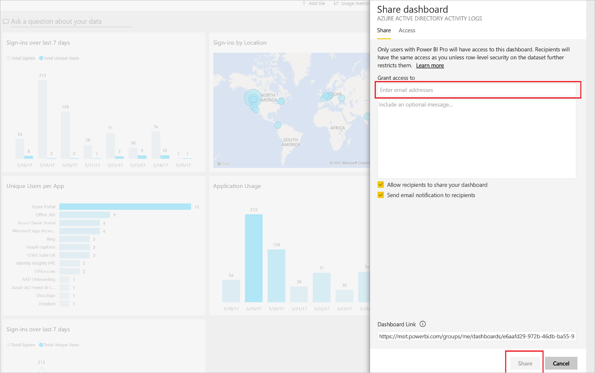
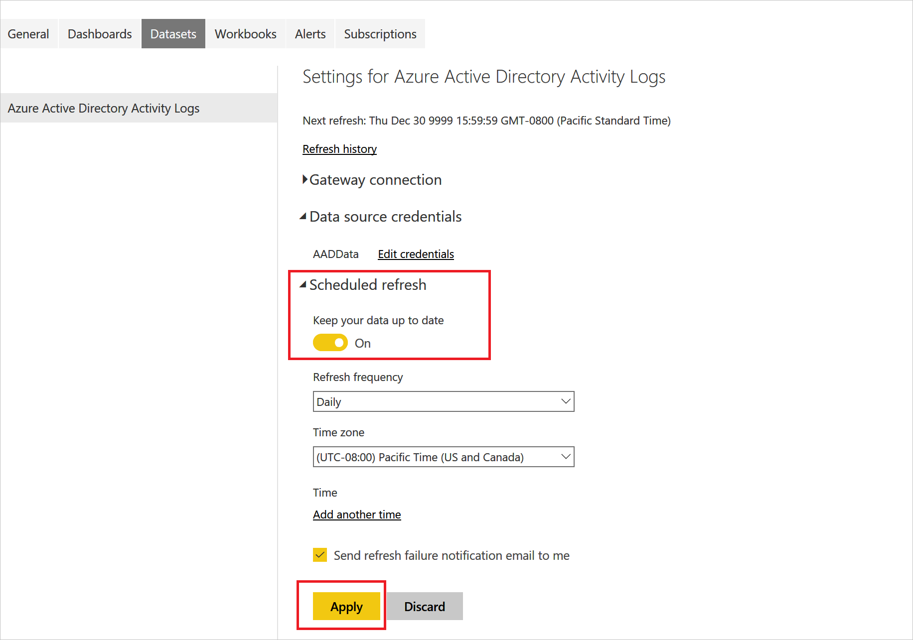

---

title: How to use the Azure Active Directory Power BI Content Pack | Microsoft Docs
description: Learn how to use the Azure Active Directory Power BI Content Pack
services: active-directory
author: MarkusVi
manager: daveba

ms.assetid: addd60fe-d5ac-4b8b-983c-0736c80ace02
ms.service: active-directory
ms.devlang:
ms.topic: conceptual
ms.tgt_pltfrm:
ms.workload: identity
ms.subservice: report-monitor
ms.date: 11/13/2018
ms.author: markvi
ms.reviewer: dhanyahk

ms.collection: M365-identity-device-management
---
# How to use the Azure Active Directory Power BI content pack

|  |
|--|
|Currently, the Azure AD Power BI content pack uses the Azure AD Graph APIs to retrieve data from your Azure AD tenant. As a result, you may see some disparity between the data available in the content pack and the data retrieved using the [Microsoft Graph APIs for reporting](concept-reporting-api.md). |
|  |

The Power BI content pack for Azure Active Directory (Azure AD) contains pre-built reports to help you understand how your users adopt and use Azure AD features. This allows you to gain insight into all the activities within your directory, using the rich visualization experience in Power BI. You can also create your own dashboard and share it with anyone in your organization. 

## Prerequisites

You need an Azure AD premium (P1/P2) license to use the content pack. See [Getting started with Azure Active Directory Premium](../fundamentals/active-directory-get-started-premium.md) to upgrade your Azure Active Directory edition.

## Install the content pack

Check out the [quickstart](quickstart-install-power-bi-content-pack.md) to install the Azure AD Power BI content pack.

### Reports included in this version of Azure AD logs Content Pack

The following reports are included in the Azure AD Power BI content pack. The reports contain data from the **last 30 days**.

**App Usage and trends report**:  This report gives you insight into the applications used in your organization. You can get a list of the most popular applications, or understand how an application you recently rolled out in your organization is being used. This allows you to track and improve usage over time.

**Sign-ins by location and users**: This report provides data on all the sign-ins performed using Azure Identity. With this report, you can drill down to individual sign-ins and answer questions like:

- Where did this user sign-in from?
- Which user has the most sign-ins and where do they sign-in from? 
- Was the sign-in successful?  
 
You can also filter results by selecting a specific date or location.

**Unique users per app**:  This report provides a view of all unique users using a given app. It only includes users who have “*successfully*” signed into an application.

**Device sign-ins**: This report helps you understand the various device profiles used within your organization and determine device policies based on usage. It provides data around the type of OS and browsers used to sign-in to applications, along with detailed information about the users including:

- User Name
- IP Address
- Location 
- Sign-in status 

**SSPR Funnel**: This report helps you understand how the SSPR tool is used within your organization. You can view how many password resets were attempted through the SSPR tool and how many of them were successful. You can also dig deeper into the password resets failures and understand why certain failures occurred. 

## Customize Azure AD Activity content pack

**Change Visualization**:  You can change a report visualization by clicking **Edit Report** and select the visualization you want.
 
 
 
 

**Include additional fields**:  You can add a field to the report or remove it by selecting the visual to which you want to add/remove the field. For example, you can add the “sign-in status” field to the table view as shown below. 
 
 

**Pin visualizations to the dashboard**:  You can customize your dashboard by including your own visualizations to the report and pinning it to the dashboard. 

 
 
**Sharing the dashboard**: You can also share the dashboard with the users in your organization. Once you share the report, users can see the fields you have selected in the report.
 
 

## Schedule a daily refresh of your Power BI report

To schedule a daily refresh of your Power BI report, go to **Datasets** > **Settings** > **Schedule Refresh** and set it as shown below.
 
 

## Update to newer version of content pack

If you want to update your content pack to a newer version:

- Download the new content pack and set it up using the instructions in this article.

- Once you have set it up, go to **Data Source** > **Settings** > **Data source credentials** and re-enter your credentials.

     

Once you verify that the new version of the content pack works as expected, you can remove the old version if needed by deleting the underlying reports and datasets associated with that content pack.

## Troubleshoot content pack errors

When working with the content pack, it is possible that you run into the following errors: 

- [Refresh failed](#refresh-failed) 
- [Failed to update data source credentials](#failed-to-update-data-source-credentials) 
- [Importing of data is taking too long](#data-import-is-too-slow) 

For general help with Power BI, check out these [help articles](https://powerbi.microsoft.com/documentation/powerbi-service-get-started/).

### Refresh failed 
 
**How this error is surfaced**: Email from Power BI or failed status in the refresh history. 

| Cause | How to fix |
| ---   | ---        |
| Refresh failure errors can be caused when the credentials of the users connecting to the content pack have been reset but not updated in the connection settings of the content pack. | In Power BI, locate the dataset corresponding to the Azure AD activity logs dashboard (**Azure Active Directory Activity logs**), choose schedule refresh, and then enter your Azure AD credentials. |
| A refresh can fail due to data issues in the underlying content pack. | [File a support ticket](../fundamentals/active-directory-troubleshooting-support-howto.md).|
 
 
### Failed to update data source credentials 
 
**How this error is surfaced**: In Power BI, when you connect to the Azure AD activity logs content pack. 

| Cause | How to fix |
| ---   | ---        |
| The connecting user is not a global administrator or a security reader or a security administrator. | Use an account that is either a global administrator or a security reader or a security administrator to access the content packs. |
| Your tenant is not a Premium tenant or doesn't have at least one user with Premium license File. | [File a support ticket](../fundamentals/active-directory-troubleshooting-support-howto.md).|
 
### Data import is too slow 
 
**How this error is surfaced**: In Power BI, after you connect your content pack, the data import process starts to prepare your dashboard for Azure AD activity logs. You see the message: **Importing data...** without any further progress.  

| Cause | How to fix |
| ---   | ---        |
| Depending on the size of your tenant, this step could take anywhere from a few minutes to 30 minutes. | If the message does not change to showing your dashboard within an hour, [file a support ticket](../fundamentals/active-directory-troubleshooting-support-howto.md).|
  
## Next steps

* [Install Power BI content pack](quickstart-install-power-bi-content-pack.md).
* [What are Azure AD reports?](overview-reports.md).
