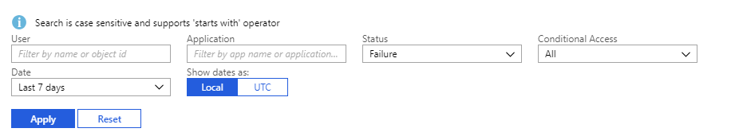
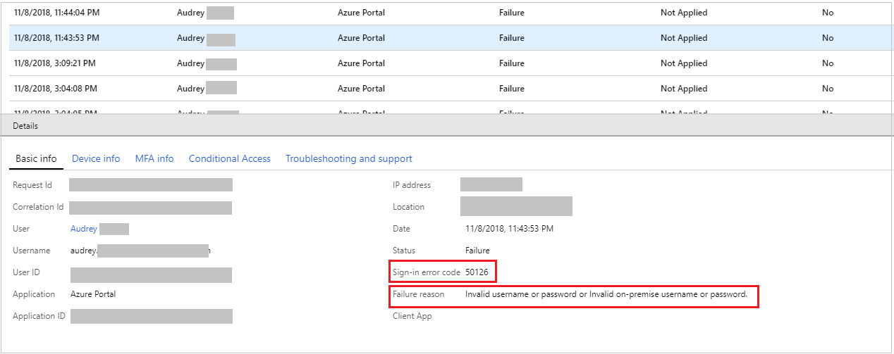
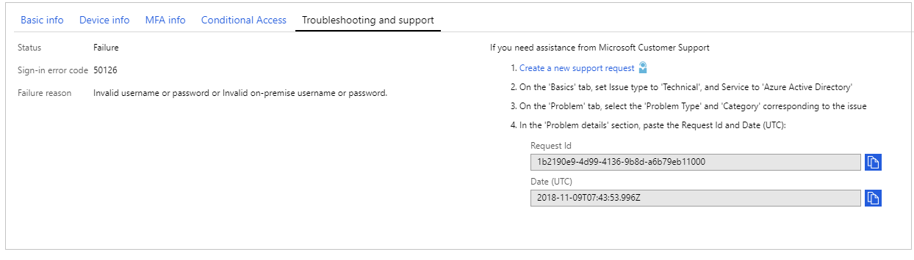

---

title: How to troubleshoot sign-in errors reports | Microsoft Docs
description: Learn how to troubleshoot sign-in errors using Azure Active Directory reports in the Azure portal
services: active-directory
documentationcenter: ''
author: MarkusVi
manager: daveba
editor: ''

ms.service: active-directory
ms.topic: conceptual
ms.workload: identity
ms.subservice: report-monitor
ms.date: 11/13/2018
ms.author: markvi
ms.reviewer: dhanyahk 

ms.collection: M365-identity-device-management
---

# How to: Troubleshoot sign-in errors using Azure Active Directory reports

The [sign-ins report](concept-sign-ins.md) in Azure Active Directory (Azure AD) enables you to find answers to questions around managing access to the applications in your organization, including:

- What is the sign-in pattern of a user?
- How many users have users signed in over a week?
- What’s the status of these sign-ins?

In addition, the sign-ins report can also help you troubleshoot sign-in failures for users in your organization. In this guide, you learn how to isolate a sign-in failure in the sign-ins report, and use it to understand the root cause of the failure.

## Prerequisites

You need:

* An Azure AD tenant with a premium (P1/P2) license. See [Getting started with Azure Active Directory Premium](../fundamentals/active-directory-get-started-premium.md) to upgrade your Azure Active Directory edition.
* A user, who is in the **global administrator**, **security administrator**, **security reader**, or **report reader** role for the tenant. In addition, any user can access their own sign-ins. 

## Troubleshoot sign-in errors using the sign-ins report

1. Navigate to the [Azure portal](https://portal.azure.com) and select your directory.
2. Select **Azure Active Directory** and select **Sign-ins** from the **Monitoring** section. 
3. Use the provided filters to narrow down the failure, either by the username or object identifier, application name or date. In addition, select **Failure** from the **Status** drop-down to display only the failed sign-ins. 

    
        
4. Identify the failed sign-in you want to investigate. Select it to open up the additional details window with more information about the failed sign-in. Note down the **Sign-in error code** and **Failure reason**. 

    
        
5. You can also find this information in the **Troubleshooting and support** tab in the details window.

    

6. The failure reason describes the error. For example, in the above scenario, the failure reason is **Invalid username or password or Invalid on-premises username or password**. The fix is to simply sign-in again with the correct username and password.

7. You can get additional information, including ideas for remediation, by searching for the error code, **50126** in this example, in the [sign-ins error codes reference](reference-sign-ins-error-codes.md). 

8. If all else fails, or the issue persists despite taking the recommended course of action, [open a support ticket](../fundamentals/active-directory-troubleshooting-support-howto.md) following the steps in the **Troubleshooting and support** tab. 

## Next steps

* [Sign-ins error codes reference](reference-sign-ins-error-codes.md)
* [Sign-ins report overview](concept-sign-ins.md)
