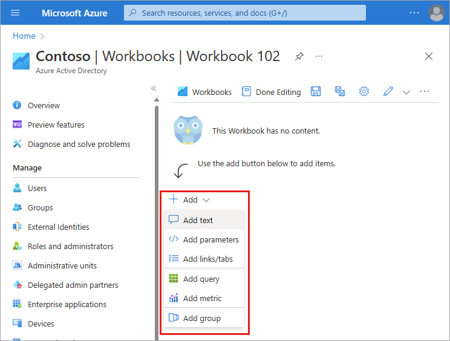
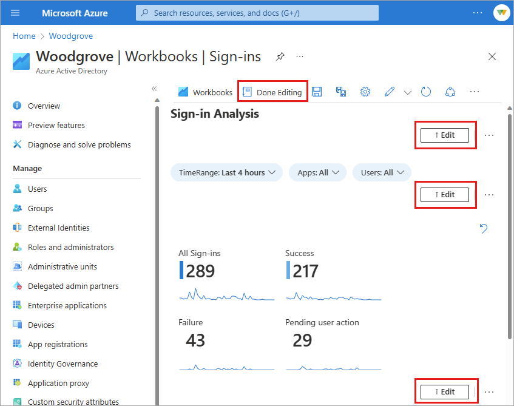

# How to use Azure Active Directory Workbooks

Workbooks are found in Azure AD and in Azure Monitor. The concepts, processes, and best practices are the same for both types of workbooks, however, workbooks for Azure Active Directory (AD) cover only those identity management scenarios that are associated with Azure AD.

When using workbooks, you can either start with an empty workbook, or use an existing template. Workbook templates enable you to quickly get started using workbooks without needing to build from scratch. 

- **Public templates** published to a [gallery](../../azure-monitor/visualize/workbooks-overview.md#the-gallery) are a good starting point when you're just getting started with workbooks.
- **Private templates** are helpful when you start building your own workbooks and want to save one as a template to serve as the foundation for multiple workbooks in your tenant.

## Prerequisites

To use Azure Workbooks for Azure AD, you need:

- An Azure AD tenant with a [Premium P1 license](../fundamentals/active-directory-get-started-premium.md)
- A Log Analytics workspace *and* access to that workspace
- The appropriate roles for Azure Monitor *and* Azure AD

### Log Analytics workspace

You must create a [Log Analytics workspace](../../azure-monitor/logs/quick-create-workspace.md) *before* you can use Azure AD Workbooks. There are a combination of factors that determine access to Log Analytics workspaces. You need the right roles for the workspace *and* the resources sending the data.

For more information, see [Manage access to Log Analytics workspaces](../../azure-monitor/logs/manage-access.md).

### Azure Monitor roles

Azure Monitor provides [two built-in roles](../../azure-monitor/roles-permissions-security.md#monitoring-reader) for viewing monitoring data and editing monitoring settings. Azure role-based access control (RBAC) also provides two Log Analytics built-in roles that grant similar access.

- **View**:
    - Monitoring Reader
    - Log Analytics Reader

- **View and modify settings**:
    - Monitoring Contributor
    - Log Analytics Contributor

For more information on the Azure Monitor built-in roles, see [Roles, permissions, and security in Azure Monitor](../../azure-monitor/roles-permissions-security.md#monitoring-reader).

For more information on the Log Analytics RBAC roles, see [Azure built-in roles](../../role-based-access-control/built-in-roles.md#log-analytics-contributor)

### Azure AD roles

Read only access allows you to view Azure AD log data inside a workbook, query data from Log Analytics, or read logs in the Azure AD portal. Update access adds the ability to create and edit diagnostic settings to send Azure AD data to a Log Analytics workspace.

- **Read**:
  - Reports Reader
  - Security Reader
  - Global Reader

- **Update**:
    - Security Administrator

For more information on Azure AD built-in roles, see [Azure AD built-in roles](../roles/permissions-reference.md).

## How to access Azure Workbooks for Azure AD

[!INCLUDE [portal updates](~/articles/active-directory/includes/portal-update.md)]

1. Sign in to the [Azure portal](https://portal.azure.com).
1. Navigate to **Azure Active Directory** > **Monitoring** > **Workbooks**. 
    - **Workbooks**: All workbooks created in your tenant
    - **Public Templates**: Prebuilt workbooks for common or high priority scenarios
    - **My Templates**: Templates you've created
1. Select a report or template from the list. Workbooks may take a few moments to populate. 
    - Search for a template by name.
    - Select the **Browse across galleries** to view templates that aren't specific to Azure AD.

    

## Create a new workbook

Workbooks can be created from scratch or from a template. When creating a new workbook, you can add elements as you go or use the **Advanced Editor** option to paste in the JSON representation of a workbook, copied from the [workbooks GitHub repository](https://github.com/Microsoft/Application-Insights-Workbooks/blob/master/schema/workbook.json).

**To create a new workbook from scratch**:
1. Navigate to **Azure AD** > **Monitoring** > **Workbooks**.
1. Select **+ New**.
1. Select an element from the **+ Add** menu.

    For more information on the available elements, see [Creating an Azure Workbook](../../azure-monitor/visualize/workbooks-create-workbook.md).

    

**To create a new workbook from a template**:
1. Navigate to **Azure AD** > **Monitoring** > **Workbooks**.
1. Select a workbook template from the Gallery.
1. Select **Edit** from the top of the page.
    - Each element of the workbook has its own **Edit** button. 
    - For more information on editing workbook elements, see [Azure Workbooks Templates](../../azure-monitor/visualize/workbooks-templates.md)

1. Select the **Edit** button for any element. Make your changes and select **Done editing**.
        
1. When you're done editing the workbook, select the **Save As** to save your workbook with a new name.
1. In the **Save As** window:
    - Provide a **Title**, **Subscription**, **Resource Group** (you must have the ability to save a workbook for the selected Resource Group), and **Location**.
    - Optionally choose to save your workbook content to an [Azure Storage Account](../../azure-monitor/visualize/workbooks-bring-your-own-storage.md).
1. Select the **Apply** button.

## Next steps

* [Create interactive reports by using Monitor workbooks](../../azure-monitor/visualize/workbooks-overview.md).
* [Create custom Azure Monitor queries using Azure PowerShell](../governance/entitlement-management-logs-and-reporting.md).
