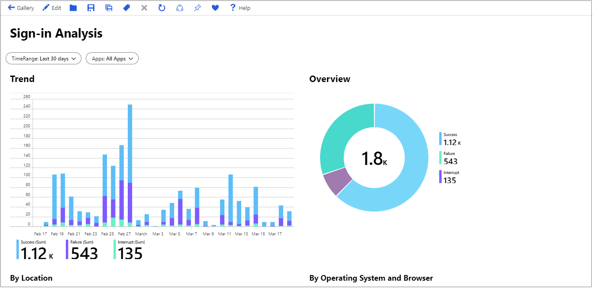
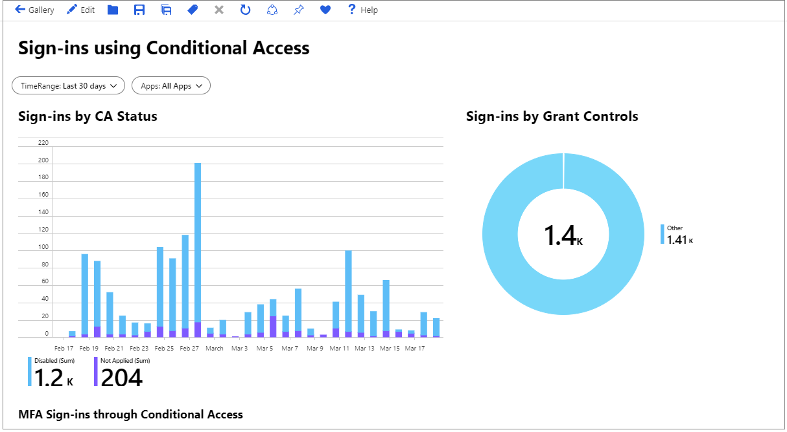
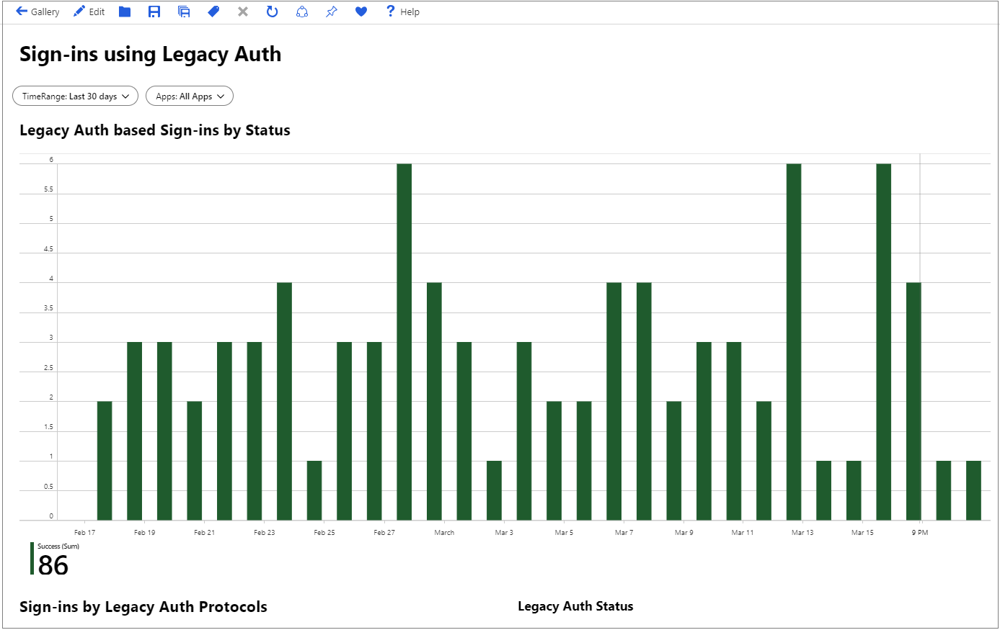
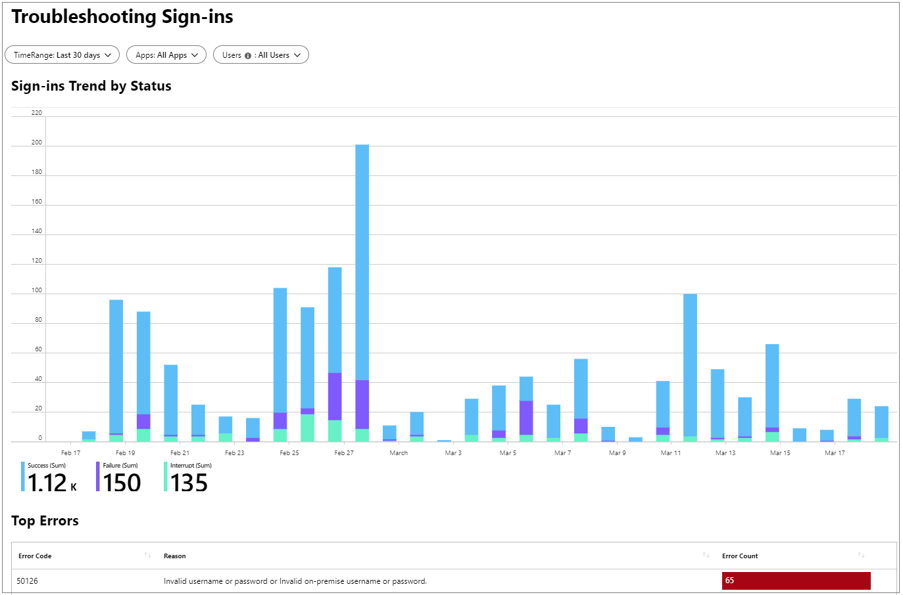

---

title: Use Azure Monitor workbooks for Azure Active Directory reports | Microsoft Docs
description: Learn how to use the Azure Monitor workbooks for Azure Active Directory reports
services: active-directory
author: MarkusVi
manager: daveba

ms.assetid: 4066725c-c430-42b8-a75b-fe2360699b82
ms.service: active-directory
ms.devlang:
ms.topic: conceptual
ms.tgt_pltfrm:
ms.workload: identity
ms.subservice: report-monitor
ms.date: 04/18/2019
ms.author: markvi
ms.reviewer: dhanyahk
---

# How to: Use Azure Monitor workbooks for Azure Active Directory reports

[Azure Monitor workbooks](https://docs.microsoft.com/azure/azure-monitor/app/usage-workbooks) combine text, Analytics queries, Azure Metrics, and parameters into rich interactive reports. Azure Active Directory provides the following workbooks to help you gain insights into your environment. 

* Usage: This workbook contains information about application usage, sign-ins, conditional access policies, and legacy authentication.
* Troubleshooting: This workbook contains information about errors that occur during attempted sign-ins, conditional access policies and legacy authentication.

Workbooks are editable by any other team members who have access to the same Azure resources.

## Prerequisites

To use this feature, you need:

1. An Azure Active Directory tenant, with a premium (P1/P2) license. Learn how to [get a premium license](https://docs.microsoft.com/azure/active-directory/fundamentals/active-directory-get-started-premium).
2. A [Log Analytics workspace](https://docs.microsoft.com/azure/azure-monitor/learn/quick-create-workspace).

## Open workbooks 

1. Sign in to your [Azure portal](https://portal.azure.com).

2. On the left navbar, click **Azure Active Directory**.

3. In the **Monitoring** section, click **Insights**. 

    

4. Click a report or template, or click **Open** in the toolbar. 

    

## Sign-ins report

To access the sign-ins data, click **Sign-ins** in the **Usage** section. 

This workbook shows the following sign-in trends:

- All sign-ins

- Success

- Pending user action

- Failure

You can filter each trend by:

- Time range

- Apps

- Users

For each trend, you get a breakdown by:

- Location

    

- Device

    

## Sign-ins using legacy authentication report

To access the sign-ins data, click **Sign-ins using Legacy Authentication** in the **Usage** section. 

This workbook shows the following sign-in trends:

- All sign-ins

- Success

You can filter each trend by:

- Time range

- Apps

- Users

For each trend, you get a breakdown by app and protocol.

## Sign-ins by conditional access report

To access the sign-ins by conditional access data, click **Sign-ins using Legacy Authentication** in the **Conditional access** section. 

This workbook shows the trend for disabled sign-ins.

You can filter each trend by:

- Time range

- Apps

- Users

For each trend, you get a breakdown by app and protocol.

## Sign-ins by grant controls

To access the sign-ins by conditional access data, click **Sign-ins using Legacy Authentication** in the **Conditional access** section. 

This workbook shows the trend for disabled sign-ins.

You can filter each trend by:

- Time range

- Apps

- Users

For each trend, you get a breakdown by app and protocol.

## Troubleshooting sign-ins

To access the sign-ins by conditional access data, click **Sign-ins using Legacy Authentication** in the **Conditional access** section. 

This workbook shows the trend for disabled sign-ins.

You can filter each trend by:

- Time range

- Apps

- Users

For each trend, you get a breakdown by:

- Top errors

    

- Sign-ins waiting on user action

    

## Backup

This workbook contains success and failure trends for attempted sign-ins over time, and shows a breakdown of sign-in attempts by location and platform (operating system and browser). 

You can filter this data by selecting a specific time range or application using the drop-down menus. You can also edit, save, or share the workbook using the buttons on the top bar. 

## Usage - Sign-ins and conditional access

The **Sign-ins and Conditional Access** workbook displays trends for the status of conditional access policies. It also displays the sign-ins by grant control policy, MFA sign-ins through conditional access and application sign-ins with and without conditional access. You can filter this data by selecting a specific time range or application using the drop-down menus. You can also edit, save, or share the workbook using the buttons on the top bar.

## Usage - Sign-ins using legacy authentication

You can access information about legacy authentication using the **Sign-ins using Legacy Auth** workbook. It displays the sign-ins using legacy authentication, including the protocols used and the status of the authentication attempt. It also displays the breakdown of sign-in attempts by users and applications. You can filter this data by selecting a specific time range or application using the drop-down menus. You can also edit, save, or share the workbook using the buttons on the top bar.

## Troubleshoot - Sign-ins failure analysis

Select the **Sign-ins failure analysis** workbook to troubleshoot errors with sign-ins, conditional access policies, and legacy authentication. The workbook shows the top sign-in errors, as well as information about errors due to conditional access policies and legacy authentication sign-ins. You can filter this data by selecting a specific time range, application, or user using the drop-down menus. You can also edit, save, or share the workbook using the buttons on the top bar. 

## Next steps

* [Create interactive reports with Azure Monitor workbooks](https://docs.microsoft.com/azure/azure-monitor/app/usage-workbooks)