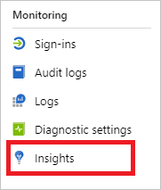

---

title: Use Azure Monitor workbooks for Azure Active Directory reports | Microsoft Docs
description: Learn how to use Azure Monitor workbooks for Azure Active Directory reports.
services: active-directory
author: MarkusVi
manager: daveba

ms.assetid: 4066725c-c430-42b8-a75b-fe2360699b82
ms.service: active-directory
ms.devlang:
ms.topic: conceptual
ms.tgt_pltfrm:
ms.workload: identity
ms.subservice: report-monitor
ms.date: 04/18/2019
ms.author: markvi
ms.reviewer: dhanyahk
---

# How to use Azure Monitor workbooks for Azure Active Directory reports

Do you want to:

- Understand the effect of your [Conditional Access policies](../conditional-access/overview.md) on your users' sign-in experience?

- Troubleshoot sign-in failures to get a better view of your organization's sign-in health and to resolve issues quickly?

- Know who's using legacy authentications to sign in to your environment? (By [blocking legacy authentication](../conditional-access/block-legacy-authentication.md), you can improve your tenant's protection.)

To help you to address these questions, Active Directory provides workbooks for monitoring. [Azure Monitor workbooks](https://docs.microsoft.com/azure/azure-monitor/app/usage-workbooks) combine text, analytics queries, metrics, and parameters into rich interactive reports. 

This article:

- Assumes you're familiar with how to [Create interactive reports by using Monitor workbooks](https://docs.microsoft.com/azure/azure-monitor/app/usage-workbooks).

- Explains how to use Monitor workbooks to understand the effect of your Conditional Access policies, to troubleshoot sign-in failures, and to identify legacy authentications.
 

## Prerequisites

To use Monitor workbooks, you need:

- An Active Directory tenant with a premium (P1 or P2) license. Learn how to [get a premium license](https://docs.microsoft.com/azure/active-directory/fundamentals/active-directory-get-started-premium).

- A [Log Analytics workspace](https://docs.microsoft.com/azure/azure-monitor/learn/quick-create-workspace).

## Workbook access 

To access workbooks:

1. Sign in to the [Azure portal](https://portal.azure.com).

2. On the left navigation pane, select **Azure Active Directory**.

3. In the **Monitoring** section, select **Workbooks**. 

    

4. Select a report or template, or on the toolbar select **Open**. 

    

## Sign-in analysis

To access the sign-in analysis workbook, in the **Usage** section, select **Sign-ins**. 

This workbook shows the following sign-in trends:

- All sign-ins

- Success

- Pending user action

- Failure

You can filter each trend by the following categories:

- Time range

- Apps

- Users

For each trend, you get a breakdown by the following categories:

- Location

    

- Device

    

## Sign-ins using legacy authentication 

To access the workbook for sign-ins that use [legacy authentication](../conditional-access/block-legacy-authentication.md), in the **Usage** section, select **Sign-ins using Legacy Authentication**. 

This workbook shows the following sign-in trends:

- All sign-ins

- Success

You can filter each trend by the following categories:

- Time range

- Apps

- Users

- Protocols

For each trend, you get a breakdown by app and protocol.

## Sign-ins by Conditional Access 

To access the workbook for sign-ins by [Conditional Access policies](../conditional-access/overview.md), in the **Conditional Access** section, select **Sign-ins by Conditional Access**. 

This workbook shows the trends for disabled sign-ins. You can filter each trend by the following categories:

- Time range

- Apps

- Users

For disabled sign-ins, you get a breakdown by the Conditional Access status.

## Sign-ins by grant controls

To access the workbook for sign-ins by [grant controls](../conditional-access/controls.md), in the **Conditional Access** section, select **Sign-ins by Grant Controls**. 

This workbook shows the following disabled sign-in trends:

- Require MFA
 
- Require terms of use

- Require privacy statement

- Other

You can filter each trend by the following categories:

- Time range

- Apps

- Users

For each trend, you get a breakdown by app and protocol.

## Sign-ins failure analysis

Use the **Sign-ins failure analysis** workbook to troubleshoot errors with the following:

- Sign-ins
- Conditional Access policies
- Legacy authentication 

To access the sign-ins by Conditional Access data, in the **Troubleshoot** section, select **Sign-ins using Legacy Authentication**. 

This workbook shows the following sign-in trends:

- All sign-ins

- Success

- Pending action

- Failure

You can filter each trend by the following categories:

- Time range

- Apps

- Users

To help you troubleshoot sign-ins, Azure Monitor gives you a breakdown by the following categories:

- Top errors

    

- Sign-ins waiting on user action

    

## Next steps

[Create interactive reports by using Monitor workbooks](https://docs.microsoft.com/azure/azure-monitor/app/usage-workbooks).
