# How to use Azure Monitor workbooks for Azure Active Directory reports

> [!IMPORTANT]
> In order to optimize the underlying queries in this workbook, please click on "Edit", click on Settings icon and select the workspace where you want to run these queries. Workbooks by default will select all workspaces where you are routing your Azure AD logs. 

Do you want to:

- Understand the effect of your [Conditional Access policies](../conditional-access/overview.md) on your users' sign-in experience?

- Troubleshoot sign-in failures to get a better view of your organization's sign-in health and to resolve issues quickly?

- Know who's using legacy authentications to sign in to your environment? (By [blocking legacy authentication](../conditional-access/block-legacy-authentication.md), you can improve your tenant's protection.)

- Do you need to understand the impact of Conditional Access policies in your tenant?

- Would you like the ability to review: sign-in log queries, the workbook 
reports how many users were granted or denied access, as well as how many users bypassed 
Conditional Access policies when accessing resources?

- Interested in developing a deeper understanding of: the workbook details per 
condition so that the impact of a policy can be contextualized per condition, 
including device platform, device state, client app, sign-in risk, location, and application?

- Gain deeper insights into sign-in log queries, the workbook 
reports how many users were granted or denied access, as well as how many users bypassed 
Conditional Access policies when accessing resources.

- To help you to address these questions, Azure Active Directory provides workbooks for monitoring. [Azure Monitor workbooks](https://docs.microsoft.com/azure/azure-monitor/platform/workbooks-overview) combine text, analytics queries, metrics, and parameters into rich interactive reports.

This article:

- Assumes you're familiar with how to [Create interactive reports by using Monitor workbooks](https://docs.microsoft.com/azure/azure-monitor/platform/workbooks-overview).

- Explains how to use Monitor workbooks to understand the effect of your Conditional Access policies, to troubleshoot sign-in failures, and to identify legacy authentications.
 

## Prerequisites

To use Monitor workbooks, you need:

- An Azure Active Directory tenant with a premium (P1 or P2) license. Learn how to [get a premium license](https://docs.microsoft.com/azure/active-directory/fundamentals/active-directory-get-started-premium).

- A [Log Analytics workspace](https://docs.microsoft.com/azure/azure-monitor/learn/quick-create-workspace).

- [Access](https://docs.microsoft.com/azure/azure-monitor/platform/manage-access#manage-access-using-workspace-permissions) to the log analytics workspace
- Following roles in Azure Active Directory (if you are accessing Log Analytics through Azure Active Directory portal)
    - Security administrator
    - Security reader
    - Report reader
    - Global administrator

## Roles
You must be in one of the following roles as well as have [access to underlying Log Analytics](https://docs.microsoft.com/azure/azure-monitor/platform/manage-access#manage-access-using-azure-permissions) workspace to manage the workbooks:
- 	Global administrator
- 	Security administrator
- 	Security reader
- 	Report reader
- 	Application administrator

## Workbook access 

To access workbooks:

1. Sign in to the [Azure portal](https://portal.azure.com).

1. Navigate to **Azure Active Directory** > **Monitoring** > **Workbooks**. 

1. Select a report or template, or on the toolbar select **Open**. 

## Sign-in analysis

To access the sign-in analysis workbook, in the **Usage** section, select **Sign-ins**. 

This workbook shows the following sign-in trends:

- All sign-ins

- Success

- Pending user action

- Failure

You can filter each trend by the following categories:

- Time range

- Apps

- Users

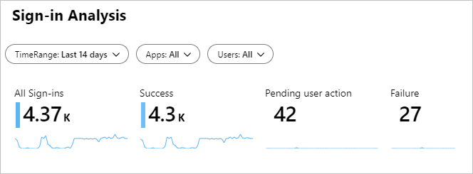

For each trend, you get a breakdown by the following categories:

- Location

    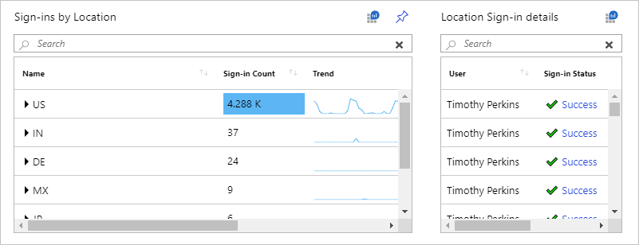

- Device

    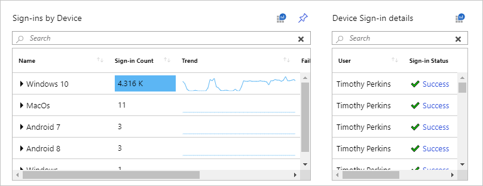

## Sign-ins using legacy authentication 

To access the workbook for sign-ins that use [legacy authentication](../conditional-access/block-legacy-authentication.md), in the **Usage** section, select **Sign-ins using Legacy Authentication**. 

This workbook shows the following sign-in trends:

- All sign-ins

- Success

You can filter each trend by the following categories:

- Time range

- Apps

- Users

- Protocols

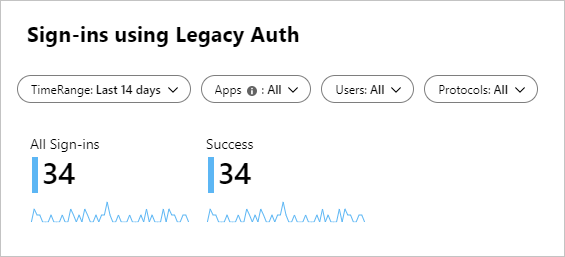

For each trend, you get a breakdown by app and protocol.

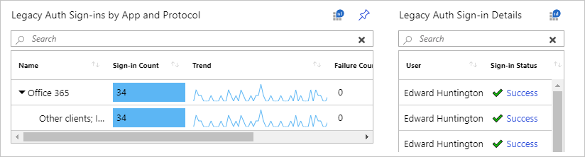

## Sign-ins by Conditional Access 

To access the workbook for sign-ins by [Conditional Access policies](../conditional-access/overview.md), in the **Conditional Access** section, select **Sign-ins by Conditional Access**. 

This workbook shows the trends for disabled sign-ins. You can filter each trend by the following categories:

- Time range

- Apps

- Users

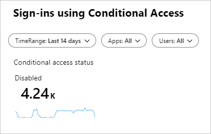

For disabled sign-ins, you get a breakdown by the Conditional Access status.

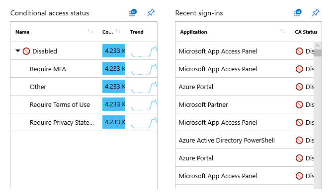

## Conditional Access Insights

### Overview

Workbooks contain sign-in log queries that can help IT administrators monitor the impact of Conditional Access policies in their tenant. You have the ability to report on how many users would have been granted or denied access. The workbook contains insights on how many users would have bypassed Conditional Access policies based on those users’ attributes at the time of sign-in. It contains details per condition so that the impact of a policy can be contextualized per condition, including device platform, device state, client app, sign-in risk, location, and application.

### Instructions 
To access the workbook for Conditional Access Insights, select the **Conditional Access Insights** workbook in the Conditional Access section. 
This workbook shows the expected impact of each Conditional Access policy in your tenant. Select one or more Conditional Access policies from the dropdown list and narrow the scope of the workbook by applying the following filters: 

- **Time Range**

- **User**

- **Apps**

- **Data View**

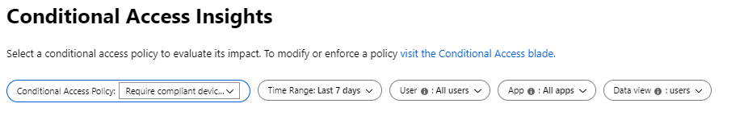

The Impact Summary shows the number of users or sign-ins for which the selected policies had a particular result. Total is the number of users or sign-ins for which the selected policies  were evaluated in the selected Time Range. Click on a tile to filter the data in the workbook by that result type. 

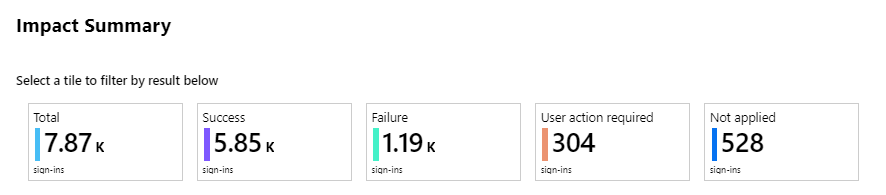

This workbook also shows the impact of the selected policies broken down by each of six conditions: 
- **Device state**
- **Device platform**
- **Client apps**
- **Sign-in risk**
- **Location**
- **Applications**

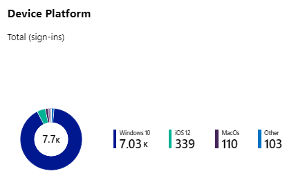

You can also investigate individual sign-ins, filtered by the parameters selected in the workbook. Search for individual users, sorted by sign-in frequency, and view their corresponding sign-in events. 

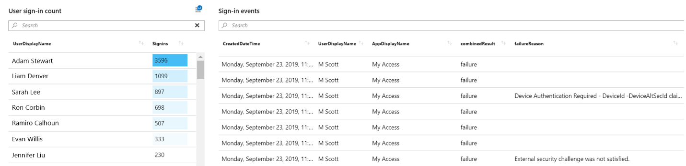

## Sign-ins by grant controls

To access the workbook for sign-ins by [grant controls](../conditional-access/controls.md), in the **Conditional Access** section, select **Sign-ins by Grant Controls**. 

This workbook shows the following disabled sign-in trends:

- Require MFA
 
- Require terms of use

- Require privacy statement

- Other

You can filter each trend by the following categories:

- Time range

- Apps

- Users

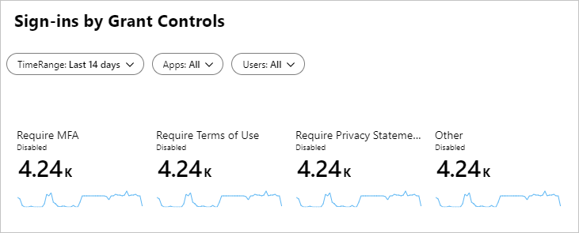

For each trend, you get a breakdown by app and protocol.

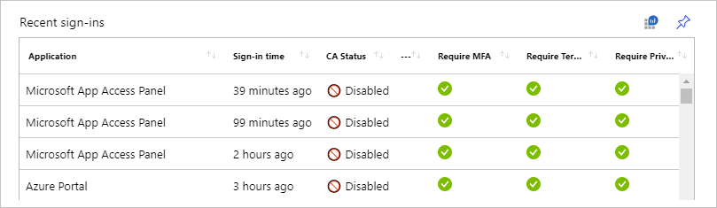

## Sign-ins failure analysis

Use the **Sign-ins failure analysis** workbook to troubleshoot errors with:

- Sign-ins
- Conditional Access policies
- Legacy authentication 

To access the sign-ins by Conditional Access data, in the **Troubleshoot** section, select **Sign-ins using Legacy Authentication**. 

This workbook shows the following sign-in trends:

- All sign-ins

- Success

- Pending action

- Failure

You can filter each trend by the following categories:

- Time range

- Apps

- Users

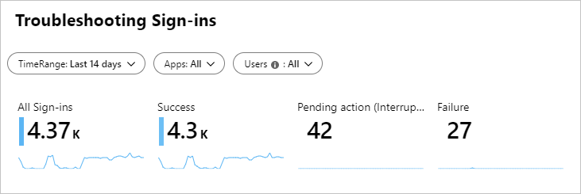

To help you troubleshoot sign-ins, Azure Monitor gives you a breakdown by the following categories:

- Top errors

    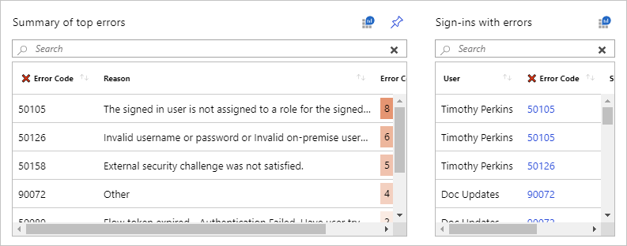

- Sign-ins waiting on user action

    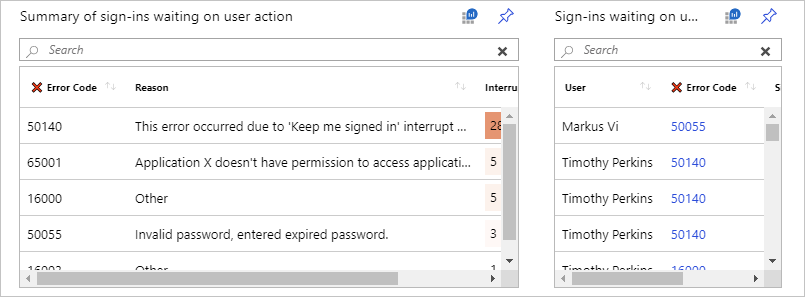

## Next steps

[Create interactive reports by using Monitor workbooks](https://docs.microsoft.com/azure/azure-monitor/platform/workbooks-overview).
