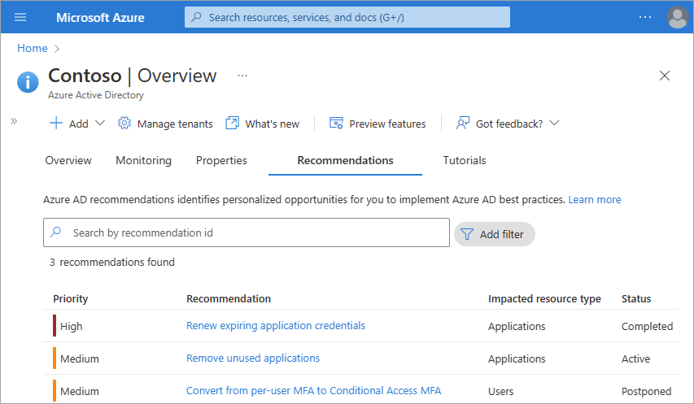
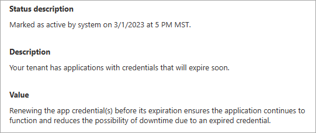
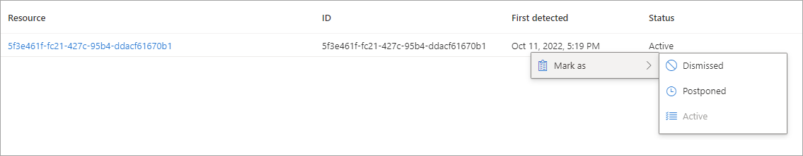
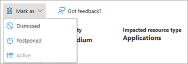

# How to use Microsoft Entra Recommendations

The Microsoft Entra recommendations feature provides you with personalized insights with actionable guidance to:

- Help you identify opportunities to implement best practices for Microsoft Entra related features.
- Improve the state of your Microsoft Entra tenant.
- Optimize the configurations for your scenarios.

This article covers how to work with Microsoft Entra recommendations. Each Microsoft Entra recommendation contains similar details such as a description, the value of addressing the recommendation, and the steps to address the recommendation. Microsoft Graph API guidance is also provided in this article.

## Role requirements

There are different role requirements for viewing or updating a recommendation. Use the least-privileged role for the type of access needed.

| Microsoft Entra role | Access type |
|---- |---- |
| Reports Reader | Read-only | 
| Security Reader | Read-only |
| Global Reader | Read-only |
| Cloud apps Administrator | Update and read |
| Apps Administrator | Update and read |
| Security Operator | Update and read |
| Security Administrator | Update and read |

Some recommendations may require a P2 or other license. For more information, see [Recommendation availability and license requirements](overview-recommendations.md#recommendation-availability-and-license-requirements).

## How to read a recommendation

Most recommendations follow the same pattern. You're provided information about how the recommendation work, its value, and some action steps to address the recommendation. This section provides an overview of the details provided in a recommendation, but aren't specific to one recommendation.

1. Sign in to the [Microsoft Entra admin center](https://entra.microsoft.com) as at least a [Reports Reader](../roles/permissions-reference.md#reports-reader).
1. Browse to **Identity** > **Overview** > **Recommendations tab**.
1. Select a recommendation from the list.

    

Each recommendation provides the same set of details that explain what the recommendation is, why it's important, and how to fix it.


- The **Status** of a recommendation can be updated manually or automatically by the system. If all resources are addressed according to the action plan, the status automatically changes to *Completed* the next time the recommendations service runs. The recommendation service runs every 24-48 hours, depending on the recommendation. 

- The **Priority** of a recommendation could be low, medium, or high. These values are determined by several factors, such as security implications, health concerns, or potential breaking changes.

    - **High**: Must do. Not acting will result in severe security implications or potential downtime.
    - **Medium**: Should do. No severe risk if action isn't taken.
    - **Low**: Might do. No security risks or health concerns if action isn't taken.

- The **Impacted resource type** for a recommendation could be applications, users, or your full tenant. This detail gives you an idea of what type of resources you need to address. If the impacted resource is at the tenant level, you may need to make a global change. 



- The **Status description** tells you the date the recommendation status changed and if it was changed by the system or a user.

- The recommendation's **Value** is an explanation of why completing the recommendation will benefit you, and the value of the associated feature. 

- The **Action plan** provides step-by-step instructions to implement a recommendation. The Action plan may include links to relevant documentation or direct you to other pages in the Azure portal.

- The **Impacted resources** table contains a list of resources identified by the recommendation. The resource's name, ID, date it was first detected, and status are provided. The resource could be an application or resource service principal, for example. 

> [!NOTE]
> In the Microsoft Entra admin enter, the impacted resources are limited to a maximum of 50 resources. To view all impacted resources for a recommendation, use this Microsoft Graph API request:
>`GET /directory/recommendations/{recommendationId}/impactedResources`
>
>For more information, see the [How to use Microsoft Graph with with Microsoft Entra recommendations](#how-to-use-microsoft-graph-with-azure-active-directory-recommendations) section of this article.

## How to update a recommendation

To update the status of a recommendation or a related resource, sign in to Azure using a least-privileged role for updating a recommendation.

1. Go to **Microsoft Entra ID** > **Recommendations**.

1. Select a recommendation from the list to view the details, status, and action plan.

1. Follow the **Action plan**.

1. If applicable, *right-click on the status* of a resource in a recommendation, select **Mark as**, then select a status.

    - The status for the resource appears as regular text, but you can right-click on the status to open the menu.
    - You can set each resource to a different status as needed.
    
    

1. The recommendation service automatically marks the recommendation as complete, but if you need to manually change the status of a recommendation, select **Mark as** from the top of the page and select a status.

    

    - Mark a recommendation as **Dismissed** if you think the recommendation is irrelevant or the data is wrong.
        - Microsoft Entra ID asks for a reason why you dismissed the recommendation so we can improve the service.
    - Mark a recommendation as **Postponed** if you want to address the recommendation at a later time.
        - The recommendation becomes **Active** when the selected date occurs.
    - You can reactivate a completed or postponed recommendation to keep it top of mind and reassess the resources.
    - Recommendations change to **Completed** if all impacted resources have been addressed.
       - If the service identifies an active resource for a completed recommendation the next time the service runs, the recommendation will automatically change back to **Active**.
       - Completing a recommendation is the only action collected in the audit log. To view these logs, go to **Microsoft Entra ID** > **Audit logs** and filter the service to "Microsoft Entra recommendations."

Continue to monitor the recommendations in your tenant for changes.

<a name='how-to-use-microsoft-graph-with-azure-active-directory-recommendations'></a>

### How to use Microsoft Graph with Microsoft Entra recommendations

Microsoft Entra recommendations can be viewed and managed using Microsoft Graph on the `/beta` endpoint. You can view recommendations along with their impacted resources, postpone a recommendation for later, and more. For more information, see the [Microsoft Graph documentation for recommendations](/graph/api/resources/recommendations-api-overview). 

To get started, follow these instructions to work with recommendations using Microsoft Graph in Graph Explorer. 

1. Sign in to [Graph Explorer](https://aka.ms/ge).
1. Select **GET** as the HTTP method from the dropdown.
1. Set the API version to **beta**.

#### View all recommendations

Add the following query to retrieve all recommendations for your tenant, then select the **Run query** button.

```http
GET https://graph.microsoft.com/beta/directory/recommendations
```

All recommendations that apply to your tenant appear in the response. The impact, benefits, summary of the impacted resources, and remediation steps are provided in the response. Locate the recommendation ID for any recommendation to view the impacted resources.

#### View a specific recommendation

If you want to look for a specific recommendation, you can add a `recommendationType` to the request. This example retrieves the details of the `applicationCredentialExpiry` recommendation.

```http
GET https://graph.microsoft.com/beta/directory/recommendations?$filter=recommendationType eq 'applicationCredentialExpiry'
```

#### View impacted resources for a recommendation

Some recommendations may potentially return a long list of impacted resources. To view the list of impacted resources, you need to locate the recommendation ID. The recommendation ID appears in the response when viewing all recommendations and a specific recommendation.

To view the impacted resources for a specific recommendation, use the following query with the recommendation ID you saved.

```http
GET /directory/recommendations/{recommendationId}/impactedResources
```

## Next steps

- [Review the Microsoft Entra recommendations overview](overview-recommendations.md)
- [Learn about Service Health notifications](/azure/service-health/service-health-portal-update)
