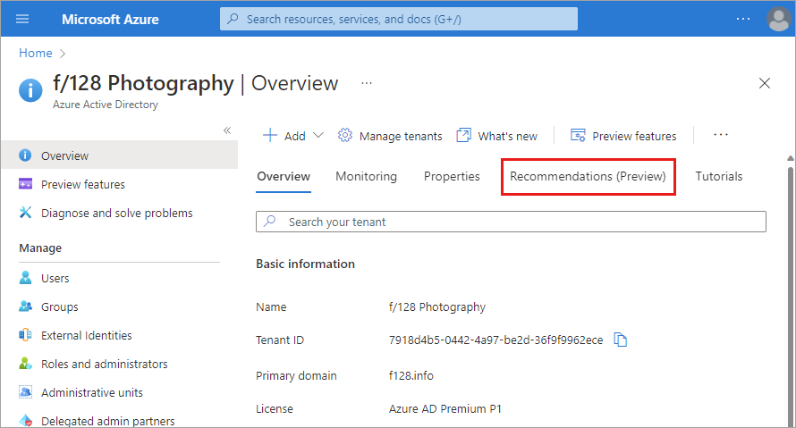

# What are Azure Active Directory recommendations?

Keeping track of all the settings and resources in your tenant can be overwhelming. The Azure Active Directory (Azure AD) recommendations feature helps monitor the status of your tenant so you don't have to. The Azure AD recommendations feature helps ensure your tenant is in a secure and healthy state while also helping you maximize the value of the features available in Azure AD.

The Azure AD recommendations feature provides you with personalized insights with actionable guidance to:

- Help you identify opportunities to implement best practices for Azure AD-related features.
- Improve the state of your Azure AD tenant.
- Optimize the configurations for your scenarios.

This article gives you an overview of how you can use Azure AD recommendations. As an administrator, you should review your tenant's Azure AD recommendations, and their associated resources periodically. 

## What it is 

The Azure AD recommendations feature is the Azure AD specific implementation of [Azure Advisor](../../advisor/advisor-overview.md), which is a personalized cloud consultant that helps you follow best practices to optimize your Azure deployments. Azure Advisor analyzes your resource configuration and usage data to recommend solutions that can help you improve the cost effectiveness, performance, reliability, and security of your Azure resources.

*Azure AD recommendations* use similar data to support you with the roll-out and management of Microsoft's best practices for Azure AD tenants to keep your tenant in a secure and healthy state. The Azure AD recommendations feature provides a holistic view into your tenant's security, health, and usage. 

## How it works

On a daily basis, Azure AD analyzes the configuration of your tenant. During this analysis, Azure AD compares the data of a recommendation with the actual configuration of your tenant. If a recommendation is flagged as applicable to your tenant, the recommendation appears in the **Recommendations** section of the Azure AD Overview area. The recommendations are listed in order of priority so you can quickly determine where to focus first.

 

Each recommendation contains a description, a summary of the value of addressing the recommendation, and a step-by-step action plan. If applicable, impacted resources associated with the recommendation are listed, so you can resolve each affected area. If a recommendation doesn't have any associated resources, the impacted resource type is *Tenant level*, so your step-by-step action plan impacts the entire tenant and not just a specific resource.

## Recommendation availability and license requirements

The recommendations listed in the following table are currently available in public preview or general availability. The license requirements for recommendations in public preview are subject to change. The table provides the impacted resources and links to available documentation.

| Recommendation  | Impacted resources | Required license | Availability |
|---- |---- |---- |---- |
| [Convert per-user MFA to Conditional Access MFA](recommendation-turn-off-per-user-mfa.md) | Users | All licenses | Generally available |
| [Migrate applications from AD FS to Azure AD](recommendation-migrate-apps-from-adfs-to-azure-ad.md) | Applications | All licenses | Generally available |
| [Migrate from ADAL to MSAL](recommendation-migrate-from-adal-to-msal.md) | Applications | All licenses | Generally available |
| [Migrate to Microsoft Authenticator](recommendation-migrate-to-authenticator.md) | Users | All licenses | Preview |
| [Minimize MFA prompts from known devices](recommendation-mfa-from-known-devices.md)  | Users | All licenses | Generally available |
| [Remove unused applications](recommendation-remove-unused-apps.md) | Applications | Azure AD Premium P2 | Preview |
| [Remove unused credentials from applications](recommendation-remove-unused-credential-from-apps.md) | Applications | Azure AD Premium P2 | Preview |
| [Renew expiring application credentials](recommendation-renew-expiring-application-credential.md) | Applications | Azure AD Premium P2 | Preview |
| [Renew expiring service principal credentials](recommendation-renew-expiring-service-principal-credential.md) | Applications | Azure AD Premium P2 | Preview |

Azure AD only displays the recommendations that apply to your tenant, so you may not see all supported recommendations listed.

## Next steps

* [Learn how to use Azure AD recommendations](howto-use-recommendations.md)
* [Explore the details of the "Turn off per-user MFA" recommendation](recommendation-turn-off-per-user-mfa.md)