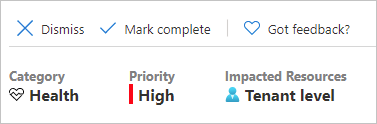
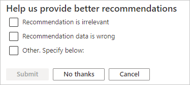
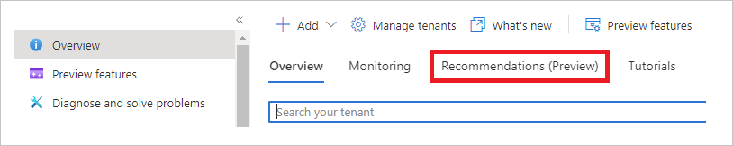

---

title: What is Azure Active Directory recommendations (preview)? | Microsoft Docs
description: Provides a general overview of Azure Active Directory recommendations.
services: active-directory
documentationcenter: ''
author: MarkusVi
manager: amycolannino
editor: ''

ms.assetid: e2b3d8ce-708a-46e4-b474-123792f35526
ms.service: active-directory
ms.devlang: na
ms.topic: overview
ms.tgt_pltfrm: na
ms.workload: identity
ms.subservice: report-monitor
ms.date: 08/22/2022
ms.author: markvi
ms.reviewer: hafowler  

# Customer intent: As an Azure AD administrator, I want guidance to so that I can keep my Azure AD tenant in a healthy state.
ms.collection: M365-identity-device-management
---

# What is Azure Active Directory recommendations (preview)?

This feature is supported as part of a public preview. For more information about previews, see [Supplemental Terms of Use for Microsoft Azure Previews](https://azure.microsoft.com/support/legal/preview-supplemental-terms/).

Ideally, you want your Azure Active Directory (Azure AD) tenant to be in a secure and healthy state. However, trying to keep your knowledge regarding the management of the various components in your tenant up to date can become overwhelming.

This is where Azure AD recommendations can help you.

The Azure AD recommendations feature provides you personalized insights with actionable guidance to:

- Help you identify opportunities to implement best practices for Azure AD-related features.
- Improve the state of your Azure AD tenant.

This article gives you an overview of how you can use Azure AD recommendations.

## What it is 

The [Azure Advisor](../../advisor/advisor-overview.md) is a personalized cloud consultant that helps you follow best practices to optimize your Azure deployments. It analyzes your resource configuration and usage telemetry and then recommends solutions that can help you improve the cost effectiveness, performance, Reliability (formerly called High availability), and security of your Azure resources.

Azure AD recommendations:

- Is the Azure AD specific implementation of Azure Advisor. 
- Supports you with the roll-out and management of Microsoft's best practices for Azure AD tenants to keep your tenant in a secure and healthy state. 
 
## Recommendation object

Azure AD tracks the status of a recommendation in a related object. This object includes attributes that are used to characterize the recommendation and a body to store the actionable guidance. 

Each object is characterized by:

- **Title** - A short summary of what the recommendation is about.

- **Priority** - Possible values are: low, medium, high

- **Status** - Possible values are: Active, Dismissed, Postponed, CompletedByUser, CompletedBySystem.

    - A recommendation is marked as CompletedByUser if you mark the recommendation as complete.

    - A recommendation is marked as CompletedBySystem if a recommendation that did once apply is no longer applicable to you because you have taken the necessary steps.
 

- **Impacted Resources** - A definition of the scope of a recommendation. Possible values are either a list of the impacted resources or **Tenant level**.    

- **Updated at** - The timestamp of the last status update.

The body of a recommendation object contains the actionable guidance:

- **Description** - An explanation of what it is that Azure AD has detected and related background information.

- **Value** - An explanation of why completing the recommendation will benefit you, and the value of the associated feature. 

- **Action Plan** - Detailed instructions to step-by-step implement a recommendation.

## How it works

On a daily basis, Azure AD analyzes the configuration of your tenant. During an analysis, Azure AD compares the  data of the known recommendations with the actual configuration. If a recommendation is flagged as applicable to your tenant, the recommendation status and its corresponding resources are marked as active. 

In the recommendations or resource list, you can use the **Status** information to determine your action item.

As an administrator, you should review your tenant's recommendations, and their associated resources periodically. 

- **Dismiss**

- **Mark complete** 

- **Postpone**

- **Reactivate**

### Dismiss

If you don't like a recommendation, or if you have another reason for not applying it, you can dismiss it. In this case, Azure AD asks you for a reason for dismissing a recommendation.

### Mark as complete

Use this state to indicate that you have:

- Completed the recommendation.
- Taken action for an individual resource. 

A recommendation or resource that has been marked as complete is again evaluated when Azure AD compares the available recommendations with your current configuration.

### Postpone 

Postpone a recommendation or resource to address it in the future. The recommendation or resource will be marked as Active again when the date that the recommendation or resource is postponed to occurs.

### Reactivate
Accidentally dismissed, completed, or postponed a recommendation or resource. Mark it as active again to keep it top of mind.

## Common tasks

### Enable recommendations

To enable your Azure AD recommendations:

1. Navigate to the **[Preview features](https://portal.azure.com/#blade/Microsoft_AAD_IAM/ActiveDirectoryMenuBlade/PreviewHub)** page.
2. Set the **State** to **On**.

    

### Manage recommendations

To manage your Azure AD recommendations:

1. Navigate to the [Azure AD overview](https://portal.azure.com/#blade/Microsoft_AAD_IAM/ActiveDirectoryMenuBlade/Overview) page.

2. On the Azure AD overview page, in the toolbar, click **Recommendations (Preview)**.
  
    

### Update the status of a resource 

To update the status of a resource, you have to right click a resource to bring up the edit menu. 

## Who can access it?

The Azure AD recommendations feature supports all editions of Azure AD. In other words, there is no specific subscription or license required to use this feature. 

To (re-) view your recommendations, you need to be:

- Global reader

- Security reader

- Reports reader

To manage your recommendations, you need to be:

- Global admin

- Security admin

- Security operator

- Cloud app admin

- App admin

## What you should know

- On the recommendations page, you might not see all supported recommendations. This is because Azure AD only displays the recommendations that apply to your tenant.

- Some recommendations have a list of impacted resources associated. This list of resources gives you more context on how the recommendation applies to you and/or which resources you need to address.

**Right now:** 

- You can update the status of a recommendation with a read only roles (global reader, security reader, reports reader). This is a known issue that will be fixed.

- The only action recorded in the audit log is completing recommendations.

- Audit logs do not capture actions taken by reader roles. 

## Next steps

* [Activity logs in Azure Monitor](concept-activity-logs-azure-monitor.md)
* [Stream logs to event hub](tutorial-azure-monitor-stream-logs-to-event-hub.md)
* [Send logs to Azure Monitor logs](howto-integrate-activity-logs-with-log-analytics.md)
