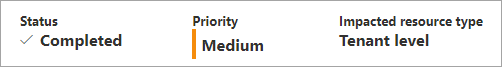

# What are Azure Active Directory recommendations?

Keeping track of all the settings and resources in your tenant can be overwhelming. The Azure Active Directory (Azure AD) recommendations feature helps monitor the status of your tenant so you don't have to. The Azure AD recommendations feature helps ensure your tenant is in a secure and healthy state while also helping you maximize the value of the features available in Azure AD.

The Azure AD recommendations feature provides you with personalized insights with actionable guidance to:

- Help you identify opportunities to implement best practices for Azure AD-related features.
- Improve the state of your Azure AD tenant.
- Optimize the configurations for your scenarios.

This article gives you an overview of how you can use Azure AD recommendations. As an administrator, you should review your tenant's Azure AD recommendations, and their associated resources periodically. 

## What it is 

The Azure AD recommendations feature is the Azure AD specific implementation of [Azure Advisor](../../advisor/advisor-overview.md), which is a personalized cloud consultant that helps you follow best practices to optimize your Azure deployments. Azure Advisor analyzes your resource configuration and usage data to recommend solutions that can help you improve the cost effectiveness, performance, reliability, and security of your Azure resources.

*Azure AD recommendations* use similar data to support you with the roll-out and management of Microsoft's best practices for Azure AD tenants to keep your tenant in a secure and healthy state. Azure AD recommendations provide a holistic view into your tenant's security, health, and usage. 
 
## How it works

On a daily basis, Azure AD analyzes the configuration of your tenant. During this analysis, Azure AD compares the data of a recommendation with the actual configuration of your tenant. If a recommendation is flagged as applicable to your tenant, the recommendation appears in the **Recommendations** section of the Azure AD Overview area. The recommendations are listed in order of priority so you can quickly determine where to focus first. 

Each recommendation contains a description, a summary of the value of addressing the recommendation, and a step-by-step action plan. If applicable, impacted resources associated with the recommendation are listed, so you can resolve each affected area. If a recommendation doesn't have any associated resources, the impacted resource type is *Tenant level*. so your step-by-step action plan impacts the entire tenant and not just a specific resource.

## Recommendation details

Each recommendation provides the same set of details that explain what the recommendation is, why it's important, and how to fix it.

The **Status** of a recommendation can be updated manually or automatically by the system. If all resources are addressed according to the action plan, the status automatically changes to *Completed* the next time the recommendations service runs. The recommendation service runs every 24-48 hours, depending on the recommendation. 

The **Priority** of a recommendation could be low, medium, or high. These values are determined by several factors, such as security implications, health concerns, or potential breaking changes.

- **High**: Must do. Not acting will result in severe security implications or potential downtime.
- **Medium**: Should do. No severe risk if action isn't taken.
- **Low**: Might do. No security risks or health concerns if action isn't taken.

The **Impacted resources** for a recommendation could be things like applications or users. This detail gives you an idea of what type of resources you need to address. The impacted resource could also be at the tenant level, so you may need to make a global change. 

The **Status description** tells you the date the recommendation status changed and if it was changed by the system or a user.

The recommendation's **Value** is an explanation of why completing the recommendation will benefit you, and the value of the associated feature. 

The **Action plan** provides step-by-step instructions to implement a recommendation. May include links to relevant documentation or direct you to other pages in the Azure AD portal.

## Roles and licenses

The following roles provide *read-only* access to recommendations:

- Reports Reader
- Security Reader
- Global Reader

The following roles provide *update and read-only* access to recommendations:

- Security Administrator
- Security Operator
- Cloud apps Administrator
- Apps Administrator
- Global Administrator

The Azure AD recommendations feature is automatically enabled. If you'd like to disable this feature, go to **Azure AD** > **Preview features**. Locate the **Recommendations** feature, and change the **State**.

Azure AD only displays the recommendations that apply to your tenant, so you may not see all supported recommendations listed. Currently, all recommendations are available in all tenants, regardless of the license type.

### Recommendations available for all Azure AD tenants

The recommendations listed in the following table are available to all Azure AD tenants, regardless of license type. The table provides the impacted resources and links to available documentation.

| Recommendation  | Impacted resources | Availability |
|---- |---- |---- |
| [Convert per-user MFA to Conditional Access MFA](recommendation-turn-off-per-user-mfa.md) | Users | Generally available |
| [Migrate applications from AD FS to Azure AD](recommendation-migrate-apps-from-adfs-to-azure-ad.md) | Users | Generally available |
| [Migrate to Microsoft Authenticator](recommendation-migrate-to-authenticator.md) | Users | Preview |
| [Minimize MFA prompts from known devices](recommendation-migrate-apps-from-adfs-to-azure-ad.md)  | Users | Generally available |

### Recommendations available specific licenses

The recommendations listed in the following table are currently available to Azure AD tenants with a P2 license (subject to change).

| Recommendation  | Impacted resources | Availability |
|---- |---- |---- |
| [Remove unused applications](recommendation-remove-unused-apps.md) | Applications | Preview |
| [Remove unused credentials from applications](recommendation-remove-unused-credential-from-apps.md) | Applications | Preview |
| [Renew expiring application credentials](recommendation-renew-expiring-application-credential.md) | Applications | Preview |
| [Renew expiring service principal credentials](recommendation-renew-expiring-service-principal-credential.md) | Applications | Preview |

## Next steps

* [Learn how to use Azure AD recommendations](howto-use-recommendations.md)
* [Learn more about Microsoft Graph](/graph/overview)
