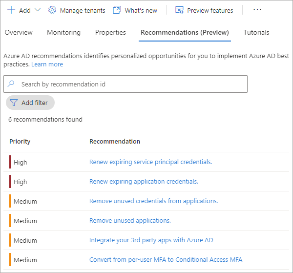

# What is Azure Active Directory recommendations (preview)?

This feature is supported as part of a public preview. For more information about previews, see [Supplemental Terms of Use for Microsoft Azure Previews](https://azure.microsoft.com/support/legal/preview-supplemental-terms/).

Ideally, you want your Azure Active Directory (Azure AD) tenant to be in a secure and healthy state. However, keeping track of all the settings and resources in your tenant can be overwhelming. Azure AD recommendations feature helps keep track of the status of your tenant so you don't have to.

The Azure AD recommendations feature provides you personalized insights with actionable guidance to:

- Help you identify opportunities to implement best practices for Azure AD-related features.
- Improve the state of your Azure AD tenant.

This article gives you an overview of how you can use Azure AD recommendations. As an administrator, you should review your tenant's recommendations, and their associated resources periodically. 

## What it is 

Azure AD recommendations is the Azure AD specific implementation of [Azure Advisor](../../advisor/advisor-overview.md), which is a personalized cloud consultant that helps you follow best practices to optimize your Azure deployments. Azure Advisor analyzes your resource configuration and usage telemetry to recommend solutions that can help you improve the cost effectiveness, performance, reliability, and security of your Azure resources.

*Azure AD recommendations* uses similar data to support you with the roll-out and management of Microsoft's best practices for Azure AD tenants to keep your tenant in a secure and healthy state. Azure AD recommendations provide a holistic view into your tenant's security, health, and usage. 
 
## How it works

On a daily basis, Azure AD analyzes the configuration of your tenant. During this analysis, Azure AD compares the data of a recommendation with the actual configuration of your tenant. If a recommendation is flagged as applicable to your tenant, the recommendation appears in the **Recommendations** section of the Azure AD Overview area. Recommendations are listed in order of priority so you can quickly determine where to focus first. 

Recommendations contain a description, a summary of the value of addressing the recommendation, and a step-by-step action plan. All impacted resources are listed, so you can resolve each affected area. 

## Recommendation details

Each recommendation provides the same set of details that explain what the recommendation is, why it's important, and how to fix it.

The **Status** of a recommendation can be updated manually or automatically. If all resources are addressed according to the action plan, the status will automatically change to *Completed* the next time the recommendations service runs. The recommendation service runs every 24-48 hours, depending on the recommendation. 

- Mark a recommendation as **Completed** if all impacted resources have been addressed.
    - If the service identifies an active resource for a manually completed recommendation the next time the service runs, the recommendation will automatically change back to **Active**.
- Mark a recommendation as **Dismissed** if you think the recommendation is irrelevant or the data is wrong.
    - Azure AD will ask for a reason why you dismissed the recommendation so we can improve the service.
- Mark a recommendation as **Postponed** if you want to address the recommendation at a later time.
    - The recommendation will become **Active** when the selected date occurs.
- You can reactivate a completed or postponed recommendation to keep it top of mind and reassess the resources.

The **Priority** of a recommendation could be low, medium, or high. These values are determined by a variety of factors, such as security implications or expiring credentials.

- **High**: Must do. Not acting will result in security implications or potential downtime.
- **Medium**: Should do. Actions will improve your tenant's health, but no risk if action isn't taken.
- **Low**: Might do. No security risks or health concerns if action isn't taken.

The **Impacted resources** for a recommendation could be things like applications or users. This detail gives you an idea of what type of resources you'll need to address. The impacted resource could also be at the tenant level, so you may need to make a global change. 

The **Status description** tells you the date the recommendation status changed and if it was changed by the system or a user.

The recommendation's **Value** is an explanation of why completing the recommendation will benefit you, and the value of the associated feature. 

The **Action plan** provides step-by-step instructions to implement a recommendation.

## What you should know

The following roles provide *read-only* access to recommendations:

- Reports Reader
- Security Reader
- Global Reader

The following roles provide *update* access to recommendations:

- Global Administrator
- Security Administrator
- Security Operator
- Cloud apps Administrator
- Apps Administrator

Any role can enable the Azure AD recommendations preview, but you'll need one of the roles listed above to view or update recommendations. Azure AD only displays the recommendations that apply to your tenant, so you may not see all supported recommendations listed.

Some recommendations have a list of impacted resources associated. This list of resources gives you more context on how the recommendation applies to you and/or which resources you need to address. The only action recorded in the audit log is completing recommendations.

## How to access Azure AD recommendations (preview)

To enable the Azure AD recommendations preview:

1. Sign in to the [Azure portal](https://portal.azure.com/).

1. Go to **Azure Active Directory** > **Preview features** and enable **Azure AD recommendations.**
   - Recommendations may take a few minutes to sync.  
   - While anyone can enable the preview feature, you'll need a [specific role](overview-recommendations.md/#what-you-should-know) to view or update a recommendation. 

    

After the preview is enabled, you can view the available recommendations from the Azure AD administration portal. The Azure AD recommendations feature appears on the **Overview** page of your tenant.

Select a recommendation from the list to view the details, status, and action plan. Recommendations are listed in priority order, from high to low.

## Next steps

* [Activity logs in Azure Monitor](concept-activity-logs-azure-monitor.md)
* [Stream logs to event hub](tutorial-azure-monitor-stream-logs-to-event-hub.md)
* [Send logs to Azure Monitor logs](howto-integrate-activity-logs-with-log-analytics.md)
