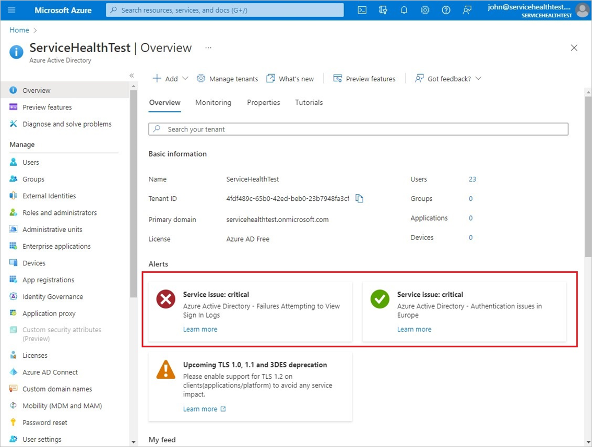
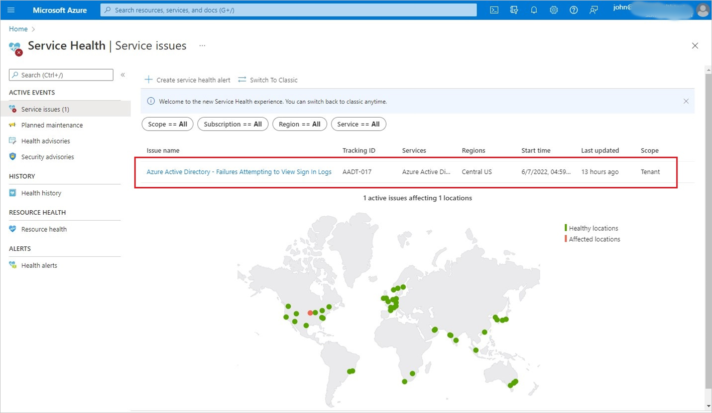

# What are Service Health notifications in Azure Active Directory?

Azure Service Health has been updated to provide notifications to tenant admins within the Azure portal when there are Service Health events for Azure Active Directory services. Due to the criticality of these events, an alert card in the Azure AD overview page will also be provided to support the discovery of these notifications. 

## How it works 

When there happens to be a Service Health notification for an Azure Active Directory service, it will be posted to the Service Health page within the Azure portal.  Previously these were subscription events that were posted to all the subscription owners/readers of subscriptions within the tenant that had an issue.  To improve the targeting of these notifications, they'll now be available as tenant events to the tenant admins of the impacted tenant.  For a transition period, these service events will be available as both tenant events and subscription events. 

Now that they're available as tenant events, they appear on the Azure AD overview page as alert cards. Any Service Health notification that has been updated within the last three days will be shown in one of the cards.   

 

Each card:

- Represents a currently active event, or a resolved one that will be distinguished by the icon in the card. 
- Has a link to the event. You can review the event on the Azure Service Health pages.  

 

 

For more information on the new Azure Service Health tenant events, see [Azure Service Health portal updates](../../service-health/service-health-portal-update.md) 

## Who will see the notifications 

Most of the built-in admin roles will have access to see these notifications. For the complete list of all authorized roles, see [Azure Service Health Tenant Admin authorized roles](../../service-health/admin-access-reference.md).  Currently custom roles aren't supported. 

## What you should know 

Service Health events allow the addition of alerts and notifications to be applied to subscription events. Currently, this isn't yet supported with tenant events, but will be coming soon. 

 

## Next steps

- [Service Health overview](../../service-health/service-health-overview.md)
