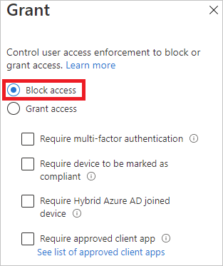
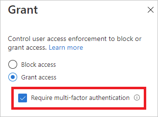

---

title: What is the sign-in diagnostic for Azure Active Directory?
description: Provides a general overview of the sign-in diagnostic in Azure Active Directory.
services: active-directory
documentationcenter: ''
author: MarkusVi
manager: daveba
editor: ''

ms.assetid: e2b3d8ce-708a-46e4-b474-123792f35526
ms.service: active-directory
ms.devlang: na
ms.topic: overview
ms.tgt_pltfrm: na
ms.workload: identity
ms.subservice: report-monitor
ms.date: 12/15/2020
ms.author: markvi
ms.reviewer: tspring  

# Customer intent: As an Azure AD administrator, I want a tool that gives me the right level of insights into the sign-in activities in my system so that I can easily diagnose and solve problems when they occur.
ms.collection: M365-identity-device-management
---

# What is the sign-in diagnostic in Azure AD?

Azure Active Directory (Azure AD) provides you with a flexible security model to control what users can do with  managed resources. Access to these resources is controlled not only by *who* they are, but also by *how* they access them. Typically, a flexible model comes with a certain degree of complexity because of the number of configuration options you have. Complexity has the potential to increase the risk for errors.

As an IT admin, you need a solution that gives you insight into the activities in your system. This visibility can let you diagnose and solve problems when they occur. The sign-in diagnostic for Azure AD is an example of such a solution. You can use the diagnostic to analyze what happened during a sign-in attempt and get recommendations for resolving problems without needing to involve Microsoft support.

This article gives you an overview of what the solution does and how you can use it.

## Requirements

The sign-in diagnostic is available in all editions of Azure AD.

You must be a global administrator in Azure AD to use it.

## How it works

In Azure AD, the response to a sign-in attempt is tied to *who* signs in and *how* they access the tenant. For example, an administrator can typically configure all aspects of the tenant when they sign in from the corporate network. But the same user might be blocked when they sign in with the same account from an untrusted network.

Due to the greater flexibility of the system to respond to a sign-in attempt, you might end-up in scenarios where you need to troubleshoot sign-ins. The sign-in diagnostic is a feature that:

- Analyzes data from sign-in events.

- Displays what happened.

- Provides recommendations for how to resolve problems.

The sign-in diagnostic for Azure AD is designed to enable self-diagnosis of sign-in errors. To complete the diagnostic process, you need to:

1. Define the scope of the sign-in events you care about.

2. Select the sign-in you want to review.

3. Review the diagnostic results.

4. Take action.

### Define scope

The goal of this step is to define the scope of the sign-in events to investigate. Your scope is either based on a user or on an identifier (correlationId, requestId) and a time range. To narrow down the scope further, you can specify an app name. Azure AD uses the scope information to locate the right events for you.  

### Select sign-in  

Based on your search criteria, Azure AD retrieves all matching sign-in events and presents them in an authentication summary list view.

You can customize the columns displayed in this view.

### Review diagnostic

For the selected sign-in event, Azure AD provides you with diagnostic results.

These results start with an assessment, which explains what happened in a few sentences. The explanation helps you to understand the behavior of the system.

Next, you get a summary of the related conditional access policies that were applied to the selected sign-in event. The diagnostic results also include  recommended remediation steps to resolve your issue. Because it's not always possible to resolve issues without more help, a recommended step might be to open a support ticket.

### Take action

At this point, you should have the information you need to fix your issue.

## Scenarios

The following scenarios are covered by the sign-in diagnostic:

- Blocked by conditional access

- Failed conditional access

- Multifactor authentication (MFA) from conditional access

- MFA from other requirements

- MFA proof up required

- MFA proof up required (risky sign-in location)

- Successful sign-in

### Blocked by conditional access

In this scenario, a sign-in attempt has been blocked by a conditional access policy.

The diagnostic section for this scenario shows details about the user sign-in event and the applied policies.

### Failed conditional access

This scenario is typically a result of a sign-in attempt that failed because the requirements of a conditional access policy weren't satisfied. Common examples are:

- Require hybrid Azure AD joined device

- Require approved client app

- Require app protection policy

The diagnostic section for this scenario shows details about the user sign-in attempt and the applied policies.

### MFA from conditional access

In this scenario, a conditional access policy has the requirement to sign in using multifactor authentication set.

The diagnostic section for this scenario shows details about the user sign-in attempt and the applied policies.

### MFA from other requirements

In this scenario, a multifactor authentication requirement wasn't enforced by a conditional access policy. For example, multifactor authentication on a per-user basis.

The intent of this diagnostic scenario is to provide more details about:

- The source of the multifactor authentication interrupt
- The result of the client interaction

You can also view all details of the user sign-in attempt.

### MFA proof up required

In this scenario, sign-in attempts were interrupted by requests to set up multifactor authentication. This setup is also known as proof up.

Multifactor authentication proof up occurs when a user is required to use multifactor authentication but hasn't configured it yet, or an administrator has required the user to configure it.

The intent of this diagnostic scenario is to reveal that the multifactor authentication interruption was due to lack of user configuration. The recommended solution is for the user to complete the proof up.

### MFA proof up required (risky sign-in location)

In this scenario, sign-in attempts were interrupted by a request to set up multifactor authentication from a risky sign-in location.

The intent of this diagnostic scenario is to reveal that the multifactor authentication interruption was due to lack of user configuration. The recommended solution is for the user to complete the proof up, specifically from a network location that doesn't appear risky.

For example, if a corporate network is defined as a named location, the user should attempt to do the proof up from the corporate network instead.

### Successful sign-in

In this scenario, sign-in events weren't interrupted by conditional access or multifactor authentication.

This diagnostic scenario provides details about user sign-in events that were expected to be interrupted due to conditional access policies or multifactor authentication.

## Next steps

- [What are Azure Active Directory reports?](overview-reports.md)
- [What is Azure Active Directory monitoring?](overview-monitoring.md)
