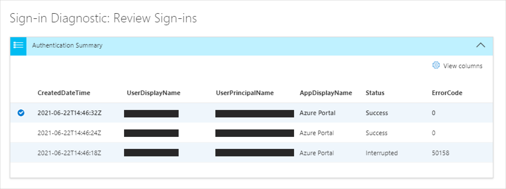
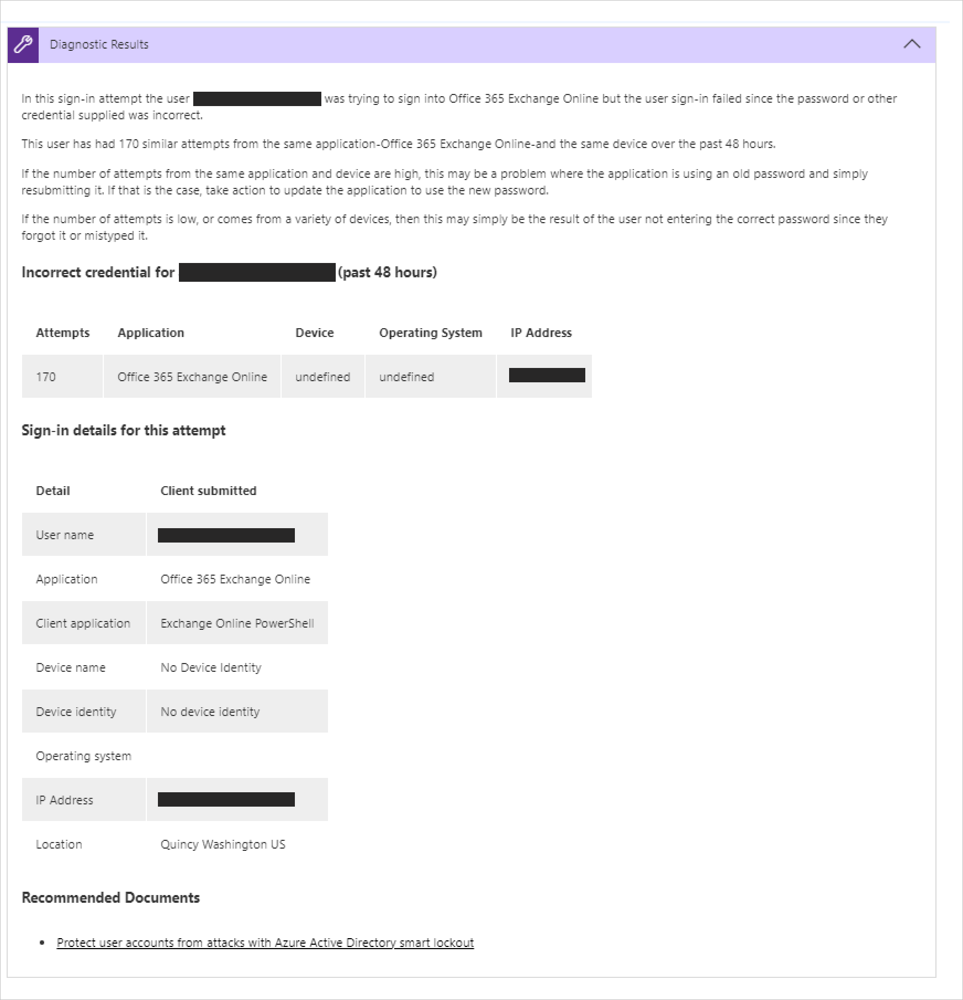
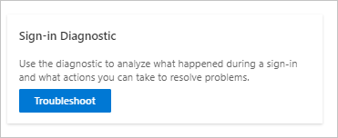
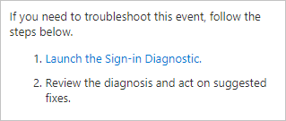

---

title: What is the sign-in diagnostic for Azure Active Directory?
description: Provides a general overview of the sign-in diagnostic in Azure Active Directory.
services: active-directory
documentationcenter: ''
author: billmath
manager: amycolannino
editor: ''

ms.assetid: e2b3d8ce-708a-46e4-b474-123792f35526
ms.service: active-directory
ms.topic: overview
ms.tgt_pltfrm: na
ms.workload: identity
ms.subservice: report-monitor
ms.date: 08/26/2022
ms.author: billmath
ms.reviewer: tspring  

# Customer intent: As an Azure AD administrator, I want a tool that gives me the right level of insights into the sign-in activities in my system so that I can easily diagnose and solve problems when they occur.
ms.collection: M365-identity-device-management
---

# What is the sign-in diagnostic in Azure AD?

Determining the reason for a failed sign-in can quickly become a challenging task. You need to analyze what happened during the sign-in attempt, and research the available recommendations to resolve the issue. Ideally, you want to resolve the issue without involving others such as Microsoft support. If you are in a situation like this, you can use the sign-in diagnostic in Azure AD, a tool that helps you investigating sign-ins in Azure AD. 

This article gives you an overview of what the diagnostic is and how you can use it to troubleshoot sign-in related errors. 

## How it works  

In Azure AD, sign-in attempts are controlled by:

- **Who** - The user performing a sign in attempt.
- **How** - How a sign-in attempt was performed.

For example, you can configure conditional access policies that enable administrators to configure all aspects of the tenant when they sign in from the corporate network. But the same user might be blocked when they sign into the same account from an untrusted network. 

Due to the greater flexibility of the system to respond to a sign-in attempt, you might end-up in scenarios where you need to troubleshoot sign-ins. The sign-in diagnostic is a tool that is designed to enable self-diagnosis of sign-in issues by:  

- Analyzing data from sign-in events.  

- Displaying information about what happened.  

- Providing recommendations to resolve problems.  

To start and complete the diagnostic process, you need to:   

1. **Identify event** - Start the diagnostic and review the flagged events users are asking assistance for, or enter information about the sign-in event to be investigated. 

2. **Select event** - Select an event based on the information shared. 

3. **Take action** - Review diagnostic results and perform steps. 

### Identify event 

The diagnostic allows two methods to find events to investigate:  

- Sign-in failures users have [flagged for assistance](overview-flagged-sign-ins.md). 
- Search for specific events by the user and additional criteria. 

Flagged sign-ins are automatically presented in a list of up to 100. You can run a diagnostics on an event immediately by clicking it.  

You can search a specific event by selecting the search tab even when flagged sign-ins are present. 
When searching for specific events, you can filter based on the following options: 

- Name of the user 

- Application 

- Correlation ID or request ID 

- Date and time 

### Select event  

For flagged sign-ins, or when a search has been done, Azure AD retrieves all matching sign-in events and presents them in an authentication summary list view. 

You can change the content displayed in the columns based on your preference. Examples are:

- Risk details
- Conditional access status
- Location
- Resource ID
- User type
- Authentication details

### Take action

For the selected sign-in event, you get a diagnostic results. Read through the results to identify action that you can take to fix the problem. These results add recommended steps and shed light on relevant information such as the related policies, sign-in details, and supportive documentation. Because it's not always possible to resolve issues without more help, a recommended step might be to open a support ticket. 

## How to access it

To use the diagnostic, you must be signed into the tenant as a global admin or a global reader. If you do not have this level of access, use [Privileged Identity Management, PIM](../privileged-identity-management/pim-resource-roles-activate-your-roles.md), to elevate your access to global admin/reader within the tenant. This will allow you to have temporary access to the diagnostic.  

With the correct access level, you can find the diagnostic in various places: 

**Option A**: Diagnose and Solve Problems 

1. Open **Azure Active Directory AAD or Azure AD Conditional Access**. 

2. From the main menu, click **Diagnose & Solve Problems**.  

3. Under the **Troubleshooters**, there is a sign-in diagnostic tile. 

4. Click **Troubleshoot** button.  

 

 

**Option B**: Sign-in Events 

1. Open Azure Active Directory. 

2. On the main menu, in the **Monitoring** section, select **Sign-ins**. 

3. From the list of sign-ins, select a sign in with a **Failure** status. You can filter your list by Status to make it easier to find failed sign-ins. 

4. The **Activity Details: Sign-ins** tab will open for the selected sign-in. Click on dotted icon to view more menu icons. Select the **Troubleshooting and support** tab. 

5. Click the link to **Launch the Sign-in Diagnostic**. 

 

**Option C**: Support Case 

The diagnostic can also be found when creating a support case to give you the opportunity to self-diagnose before resorting to submitting a case. 

## Next steps

- [Sign in diagnostics for Azure AD scenarios](concept-sign-in-diagnostics-scenarios.md)
