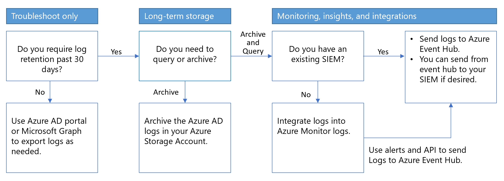

---

title: Plan reports & monitoring deployment
description: Describes how to plan and execute implementation of reporting and monitoring.
services: active-directory
author: gargi-sinha
manager: martinco
ms.service: active-directory
ms.topic: conceptual
ms.workload: identity
ms.subservice: report-monitor
ms.date: 01/20/2023
ms.author: sarahlipsey
ms.reviewer: plenzke 
# Customer intent: For a Microsoft Entra administrator to monitor logs and report on access 
ms.collection: M365-identity-device-management
---

# Microsoft Entra monitoring and health deployment dependencies

Your Microsoft Entra reporting and monitoring solution depends on legal, security, operational requirements, and your environment's processes. Use the following sections to learn about design options and deployment strategy.

## Benefits of Microsoft Entra reporting and monitoring

Microsoft Entra ID reporting has a view, and logs, of Microsoft Entra activity in your environment: sign-in and audit events, also changes to your directory.

Use data output to:

* determine how your apps and services are used.
* detect potential risks affecting the health of your environment.
* troubleshoot issues preventing your users from getting their work done.
* gain insights by seeing audit events of changes to your Microsoft Entra directory.

Microsoft Entra monitoring enables you to route your logs generated by Microsoft Entra ID reporting to different target systems. You can then either retain it for long-term use or integrate it with third-party Security Information and Event Management (SIEM) tools to gain insights into your environment.

With Microsoft Entra monitoring, you can route logs to:

* an Azure storage account for archival purposes.
* Azure Monitor logs, where you can analyze the data, create dashboards, and alert on specific events.
* an Azure event hub where you can integrate with your existing SIEM tools such as Splunk, Sumologic, or QRadar.

### Prerequisites

You'll need a Microsoft Entra ID P1 or P2 license to access the Microsoft Entra sign-in logs.

For detailed feature and licensing information, see the [Microsoft Entra pricing guide](https://www.microsoft.com/security/business/identity-access-management/azure-ad-pricing).

To deploy Microsoft Entra monitoring and health, you'll need a user who is a Global Administrator or Security Administrator for the Microsoft Entra tenant.

* [Azure Monitor data platform](../../azure-monitor/data-platform.md)
* [Azure Monitor naming and terminology changes](../../azure-monitor/overview.md)
* [How long does Microsoft Entra ID store reporting data?](./reference-reports-data-retention.md)
* An Azure storage account that you have `ListKeys` permissions for. We recommend that you use a general storage account and not a Blob storage account. For storage pricing information, see the [Azure Storage pricing calculator](https://azure.microsoft.com/pricing/calculator/?service=storage).
* An Azure Event Hubs namespace to integrate with third-party SIEM solutions.
* An Azure Log Analytics workspace to send logs to Azure Monitor logs.

## Plan and deploy a Microsoft Entra monitoring and health deployment project

Reporting and monitoring are used to meet your business requirements, gain insights into usage patterns, and increase your organization's security posture. In this project, you'll define the audiences that will consume and monitor reports, and define your Microsoft Entra monitoring architecture.

## Stakeholders, communications, and documentation

When technology projects fail, they typically do so due to mismatched expectations on effect, outcomes, and responsibilities. To avoid these pitfalls, [ensure that you're engaging the right stakeholders](../architecture/deployment-plans.md). Also ensure that stakeholder roles in the project are well understood by documenting the stakeholders and their project input and responsibilities.

Stakeholders need to access Microsoft Entra logs to gain operational insights. Likely users include security team members, internal or external auditors, and the identity and access management operations team.

Microsoft Entra roles enable you to delegate the ability to configure and view Microsoft Entra reports based on your role. Identify who in your organization needs permission to read Microsoft Entra reports and what role would be appropriate for them. 

The following roles can read Microsoft Entra reports:

* Global Administrator
* Security Administrator
* Security Reader
* Reports Reader

Learn More About [Microsoft Entra Administrative Roles](../roles/permissions-reference.md). Always apply the concept of least privileges to reduce the risk of an account compromise. Consider implementing [Privileged Identity Management](../privileged-identity-management/pim-configure.md) to further secure your organization.

### Engage stakeholders

Successful projects align expectations, outcomes, and responsibilities. See, [Microsoft Entra deployment plans](../architecture/deployment-plans.md). Document and communicate stakeholder roles that require input and accountability.

### Communications plan

Tell your users when, and how, their experience will change. Provide contact information for support.

* What, if any, SIEM tools you're using.
* Your Azure infrastructure, including existing storage accounts and monitoring being used.
* Your organizational retention policies for logs, including any applicable compliance frameworks required. 

### Business use cases

To better prioritize the use cases and solutions, organize the options by "required for solution to meet business needs," "nice to have to meet business needs," and "not applicable."

### Considerations

* **Retention** - Log retention: store audit logs and sign in logs of Microsoft Entra longer than 30 days
* **Analytics** - Logs are searchable with analytic tools
* **Operational and security insights** - Provide access to application usage, sign-in errors, self-service usage, trends, etc.
* **SIEM integration** - Integrate and stream Microsoft Entra sign-in logs and audit logs to SIEM systems

### Monitoring solution architecture

With Microsoft Entra monitoring, you can route Microsoft Entra activity logs and retain them for long-term reporting and analysis to gain environment insights, and integrate it with SIEM tools. Use the following decision flow chart to help select an architecture.

   

#### Archive logs in a storage account

You can keep logs longer than the default retention period by routing them to an Azure storage account.

   > [!IMPORTANT]
   > Use this archival method if there is no need to integrate logs with a SIEM system, or no need for ongoing queries and analysis. You can use on-demand searches.

Learn more:

* [How long does Microsoft Entra ID store reporting data?](./reference-reports-data-retention.md)
* [Tutorial: Archive Microsoft Entra logs to an Azure storage account](./quickstart-azure-monitor-route-logs-to-storage-account.md)

#### Stream logs to storage and SIEM tools

* [Integrate Microsoft Entra logs with Azure Monitor logs](./howto-integrate-activity-logs-with-log-analytics.md).
* [Analyze Microsoft Entra activity logs with Azure Monitor logs](../reports-monitoring/howto-analyze-activity-logs-log-analytics.md).
* Learn how to [stream logs to an event hub](./tutorial-azure-monitor-stream-logs-to-event-hub.md).
* Learn how to [Archive Microsoft Entra logs to an Azure Storage account](./howto-archive-logs-to-storage-account.md).
* [Route Microsoft Entra logs to an event hub](./howto-stream-logs-to-event-hub.md)

## Next steps

- Consider implementing [Privileged Identity Management](../privileged-identity-management/pim-configure.md) 
- Consider implementing [Azure role-based access control](../../role-based-access-control/overview.md)
- [Learn more about report retention policies](./reference-reports-data-retention.md).
- [Analyze Microsoft Entra activity logs with Azure Monitor logs](./howto-analyze-activity-logs-log-analytics.md)
