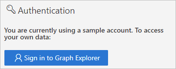

# Quickstart: Access Azure AD logs with the Microsoft Graph API 

With the information in the Azure Active Directory (Azure AD) sign-in logs, you can figure out what happened if a sign-in of a user failed. This quickstart shows you how to access the sign-ins log using the Graph API.

## Prerequisites

To complete the scenario in this quickstart, you need:

- **Access to an Azure AD tenant**: If you don't have access to an Azure AD tenant, see [Create your Azure free account today](https://azure.microsoft.com/free/?WT.mc_id=A261C142F). 
- **A test account called Isabella Simonsen**: If you don't know how to create a test account, see [Add cloud-based users](../fundamentals/add-users-azure-active-directory.md#add-a-new-user).
- **Access to the reporting API**: If you haven't configured access yet, see [How to configure the prerequisites for the reporting API](howto-configure-prerequisites-for-reporting-api.md).

## Perform a failed sign-in

[!INCLUDE [portal updates](~/articles/active-directory/includes/portal-update.md)]

The goal of this step is to create a record of a failed sign-in in the Azure AD sign-ins log.

**To complete this step:**

1. Sign in to the [Azure portal](https://portal.azure.com) as Isabella Simonsen using an incorrect password.

2. Wait for 5 minutes to ensure that you can find a record of the sign-in in the sign-ins log. For more information, see [Activity reports](reference-reports-latencies.md#activity-reports).

## Find the failed sign-in

This section provides you with the steps to get information about your sign-in using the Graph API.

    

**To review the failed sign-in:**

1. Navigate to [Microsoft Graph Explorer](https://developer.microsoft.com/en-us/graph/graph-explorer).

2. Sign-in to your tenant as global administrator.

       

3. In the **HTTP verb drop-down list**, select **GET**.

4. In the **API version drop-down list**, select **beta**.

5. In the **Request query address bar**, type `https://graph.microsoft.com/beta/auditLogs/signIns?$top=100&$filter=userDisplayName eq 'Isabella Simonsen'`
 
6. Select **Run query**.

Review the outcome of your query.

    

## Clean up resources

When no longer needed, delete the test user. If you don't know how to delete an Azure AD user, see [Delete users from Azure AD](../fundamentals/add-users-azure-active-directory.md#delete-a-user).

## Next steps

> [!div class="nextstepaction"]
> [What are Azure Active Directory reports?](overview-reports.md)
