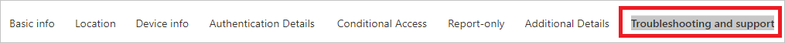

# Quickstart: Analyze sign-ins with the Azure AD sign-ins log 

With the information in the Azure AD sign-ins log, you can figure out what happened if a sign-in of a user failed. This quickstart shows how to you can locate failed sign-in using the sign-ins log.

## Prerequisites

To complete the scenario in this quickstart, you need:

- **Access to an Azure AD tenant** - If you don't have access to an Azure AD tenant, see [Create your Azure free account today](https://azure.microsoft.com/free/?WT.mc_id=A261C142F). 
- **A test account called Isabella Simonsen** - If you don't know how to create a test account, see [Add cloud-based users](../fundamentals/add-users-azure-active-directory.md#add-a-new-user).

## Perform a failed sign-in

[!INCLUDE [portal updates](~/articles/active-directory/includes/portal-update.md)]

The goal of this step is to create a record of a failed sign-in in the Azure AD sign-ins log.

**To complete this step:**

1. Sign in to the [Azure portal](https://portal.azure.com) as Isabella Simonsen using an incorrect password.

2. Wait for 5 minutes to ensure that you can find a record of the sign-in in the sign-ins log. For more information, see [Activity reports](reference-reports-latencies.md#activity-reports).

## Find the failed sign-in

This section provides you with the steps to analyze a failed sign-in:

- **Filter sign-ins**: Remove all records that aren't relevant to your analysis. For example, set a filter to display only the records of a specific user.
- **Lookup additional error information**: In addition to the information you can find in the sign-ins log, you can also look up the error using the [sign-in error lookup tool](https://login.microsoftonline.com/error). This tool might provide you with additional information for a sign-in error. 

**To review the failed sign-in:**

1. Navigate to the [sign-ins log](https://portal.azure.com/#blade/Microsoft_AAD_IAM/ActiveDirectoryMenuBlade/SignIns).

2. To list only records for Isabella Simonsen:

    1. In the toolbar, select **Add filters**.
    
       

    1. In the **Pick a field** list, select **User**, and then select **Apply**.

    1. In the **Username** textbox, type **Isabella Simonsen**, and then select **Apply**.

    1. In the toolbar, select **Refresh**.

3. To analyze the issue, select **Troubleshooting and support**.

    

4. Copy the **Sign-in error code**.

       

5. Paste the error code into the textbox of the [sign-in error lookup tool](https://login.microsoftonline.com/error), and then select **Submit**.

Review the outcome of the tool and determine whether it provides you with additional information.

## More tests

Now, that you know how to find an entry in the sign-in log by name, you should also try to find the record using the following filters:

- **Date** - Try to find Isabella using a **Start** and an **End**.

    

- **Status** - Try to find Isabella using **Status: Failure**.

    

## Clean up resources

When no longer needed, delete the test user. If you don't know how to delete an Azure AD user, see [Delete users from Azure AD](../fundamentals/add-users-azure-active-directory.md#delete-a-user).

## Next steps

> [!div class="nextstepaction"]
> [What are Azure Active Directory reports?](overview-reports.md)
