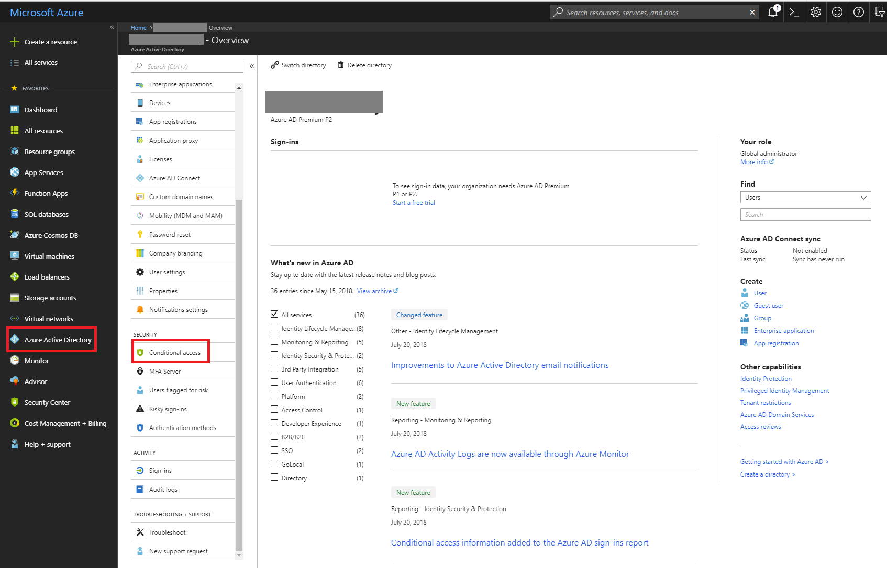
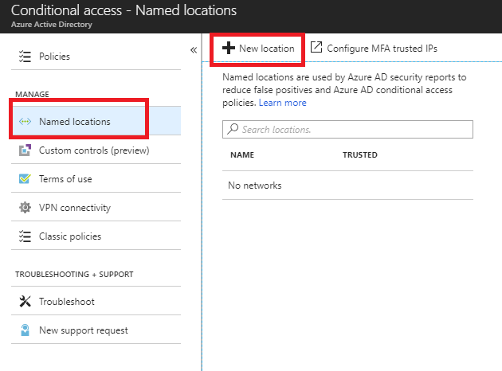
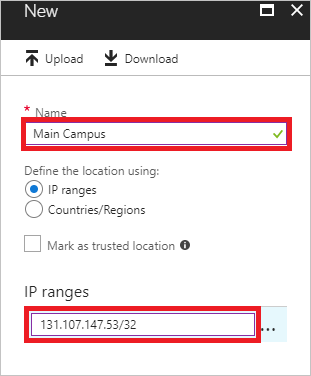

# Quickstart: Configure named locations in Azure Active Directory

With named locations, you can label trusted IP address ranges in your organization. Azure AD uses named locations to:
- Detect false positives in [risk events](concept-risk-events.md). Signing in from a trusted location lowers a user's sign-in risk.   
- Configure [location-based Conditional Access](../conditional-access/location-condition.md).

In this quickstart, you learn how to configure named locations in your environment.

## Prerequisites

To complete this quickstart, you need:

* An Azure AD tenant. Sign up for a [free trial](https://azure.microsoft.com/trial/get-started-active-directory/). 
* A user, who is a global administrator for the tenant.
* An IP range that is established and credible in your organization. The IP range needs to be in **Classless Interdomain Routing (CIDR)** format.

## Configure named locations

1. Sign in to the [Azure portal](https://portal.azure.com).

2. In the left pane, select **Azure Active Directory**, then select **Conditional Access** from the **Security** section.

    

3. On the **Conditional Access** page, select **Named locations** and select **New location**.

    

6. Fill out the form on the new page. 

   * In the **Name** box, type a name for your named location.
   * In the **IP ranges** box, type the IP range in CIDR format.  
   * Click **Create**.
    
     

## Next steps

For more information, see:

- [Azure AD Conditional Access](../active-directory-conditional-access-azure-portal.md).
- [Location conditions in Azure AD Conditional Access](../conditional-access/location-condition.md)
- [Risky sign-ins report](concept-risky-sign-ins.md).  
