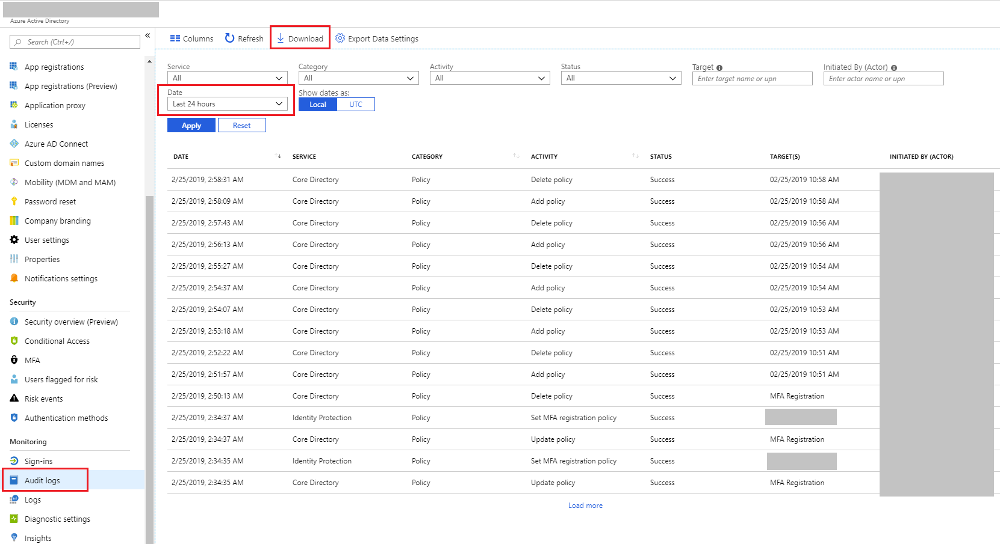

# Quickstart: Download an audit report using the Azure portal

In this quickstart, you learn how to download a CSV file of the audit logs for your tenant for the past 24 hours. You can download up to 250,000 records from the Azure portal. The records are sorted by most recent so by default, you get the most recent 250,000 records. 

## Prerequisites

You need:

* An Azure Active Directory tenant. 
* A user, who is in the **Security Administrator**, **Security Reader**, or **Global Administrator** role for the tenant. In addition, any user in the tenant can access their own audit logs.

## Quickstart: Download an audit report

1. Navigate to the [Azure portal](https://portal.azure.com).
2. Select **Azure Active Directory** from the left navigation pane and use the **Switch directory** button to select your active directory.
3. From the dashboard, select **Azure Active Directory** and then select **Audit logs**. 
4. Choose **last 24 hours** in the **Date range** filter drop-down and select **Apply** to view the audit logs for the past 24 hours. 
5. Select the **Download** button, select **CSV** as the file format and specify a file name to download a CSV file containing the filtered records. 

## Next steps

* [Sign-in activity reports in the Azure Active Directory portal](concept-sign-ins.md)
* [Azure Active Directory reporting retention](reference-reports-data-retention.md)
* [Azure Active Directory reporting latencies](reference-reports-latencies.md)
