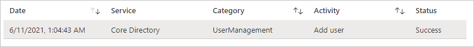
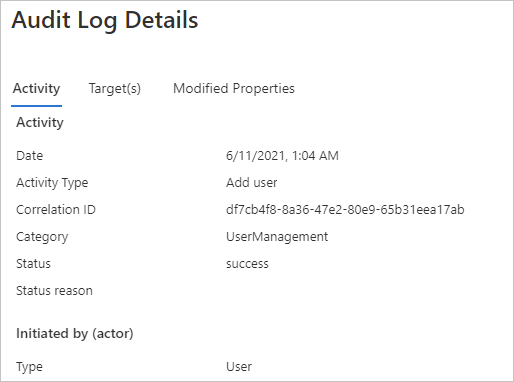

# Quickstart: Filter your Azure AD audit log 

With the information in the Azure AD audit log, you get access to records of system activities for compliance. 
This quickstart shows how to you can locate a newly created user account in your audit log.

## Prerequisites

To complete the scenario in this quickstart, you need:

- **Access to an Azure AD tenant** - If you don't have access to an Azure AD tenant, see [Create your Azure free account today](https://azure.microsoft.com/free/?WT.mc_id=A261C142F). 
- **A test account called Isabella Simonsen** - If you don't know how to create a test account, see [Add cloud-based users](../fundamentals/add-users-azure-active-directory.md#add-a-new-user).

## Find the new user account

This section provides you with the steps to filter your audit log.

**To find the new user:**

1. Navigate to the [audit log](https://portal.azure.com/#blade/Microsoft_AAD_IAM/ActiveDirectoryMenuBlade/Audit).

2. To list only records for Isabella Simonsen:

    a. In the toolbar, click **Add filters**.
    
       

    b. In the **Pick a field** list, select **Target**, and then click **Apply**

    c. In the **Target** textbox, type the **User Principal Name** of **Isabella Simonsen**, and then click **Apply**.

3. Click the filtered item.

      

4.  Review the **Audit Log Details**.
 
      
 
  

## Clean up resources

When no longer needed, delete the test user. If you don't know how to delete an Azure AD user, see [Delete users from Azure AD](../fundamentals/add-users-azure-active-directory.md#delete-a-user).

## Next steps

> [!div class="nextstepaction"]
> [What are Azure Active Directory reports?](overview-reports.md)
