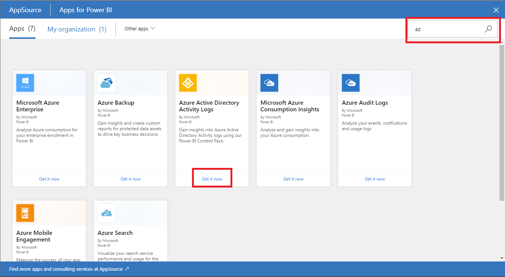
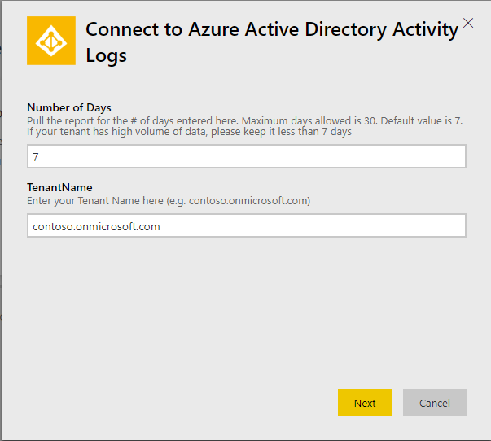
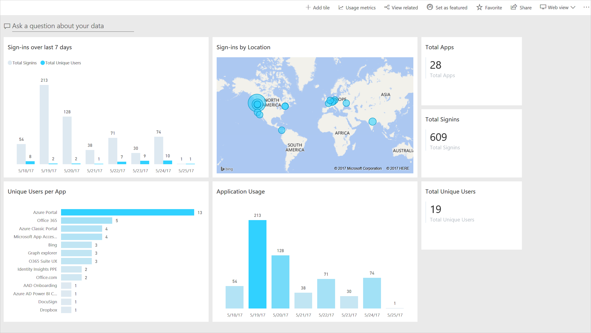

# Quickstart: Install Azure Active Directory Power BI Content pack

|  |
|--|
|Currently, the Azure AD Power BI content pack uses the Azure AD Graph APIs to retrieve data from your Azure AD tenant. As a result, you may see some disparity between the data available in the content pack and the data retrieved using the [Microsoft Graph APIs for reporting](concept-reporting-api.md). |
|  |

The Power BI content pack for Azure Active Directory gives you the ability to gain deep insights into what’s going on with your active directory. You can download the pre-built content pack and use it to report all the activities within your directory using the rich visualization experience that Power BI offers. You can also create your own dashboard and share it easily with anyone in your organization. 

In this quickstart, you learn how to install the content pack.

## Prerequisites

To complete this quickstart, you need:

* A Power BI account. This is the same account as your O365 or Azure AD account. 
* Your Azure AD tenant ID. This is the **Directory ID** of your directory from the [properties page](https://portal.azure.com/#blade/Microsoft_AAD_IAM/ActiveDirectoryMenuBlade/Properties) of the Azure portal.
* An Azure AD Premium (P1/P2) license. 

## Install Azure AD Power BI content pack 

1. Log into [Power BI](https://app.powerbi.com/groups/me/getdata/services) with your Power BI Account. This is the same account as your O365 or Azure AD Account.

2. Search for **Azure Active Directory Activity Logs** in the **Apps** page and select **Get it now**. 

    
    
3. In the popup window, type your Azure AD Tenant ID, enter **7** for the number of days to query and then select **Next**.
    
    

4. When your Azure Active Directory Activity logs dashboard has been created, select it.

    
    
## Next steps

* [Use Power BI content pack](howto-power-bi-content-pack.md).
* [Troubleshoot content pack errors](troubleshoot-content-pack.md).
