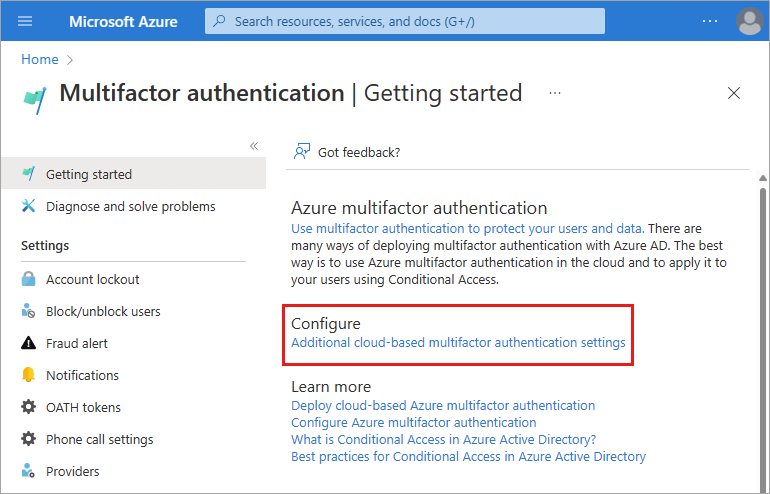

# Azure AD recommendation: Minimize MFA prompts from known devices 

[Azure AD recommendations](overview-recommendations.md) is a feature that provides you with personalized insights and actionable guidance to align your tenant with recommended best practices.

This article covers the recommendation to minimize multi-factor authentication (MFA) prompts from known devices. This recommendation is called `tenantMFA` in the recommendations API in Microsoft Graph. 

## Description

As an admin, you want to maintain security for your company’s resources, but you also want your employees to easily access resources as needed.

MFA enables you to enhance the security posture of your tenant. While enabling MFA is a good practice, you should try to keep the number of MFA prompts your users have to go through at a minimum. One option you have to accomplish this goal is to **allow users to remember multi-factor authentication on trusted devices**.

The "remember multi-factor authentication on trusted device" feature sets a persistent cookie on the browser when a user selects the "Don't ask again for X days" option at sign-in. The user isn't prompted again for MFA from that browser until the cookie expires. If the user opens a different browser on the same device or clears the cookies, they're prompted again to verify.

For more information, see [Configure Azure AD Multi-Factor Authentication settings](../authentication/howto-mfa-mfasettings.md).

This recommendation shows up if you have set the **remember multi-factor authentication** feature to less than 30 days.

## Value 

This recommendation improves your user's productivity and minimizes the sign-in time with fewer MFA prompts. Ensure that your most sensitive resources can have the tightest controls, while your least sensitive resources can be more freely accessible.

## Action plan

1. Review the [How to configure Azure AD Multi-Factor Authentication settings](../authentication/howto-mfa-mfasettings.md) article.  
1. Go to **Azure AD** > **Multifactor authentication** > select the **Additional cloud-based multifactor authentication settings** link.

    

1. Adjust the number of days in the **remember multi-factor authentication on trusted device** section to 90 days.

    

## Next steps

- [Review the Azure AD recommendations overview](overview-recommendations.md)
- [Learn how to use Azure AD recommendations](howto-use-recommendations.md)
- [Explore the Microsoft Graph API properties for recommendations](/graph/api/resources/recommendation)