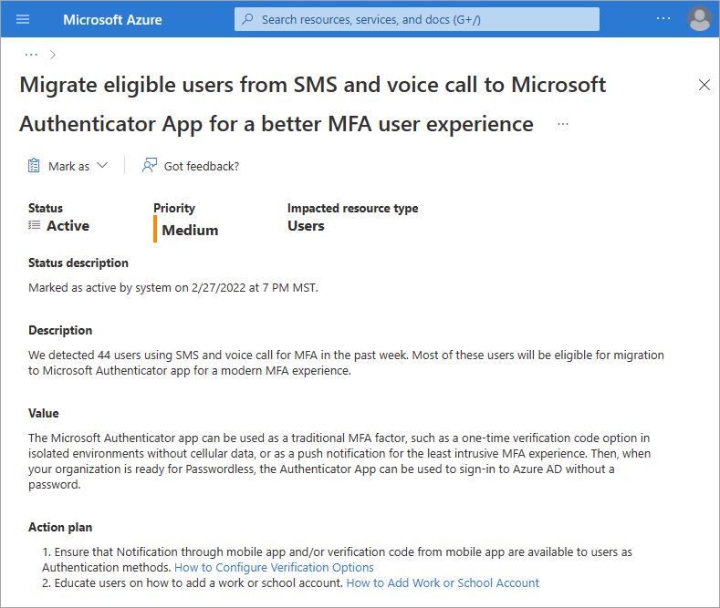

# Azure AD recommendation: Migrate to Microsoft Authenticator (preview)

[Azure AD recommendations](overview-recommendations.md) is a feature that provides you with personalized insights and actionable guidance to align your tenant with recommended best practices.

This article covers the recommendation to migrate users to the Microsoft Authenticator app, which is currently a preview recommendation. This recommendation is called `useAuthenticatorApp` in the recommendations API in Microsoft Graph.

## Description

Multi-factor authentication (MFA) is a key component to improve the security posture of your Azure AD tenant. However, while keeping your tenant safe is important, you should also keep an eye on keeping the security related overhead as little as possible on your users.

One possibility to accomplish this goal is to migrate users using SMS or voice call for MFA to use the Microsoft authenticator app.

This recommendation appears if Azure AD detects that your tenant has users authenticating using SMS or voice instead of the Microsoft Authenticator app in the past week.

## Value 

Push notifications through the Microsoft Authenticator app provide the least intrusive MFA experience for users. This method is the most reliable and secure option because it relies on a data connection rather than telephony.

The verification code option enables MFA even in isolated environments without data or cellular signals, where SMS and Voice calls may not work.

The Microsoft Authenticator app is available for Android and iOS. Microsoft Authenticator can serve as a traditional MFA factor (one-time passcodes, push notification) and when your organization is ready for Password-less, the Microsoft Authenticator app can be used to sign in to Azure AD without a password.

## Action plan

1.	Ensure that notification through mobile app and/or verification code from mobile app are available to users as authentication methods. How to Configure Verification Options

2.	Educate users on how to add a work or school account. 

## Next steps

- [Review the Azure AD recommendations overview](overview-recommendations.md)
- [Learn how to use Azure AD recommendations](howto-use-recommendations.md)
- [Explore the Microsoft Graph API properties for recommendations](/graph/api/resources/recommendation)
