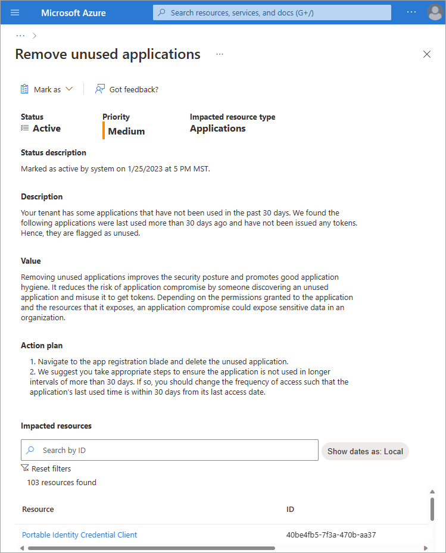

# Azure AD recommendation: Remove unused applications
[Azure AD recommendations](overview-recommendations.md) is a feature that provides you with personalized insights and actionable guidance to align your tenant with recommended best practices.

This article covers the recommendation to remove unused applications.

## Description

Applications registered with your tenant require an application credential, which are used to get a token that grants access to a resource or another service. Only applications actively used in your tenant should be registered.

This recommendation shows up if your tenant has applications that haven't been used in more than 30 days, so haven't been issued any tokens.

## Value 

Removing unused applications improves the security posture and promotes good application hygiene. It reduces the risk of application compromise by someone discovering an unused application and misuse it to get tokens. Depending on the permissions granted to the application and the resources that it exposes, an application compromise could expose sensitive data in an organization.

## Action plan

1. Navigate to **Azure AD** > **App registration** and locate the application that hasn't been used in 30 days.
1. We suggest you take appropriate steps to ensure the application is not used in longer intervals of more than 30 days. If so, you should change the frequency of access such that the application’s last used time is within 30 days from its last access date.

## Known limitations

The time frame application usage that triggers this recommendation cannot be customized.

## Next steps

- [What is Azure Active Directory recommendations](overview-recommendations.md)
- [Learn about app and service principal objects in Azure AD](../develop/app-objects-and-service-principals.md)