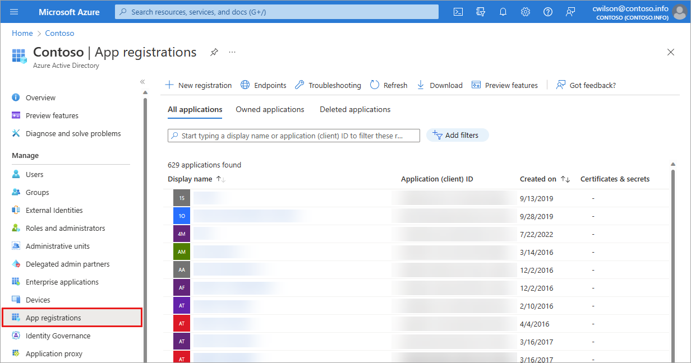
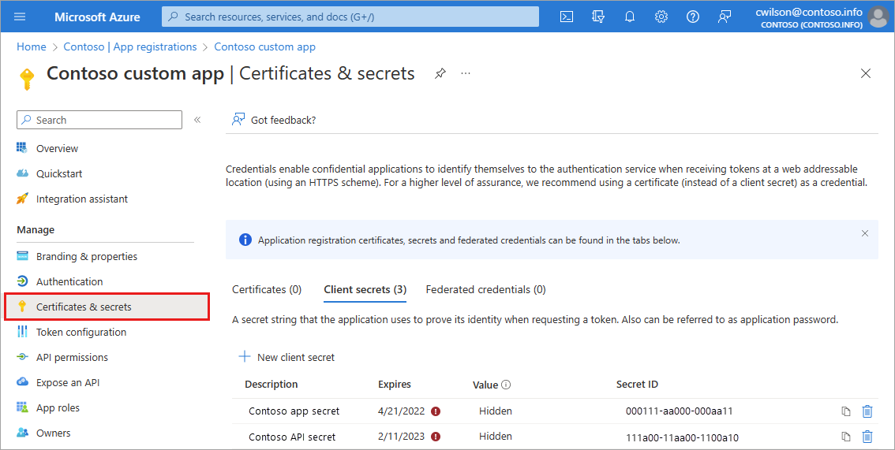

# Microsoft Entra recommendation: Renew expiring application credentials (preview)
[Microsoft Entra recommendations](overview-recommendations.md) is a feature that provides you with personalized insights and actionable guidance to align your tenant with recommended best practices.

This article covers the recommendation to renew expiring application credentials. This recommendation is called `applicationCredentialExpiry` in the recommendations API in Microsoft Graph. 

## Description

Application credentials can include certificates and other types of secrets that need to be registered with that application. These credentials are used to prove the identity of the application.

This recommendation shows up if your tenant has application credentials that will expire soon. 

## Value 

Renewing the app credential(s) before its expiration ensures the application continues to function and reduces the possibility of downtime due to an expired credential.

## Action plan

Applications that the recommendation identified appear in the list of **Impacted resources** at the bottom of the recommendation. 

1. Take note of the application name and ID that the recommendation identified.
1. Browse to **Identity** > **Applications** > **App registrations** and locate the application for which the credential needs to be rotated.

    

1. Navigate to the **Certificates & Secrets** section of the app registration.
1. Pick the credential type that you want to rotate and navigate to either **Certificates** or **Client Secret** tab and follow the prompts.

    

1. Once the certificate or secret is successfully added, update the service code to ensure it works with the new credential and doesn't negatively affect customers.
1. Use the Microsoft Entra sign-in logs to validate that the Key ID of the credential matches the one that was recently added.
1. After validating the new credential, navigate back to **App registrations** > **Certificates and Secrets** for the app and remove the old credential.
 
## Known limitations

- Currently in the list of **Impacted resources**, only the app name and resource ID are shown. The key ID for the credential that needs to be rotated isn't shown. To find the key ID credential, navigate back to **App registrations** > **Certificates and Secrets** for the application. 

- An **Impacted resource** with credentials that expired recently are as **Complete**. If that resource has more than one credential expiring soon, the status of the resource is **Active**.

## Next steps

- [Review the Microsoft Entra recommendations overview](overview-recommendations.md)
- [Learn how to use Microsoft Entra recommendations](howto-use-recommendations.md)
- [Explore the Microsoft Graph API properties for recommendations](/graph/api/resources/recommendation)
- [Learn about app and service principal objects in Microsoft Entra ID](../develop/app-objects-and-service-principals.md)
