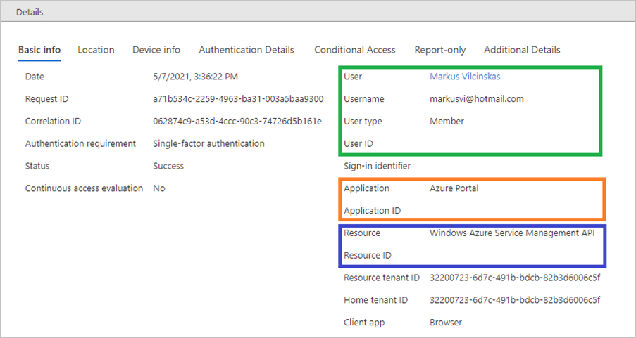

# Basic info identifiers in the Azure AD sign-in log

Azure AD logs all sign-ins into an Azure tenant for compliance. As an IT administrator, you need to know what the values in a sign-in log mean, so that you can interpret the log values correctly.
This article explains the identifiers on the Basic info tab of the sign-ins log.

## Unique identifiers 

In Azure AD, a resource access has three relevant components:

- **Who** – The identity (User) performing the sign-in. 
- **How** – The client (Application) used for the access.  
- **What** – The target (Resource) accessed by the identity.

Each component has an associated unique identifier (ID). Below is an example of user using the Windows Azure Service Management API to access the Azure portal.

## Tenant identifiers

The sign-in log tracks two tenant identifiers:

- **Home tenant** – The tenant that owns the user identity. 
- **Resource tenant** – The tenant that owns the (target) resource.

These identifiers are relevant in cross-tenant scenarios. For example, to find out how users outside your tenant are accessing your resources, select all entries where the home tenant doesn’t match the resource tenant.

## Request ID

The request ID is an identifier that corresponds to an issued token. If you are looking for sign-ins that were performed with a specific token, you need to extract the request ID from the token, first.

## Correlation ID

The correlation ID is an identifier that correlates sign-ins from the same sign-in session. The identifier was implemented for convenience. Its accuracy is not guaranteed because the value is based on parameters passed by a client. 

## Next steps

* [Sign-in logs in Azure Active Directory](concept-sign-ins.md)
* [What is the sign-in diagnostic in Azure AD?](overview-sign-in-diagnostics.md)
