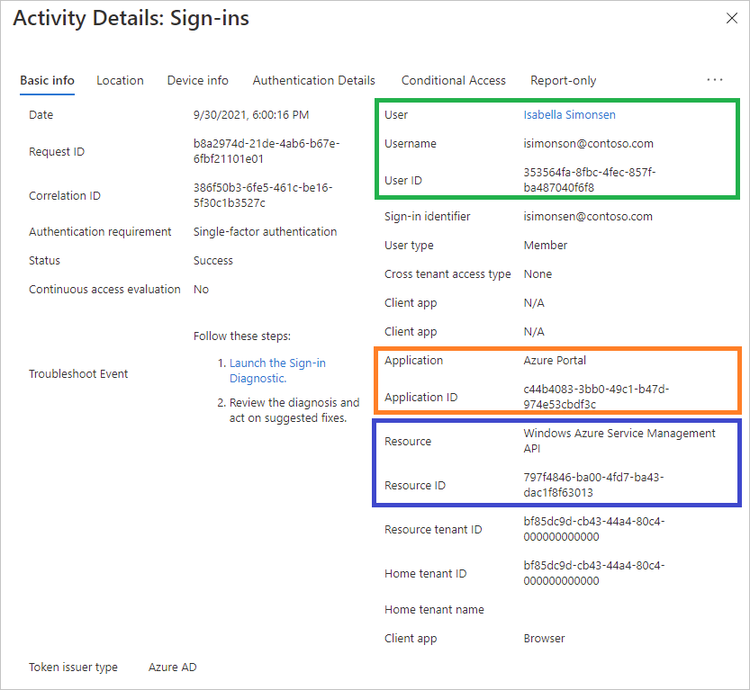

# Basic info in the Azure AD sign-in logs

Azure AD logs all sign-ins into an Azure tenant for compliance. As an IT administrator, you need to know what the values in the sign-in logs mean, so that you can interpret the log values correctly. [Learn how to access, view, and analyze Azure AD sign-in logs](concept-sign-ins.md)

This article explains the values on the Basic info tab of the sign-ins log.

## Unique identifiers 

In Azure AD, a resource access has three relevant components:

- **Who** – The identity (User) doing the sign-in. 
- **How** – The client (Application) used for the access.  
- **What** – The target (Resource) accessed by the identity.

Each component has an associated unique identifier (ID). Below is an example of user using the Microsoft Azure classic deployment model to access the Azure portal.

### Tenant

The sign-in log tracks two tenant identifiers:

- **Home tenant** – The tenant that owns the user identity. 
- **Resource tenant** – The tenant that owns the (target) resource.

These identifiers are relevant in cross-tenant scenarios. For example, to find out how users outside your tenant are accessing your resources, select all entries where the home tenant doesn’t match the resource tenant.
For the home tenant, Azure AD tracks the ID and the name. 

### Request ID

The request ID is an identifier that corresponds to an issued token. If you are looking for sign-ins with a specific token, you need to extract the request ID from the token, first.

### Correlation ID

The correlation ID groups sign-ins from the same sign-in session. The identifier was implemented for convenience. Its accuracy is not guaranteed because the value is based on parameters passed by a client. 

### Sign-in

The sign-in identifier is a string the user provides to Azure AD to identify itself when attempting to sign-in. It's usually a user principal name (UPN), but can be another identifier such as a phone number. 

### Authentication requirement 

This attribute shows the highest level of authentication needed through all the sign-in steps for the sign-in to succeed. Graph API supports `$filter` (`eq` and `startsWith` operators only).

### Sign-in event types 

Indicates the category of the sign in the event represents. For user sign-ins, the category can be `interactiveUser` or `nonInteractiveUser` and corresponds to the value for the **isInteractive** property on the sign-in resource. For managed identity sign-ins, the category is `managedIdentity`. For service principal sign-ins, the category is **servicePrincipal**. The Azure portal doesn't show this value, but the sign-in event is placed in the tab that matches its sign-in event type. Possible values are:

- `interactiveUser`
- `nonInteractiveUser`
- `servicePrincipal`
- `managedIdentity`
- `unknownFutureValue`

The Microsoft Graph API, supports: `$filter` (`eq` operator only)

### User type 

The type of a user. Examples include `member`, `guest`, or `external`.

### Cross-tenant access type 

This attribute describes the type of cross-tenant access used by the actor to access the resource. Possible values are: 

- `none` - A sign-in event that did not cross an Azure AD tenant's boundaries.
- `b2bCollaboration`- A cross tenant sign-in performed by a guest user using B2B Collaboration.
- `b2bDirectConnect` - A cross tenant sign-in performed by a B2B.
- `microsoftSupport`- A cross tenant sign-in performed by a Microsoft support agent in a Microsoft customer tenant.
- `serviceProvider` - A cross-tenant sign-in performed by a Cloud Service Provider (CSP) or similar admin on behalf of that CSP's customer in a tenant
- `unknownFutureValue` - A sentinel value used by MS Graph to help clients handle changes in enum lists. For more information, see [Best practices for working with Microsoft Graph](/graph/best-practices-concept).

If the sign-in did not the pass the boundaries of a tenant, the value is `none`.

### Conditional Access evaluation 

This value shows whether continuous access evaluation (CAE) was applied to the sign-in event. There are multiple sign-in requests for each authentication. Some are shown on the interactive tab, while others are shown on the non-interactive tab. CAE is only displayed as true for one of the requests, and it can be on the interactive tab or non-interactive tab. For more information, see [Monitor and troubleshoot sign-ins with continuous access evaluation in Azure AD](../conditional-access/howto-continuous-access-evaluation-troubleshoot.md). 

## Next steps

* [Learn about exporting Azure AD sign-in logs](concept-activity-logs-azure-monitor.md)
* [Explore the sign-in diagnostic in Azure AD](overview-sign-in-diagnostics.md)